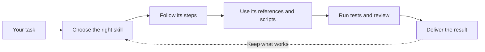

# CCL Skills

Reusable workflows that help coding agents plan, build, test, review, and release software.

CCL Skills works with Claude Code, Codex, OpenCode, and other tools that support [Agent Skills](https://agentskills.io).



| [Browse all skills](docs/SKILLS.md) | [Read the theory](docs/skills-theory-foundations.md) | [Understand the architecture](docs/ARCHITECTURE.md) |
| --- | --- | --- |
| Find the workflow for your task | See why the rules exist | See how skills are selected, loaded, and checked |

## Quick start

You need Git, Bash, and at least one supported coding-agent CLI.

```bash
git clone https://github.com/ccoalm/ccl-skills.git
cd ccl-skills
make install
```

Restart the coding-agent CLI so it reloads the skills.

OpenCode only:

```bash
bash scripts/install-opencode.sh --no-agent
```

Use the skills from one OpenCode project checkout:

```bash
bash scripts/install-opencode.sh --project
```

Run `make help` to see the available install and update commands. Node.js 20 or later is required to build or run both npm packages.

## Use a skill

Ask for a skill by name:

```text
Use product-rd-workflow to plan and deliver this feature.
Use defect-diagnosis to find the cause of this failure.
Use testing-strategy to add regression coverage.
```

The coding agent can also choose a skill from the task. It reads `skills/<name>/SKILL.md` first, then opens the references and scripts needed for that work.

## Find the right skill

[**docs/SKILLS.md**](docs/SKILLS.md) is the single authoritative catalog. It lists every skill in `skills/`, grouped by delivery stage, and gives each one two lines: when to use it, and when to use something else instead. Start there — this README deliberately keeps no second list of its own.

## Supported tools

| Tool | Install from this repository |
| --- | --- |
| Claude Code | `make install` |
| Codex | `make install` or [`packages/codex-npm`](packages/codex-npm/README.md) |
| OpenCode | [`scripts/install-opencode.sh`](scripts/install-opencode.sh) or [`packages/opencode-npm`](packages/opencode-npm/README.md) |

## Repository layout

```text
skills/          Skills, references, and their scripts
agent-context/   Text injected into agent sessions; one file per injecting hook
docs/            Guides for users and contributors
hooks/           Claude Code runtime checks
packages/        Distributables: npm packages and the standalone OpenCode plugin
scripts/         Installers and repository checks
eval/            Skill evaluation cases
AGENTS.md        Rules for coding agents working in this repository
.worktree-only   Repository-root marker: edits here must go through a worktree
```

## Contributing

Read [the contribution guide](docs/CONTRIBUTING.md) before making a change. It covers worktree setup, repository rules, review, and required checks.
