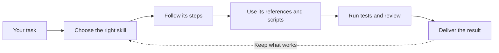

# CCL Skills

Reusable workflows that help coding agents plan, build, test, review, and release software.

CCL Skills works with Claude Code, Codex, OpenCode, and other tools that support [Agent Skills](https://agentskills.io).



| [Browse all skills](docs/SKILLS.md) | [Read the theory](docs/skills-theory-foundations.md) | [Understand the architecture](docs/ARCHITECTURE.md) |
| --- | --- | --- |
| Find the workflow for your task | See why the rules exist | See how skills are selected, loaded, and checked |

## Quick start

Install the unified package with Node.js 20 or later:

```bash
npm install --global @ccoalm/ccl-skills
ccl-skills install
```

The npm tarball includes the skills, agent context, plugin manifests, and runtime hooks. Claude Code and Codex consume the plugin hooks directly. OpenCode installs a native plugin plus the same bundled hook runtime, including edit isolation for `edit`, `write`, and `apply_patch`. Installation does not need a Git checkout.

If npm returns `E404` before the initial registry release, install from source:

```bash
git clone https://github.com/ccoalm/ccl-skills.git
cd ccl-skills
make install
```

Both install paths configure every CLI they detect — Claude Code, Codex, and OpenCode. Restart the CLI afterwards so it reloads the skills.

Confirm the install landed:

```bash
claude plugin list            # expect ccl-skills@ccl-skills
codex plugin list             # expect ccl-skills
ls ~/.config/opencode/skills  # expect the skill directories
test -f ~/.config/opencode/ccl-skills/runtime/hooks/hooks.json
```

To pin one OpenCode project to this checkout instead of the global install:

```bash
bash scripts/install-opencode.sh --project
```

Run `make help` for every install, update, and evaluation target. The unified npm package lives in `packages/ccl-skills-npm` and requires Node.js 20 or later.

## Install and update

npm installs use one command for all detected hosts:

```bash
ccl-skills update       # preview; no network or global mutation
ccl-skills update --yes # upgrade the package and refresh host assets
```

By default `update --yes` upgrades the global npm package to `@latest` first. Set `CCL_SKILLS_SKIP_SELF_UPDATE=1` for an assets-only refresh; `--allow-downgrade` always uses the currently invoked package instead of installing `@latest`.

Git-checkout installs use `make update`.

The host-specific behavior is:

| Host | What an update actually requires |
| --- | --- |
| Claude Code | `make install` writes `extraKnownMarketplaces.ccl-skills` with `autoUpdate: true`, so Claude periodically refreshes the marketplace metadata. That does **not** guarantee a reinstall. For a deterministic update run `make update`, which calls `claude plugin update` — `claude plugin install` no-ops on an already-installed plugin and never updates it. |
| Codex | No native auto-update. `make update` runs `codex plugin marketplace upgrade` (refreshes the git snapshot) and then `codex plugin add` (installs a copy of that snapshot); running only one of the two leaves you on the old code. `make install-codex-cron` schedules those two steps daily — it edits your crontab, so it is opt-in. |
| OpenCode | `scripts/install-opencode.sh` installs from the **current checkout and never fetches**. Either `git pull` first, or use `make update-opencode` / `make update-opencode-no-agent`, which run `git pull --ff-only` before installing. |
| npm (`@ccoalm/ccl-skills`) | No auto-update either: the global package does not upgrade itself, and the assets it installed are a snapshot. `make update-npm` (`ccl-skills update --yes`) upgrades the package to `@latest` and then refreshes host assets. An interactive run prints an update notice on stderr — see the package README for its eligibility and opt-out rules. |

For npm installs, Claude and Codex register package-owned local marketplaces and consume their plugin hooks. OpenCode installs its skills, native plugin, and hook runtime into host-visible shared paths after collision checks. npm uninstall retains those shared files and reports them for manual cleanup.

Claude keeps one cache directory per installed version and they accumulate. `make prune-cache` removes the stale ones and keeps the active version; it refuses to delete anything when it cannot determine which version is active.

## Install the gates into your own repository

The repository checks are also distributable. This adds the agent-contract, owner-dispatch, and control-plane gates to a product repository:

```bash
make install-gates TARGET=/path/to/repo
```

The install is additive and starts **warn-only** because the installer cannot infer a target repository's owner mappings, baseline cleanliness, false-positive history, or risk tolerance. Enforcement is a deliberate repository decision: verify the specific gate is deterministic and ready, then set `enabled: true`, pass `--enforce` in CI, and remove `allow_failure`. This is an installation default, not a universal warn-to-block maturity sequence for every signal.

## Use a skill

Ask for a skill by name:

```text
Use product-rd-workflow to plan and deliver this feature.
Use defect-diagnosis to find the cause of this failure.
Use testing-strategy to add regression coverage.
```

The coding agent can also choose a skill from the task. It reads `skills/<name>/SKILL.md` first, then opens the references and scripts needed for that work.

## Find the right skill

[**docs/SKILLS.md**](docs/SKILLS.md) is the single authoritative catalog. It lists every skill in `skills/`, grouped by delivery stage, and gives each one two lines: when to use it, and when to use something else instead. Start there — this README deliberately keeps no second list of its own.

## Supported tools

Use `npx` to run the package without installing it globally. If the registry still returns `E404`, use the checkout alternative.

| Tool | Install from this repository |
| --- | --- |
| Claude Code | `npx @ccoalm/ccl-skills@latest install --host claude` or `make install` |
| Codex | `npx @ccoalm/ccl-skills@latest install --host codex` or `make install` |
| OpenCode | `npx @ccoalm/ccl-skills@latest install --host opencode` or `make install`; [`scripts/install-opencode.sh --project`](scripts/install-opencode.sh) pins a single project |

## Repository layout

```text
skills/           Skills, references, and their scripts
agent-context/    Text injected into agent sessions; one file per injecting hook
docs/             Guides for users and contributors
hooks/            Canonical runtime checks consumed by Claude Code, Codex, and the OpenCode adapter
scripts/          Installers, gate installers, and repository checks
packages/         Unified npm package and the standalone OpenCode plugin source
eval/             Skill evaluation cases
specs/            Design notes for in-flight repository changes
.claude-plugin/   Claude Code marketplace and plugin manifests
.codex-plugin/    Codex plugin manifest
.agents/          Codex marketplace manifest
.github/          CI workflow
.githooks/        Opt-in local git hooks; enable with `git config core.hooksPath .githooks`
opencode.json     OpenCode config for using the skills from inside this checkout
AGENTS.md         Rules for coding agents working in this repository
.worktree-only    Repository-root marker: edits here must go through a worktree
```

[`docs/ARCHITECTURE.md`](docs/ARCHITECTURE.md) carries the full table, including what each manifest is for and which hook runs on which event.

## Contributing

Read [the contribution guide](docs/CONTRIBUTING.md) before making a change. It covers worktree setup, repository rules, review, and required checks.

Maintainers should also read the [npm release runbook](docs/npm-release.md) before changing a version or creating a release tag.
