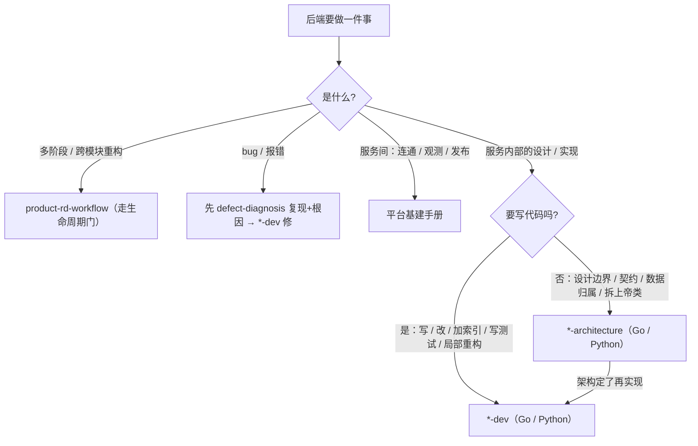

# 后端服务开发手册（Go / Python）

> 域专题：写后端服务时用哪个技能、架构和实现怎么分工。每个语言都是"架构 + 实现"一对。
>
> **何时找它**：要设计或写 Go / Python 后端服务、拆服务边界、定契约/数据归属、局部重构某文件或类。

## 四个技能，两对

| 技能 | owns |
|---|---|
| [`go-microservice-architecture`](../skills/go-microservice-architecture/SKILL.md) | Go 服务边界、IDL/RPC、数据所有权、可靠性、安全、运行时（Kitex/Hertz/protobuf/MySQL/Redis/MQ/服务发现/动态config/codegen） |
| [`go-microservice-dev`](../skills/go-microservice-dev/SKILL.md) | Go 实现：protobuf、Kitex/Hertz、Wire/DI、GORM DAL、Redis、MQ、codegen、聚焦测试 |
| [`python-service-architecture`](../skills/python-service-architecture/SKILL.md) | Python 服务/worker/批任务/包/运行时边界（FastAPI/Flask/Django/SQLAlchemy/Alembic/Celery/asyncio/Pydantic/OpenAPI） |
| [`python-service-dev`](../skills/python-service-dev/SKILL.md) | Python 实现：接口、model、Celery 任务、pytest、ruff、mypy、依赖管理 |

## 后端的活怎么路由

- 默认序：架构不清先 `*-architecture` 再 `*-dev`；新 Python 服务默认按微服务边界思考，单体/脚本/包是例外。
- 跨语言契约：路由到拥有被改边界那侧的架构技能。

## 关键纪律

- **架构决策显式化**：实现时保留架构决策，不偷偷改边界。
- **代码改动必须测**：见 [写测试与测试用例手册](testing-handbook.md)。

## 延伸阅读

- 四个技能 SKILL.md（见上）
- [平台基建手册](platform-infra-handbook.md) · [做需求/加功能/重构手册](feature-delivery-handbook.md)
