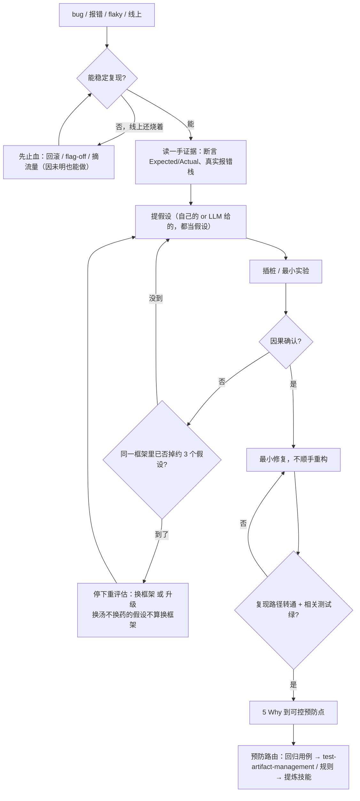

# 排查与修复 bug 手册

> **何时找它**：bug、报错、回归、flaky、线上问题、找根因。入口是 [`defect-diagnosis`](../skills/defect-diagnosis/SKILL.md)。
>
> 核心纪律：**先读一手失败证据再定性**——断言的 Expected/Actual、真实报错栈，不凭猜、不凭"某 AI 说"就下根因。

## 什么时候用

- bug / 报错 / 复现 / 线上问题 / test 挂了 / flaky / "昨天还好好的"。
- 拿到 stack trace、失败 CI、异常行为描述——即使没说"debug"。
- 要执行某个 LLM/agent 提出的原因或修复（"Cursor 说是因为 X / AI 建议改这里"）——**LLM 给的原因是假设，不是判决**，仍要复现核实。

**跳过**：用户已经**亲手核实过**根因（不只是 LLM 声称），只要你打补丁。

## 流程速查

| 阶段 | 做什么 | 硬线 |
|---|---|---|
| 1 复现 | 稳定复现路径 | 不能复现就不算定位 |
| 2 一手证据 | 读断言 Expected/Actual、真实报错栈 | 不凭猜/不凭"AI 说"定性 |
| 3 隔离 | 缩小到最小触发 | — |
| 4 假设 | 提出或评估（含 LLM 提的）根因假设 | LLM 假设当假设，不当结论 |
| 5 插桩验证 | 用日志/断点/最小实验确认因果 | 验证到真实因果再改 |
| 6 最小修复 | 改最小面，不顺手镀金 | 不靠 workaround 掩盖 |
| 7 证明闭环 | 跑测试证明修好、且没破坏别的 | 无证据不声称修复 |
| 8 5 Why | 追到可控预防点 | 不接受"agent 不小心"当根因 |
| 9 预防路由 | 可复用教训路由到提炼技能 / 回归用例路由 test-artifact-management | — |

表是每阶段出什么，下图是它画不出的两个回环 + 止血分支：

## 按症状选技法

流程是骨架，下面是"具体怎么查"——按症状挑最有效的：

| 症状 | 最有效的技法 |
|---|---|
| 回归（昨天还好好的，有 good / bad commit）| `git bisect run <脚本>` 自动二分。脚本要**确定性**（flaky 会二分到错的 commit）；退出码：0=good、125=跳过(建不起来)、其余=bad |
| 疑似 flaky | 先**重跑 N 次量 pass/fail 比率**——100% 复现就是确定性 bug、不是 flaky。先读断言 Expected/Actual，再怀疑并发 / 共享状态（别从"时好时坏"或日志行就猜并发）|
| 线上有 telemetry | 从坏**指标 / 告警**出发，顺 trace（exemplar）往回走读 span，再跳日志——**别从代码 bottom-up 读**，那是最大时间黑洞 |
| 用 AI 协助 | 让它出**排序假设 + 每条的取证命令**，你跑命令读真实输出；prompt+输出存证。AI 说"修好了"不算数，**失败→通过的测试**才算 |

> **事故级**（线上故障 / 数据损坏 / 安全 / 反复回归）：5 Why 之外再走**无责复盘 + 多层补洞**——测试 / 评审 / 告警 / runbook / on-call 哪层有洞都补，别只补离 bug 最近的那一层。

## 查不下去的时候

假设-验证这个环不能无限转。三条收敛信号：

| 信号 | 判据 | 该做什么 |
|---|---|---|
| **三次否决就换框架** | 同一个框架（同一层、同一证据源、同一复现路径）里已经有证据地否掉约 3 个假设 | 停下重评估。换个说法的同一类假设、换个看同样信号的工具、换个 owner 名字——都不算换框架，计数不清零。想继续留在原框架，下一个假设必须有**不同的证伪方式**和更深的新证据 |
| **升级不等于结案** | 交接、"先插桩观察"、重新划范围 | 缺陷仍然**是开的**。交接包要带：症状、复现、已否掉的假设及其证据、当前止血措施、下一个 owner、还欠的验证和回归证据 |
| **"先观察着"要过严重性关** | 想挂起观察 | 只有在明确判定无用户影响、无数据完整性 / 安全 / 合规 / SLA 影响、且止血已生效时才允许；够不上就不能挂起 |

## 关键纪律

- **一手证据优先**：先看真实失败输出，再形成假设。最常见的浪费是对着猜的原因改了一通。
- **止血不必等定因**：线上烧着时可以先回滚 / flag-off / 摘流量止损——这不违反"先定因"。禁的是**因还没确认就当它确认、去选并打修复**；止血是缓解、不是修复。
- **最小修复**：根因清楚后改最小面；不要借机重构（那是另一个交付，走 product-rd-workflow）。
- **证明闭环**：修复后必须有当轮验证证据——复现路径现在通过、相关测试绿。
- **不删/弱化失败测试求绿**：修代码或用证据纠正无效测试，不是把测试跳过。

## 和测试、提炼的衔接

- bug 该有但没有的测试覆盖 → `testing-strategy` 补层。
- 把 bug 变成回归用例（P0 [回归] TC）→ `test-artifact-management`，测试代码挂 `tc("TC-XX")`。
- 事故/回归复盘的**可复用预防规则** → `defect-diagnosis` → `skill-extraction-workflow`（bug 修复进代码，预防规则进技能）。

## 走查示例：接口偶发 500

1. 复现：压测下偶发，单请求稳定 → flaky，疑似并发。
2. 一手证据：读报错栈，是 DB 连接池耗尽，不是业务逻辑。
3. 隔离：并发 > 池大小时必现。
4. 假设：某路径没释放连接。插桩确认是异常分支漏 close。
5. 最小修复：异常分支补释放（用 defer/context manager），不动池配置。
6. 闭环：加并发用例复现 RED → 修复后绿。
7. 5 Why：为什么漏？→ 没有"资源获取必配释放"的检查 → 路由到栈技能/测试策略补规则。

## 延伸阅读

- [`defect-diagnosis` 技能](../skills/defect-diagnosis/SKILL.md)
- [写测试与测试用例手册](testing-handbook.md)
- [复盘与沉淀/迭代技能手册](skill-extraction-handbook.md)
