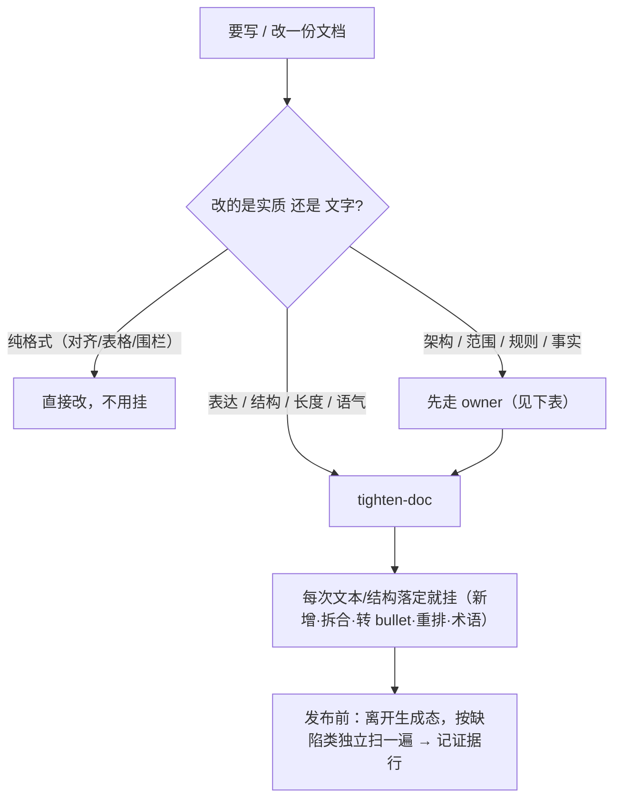

# 写文档与润色手册

> **何时找它**：文档怎么写、表达、结构、润色、去废话、AI 味、成文交付。文字质量这一层归 [`tighten-doc`](../skills/tighten-doc/SKILL.md)；文档的**实质内容**仍先走 owner。
>
> 一句话：**实质先走 owner，文字层走 tighten-doc，发布前再扫一遍。**

## 先分清：实质 vs 文字

`tighten-doc` 只做发布前的文字质量这一层，不替你定实质——按下图分流：

## 实质归谁

`tighten-doc` 接手之前，文档的实质得有 owner：

| 要写的东西 | 实质 owner |
|---|---|
| PRD / 需求文档 / 用户故事 / 验收标准 | `requirement-doc-writer`（需求还没澄清先走 `requirement-intent`）|
| 上线文档 / 发布说明 / 发布证据 | `release-doc-writer` |
| 技术方案 / spec / 计划 / 跨阶段交付材料 | `product-rd-workflow` |
| 测试用例文档 | `test-artifact-management` |
| 复盘 / 沉淀 / 技能改动 | `skill-extraction-workflow` |
| 调研简报 | `multi-perspective-research` |

## 什么时候挂 tighten-doc

owner 把实质定了之后，**每次交付文本/结构落定就挂**——不是只初稿挂、也不是每个 turn 机械挂。触发：

- 新增/删/拆/合并段落或列表项。
- 加标题/callout。
- prose ↔ bullet/编号 互转。
- 重排章节。
- 引入/重命名术语。

**免挂**：纯错字/链接/格式；以及同一工作流内已过 rubric、受众/发布面没变的搬运。

## tighten-doc 去什么

- 废话、填充词、套话。
- 元叙述（"在本节中我们将…"这类自我交代）。
- 重复、冗余。
- AI 味（过度礼貌、排比堆砌、空洞总结）。
- 啰嗦——在不丢决策的前提下变短、变清楚、面向读者。

它对协作文档（飞书/Lark）有 comment-safe 编辑规则，不破坏批注锚点。

## tighten-doc 怎么成文（FORM）

去废话是减法，下面是加法——同样是 `tighten-doc` 的一部分：

- **命名超链接，不裸 URL**：`[真实文档名](url)`，别贴一长串链接。
- **一点一行**：枚举拆成多行 bullet 或表格，别用 `；` 压成一长串。
- **术语首次出现就 gloss 一次**：面向读者（默认：没上下文的新同事）；协议名/字段名/契约名等保留，只解释读者不懂的。
- **结论前置（BLUF）**：bullet/段落开头先放结论/动作，例子和背景后置——但**改变结论的条件**（红线/阈值/例外）要和结论同句，别降级到后面或塞括号弱化。
- **主动语态、具体优于空泛**：写"谁做什么"，用数字/对象/阈值，删"全面提升/大力推进"这类空话。

## 发布前扫读

任何要给别人读的交付文档（spec、技术设计、SOP、模板、检查表、报告、任务卡、上线材料），在**分享/发布/同步/提 MR 前**确认这一轮过了 tighten-doc，记一行证据（模式、文档、应用或 no-op 原因），或记显式 waiver。实质评审（codex review、工程评审）可以顺带提可读性，但**不替代** tighten-doc 这道专门的可读性扫读。

> **扫读是和起草分开的一遍**：边写边顺手扫不算——离开"生成态"，把改动块当陌生人刚贴进来，按缺陷类（结构+跨节重复 / 句子精简+去夹生 / 脏扫）各扫一遍。"我跑了 tighten" 却还在生成态 = 没做这道扫读。可证伪标准：读者下一句单贴还能挑出同类残留，就是没扫到。

## 走查示例：把一份方案初稿发出去

1. 实质：方案的架构/范围 → 先走 `product-rd-workflow` 或上表对应 owner 定稿。
2. 文字：定稿后挂 `tighten-doc` 去废话、理结构、统一术语。
3. 发布前：再扫一遍，记证据行。
4. 同步飞书：comment-safe，不动已有批注。

## 延伸阅读

- [`tighten-doc` 技能](../skills/tighten-doc/SKILL.md)
- [复盘与沉淀/迭代技能手册](skill-extraction-handbook.md)（复盘成文的实质归它）
- [`CONTRIBUTING.md`](CONTRIBUTING.md) docs 改动段
