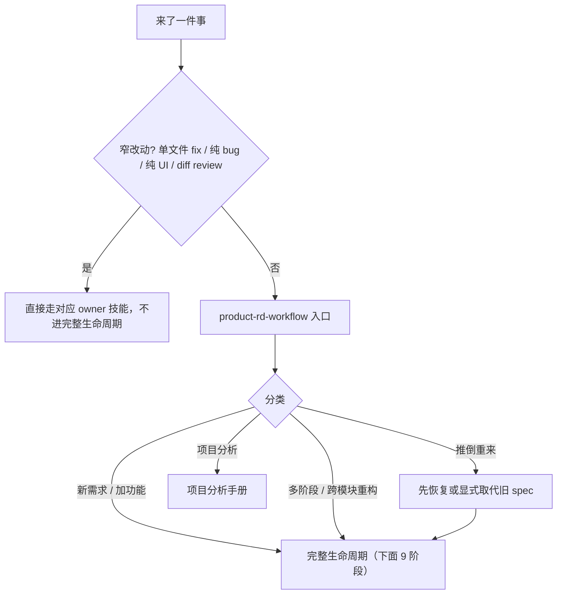
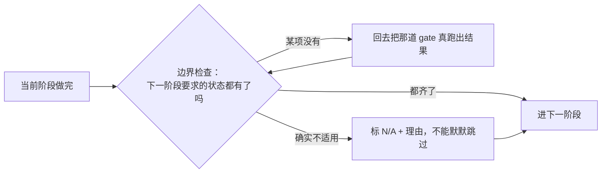
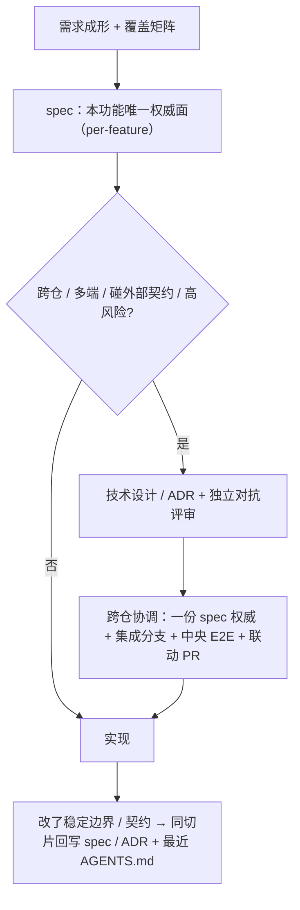
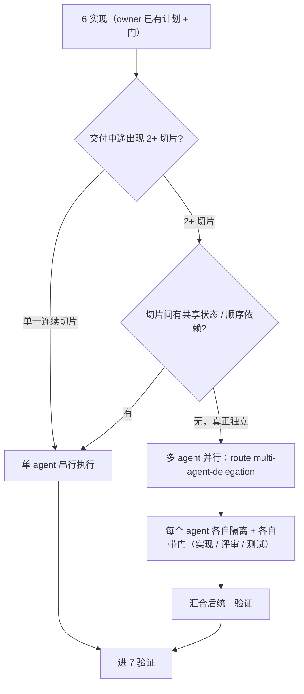

# 做需求 / 加功能 / 重构手册

> 入口是 [`product-rd-workflow`](../skills/product-rd-workflow/SKILL.md)——它不替你写代码，而是**分派**设计/架构/dev/测试/发布到对应技能、持有生命周期门。权威门禁与模板以该技能为准，本手册是操作视图。

## 什么时候用

- 加功能 / 新需求 / 实现某能力。
- 多阶段或跨模块重构、推倒重来。
- 质量专项 / 工程质量基线整治（多阶段、跨切面，不是单个 bug/重构）——也从这进，再分派各阶段。
- 不确定该组合哪些设计/开发/测试/评审/发布技能。

**不要**为了图快直接抓栈技能（一看到 React 就 `web-react-dev`）——先走入口判断要不要走完整生命周期（窄改动直接走对应 owner，见下图）。

## 流程速查

| 阶段 | 出什么 | 不过不进下一步的硬线 |
|---|---|---|
| 1 分类 | 这是新需求 / 重构 / 项目分析 / 高风险改动？ | 重启/推倒重来要先恢复或显式取代旧 spec，不许凭记忆裸跑 |
| 2 需求成形 | 用户工作流、成功标准、非目标、约束、验收检查（窄产品产物见下表）| 验收口径不清不进实现 |
| 3 风险定级 | 走 `feature-risk-router`：风险标签 + 必跑/可跳门禁 | 碰钱/权限/数据隔离/写终态/AI 高影响 → 必须先定级 |
| 4 设计 | 可见界面：UI/UX 设计检查点；跨仓/多端/契约：技术设计评审 | 高风险或跨外部消费者契约缺技术设计 = 流程缺陷 |
| 5 计划 | 任务拆分、test-case-first、验证命令、停止条件 | 多步改动没计划不许动代码 |
| 6 实现 | 路由到对应栈技能（见下）| 在独立 worktree 上，不在 main |
| 7 验证 | 按层报告：unit/集成/E2E/手动/build；独立评审走 `code-review` | 无证据不声称完成；改了行为必须有测试 |
| 8 发布 | 灰度/回滚/可观测策略见平台基建手册；发版执行走 `release-coordination`；发布文档正文走 `release-doc-writer` | 回滚预案没定不放量；发版按 `release-coordination` 走，不手工绕 |
| 9 收尾 | 可复用教训路由到提炼技能 | — |

技能内部按 7 个阶段管边界（需求成形 · 设计就绪 · 架构 · 实现 · 评审 · 发布 · 学习），每跨一次边界要走一遍**边界检查**——阻断式的，不是参考清单：

> **只有 gate 的真实产出算数。** 指向那道 gate 的指针不算、"我考虑过了"不算、自己写个 `N/A` 标签也不算——得真去跑那道 gate、拿到它的决定或证据。

三道容易被跳过的边界门：

| 门 | 什么时候撞上 | 它拦什么 |
|---|---|---|
| **实现入口 / 重入门** | 要开始写代码，或中断后要接着写 | 凭记忆裸跑。恢复交付得先确认接的是哪份持久件，不是靠上下文摘要 |
| **完成证据门** | 你想说"完成 / 修好了 / 通过了" | 没亲手跑过验证就下这个结论 |
| **收尾续做门** | 一个切片落地或挂成待审 MR 之后、给出最终回复前 | 落一半就收工；要么明确继续下一切片，要么给出具体的停止理由和查过的证据 |

## 需求成形：覆盖矩阵

多功能点的需求，成形时列一张「点 × 可观测验收 × 非目标」覆盖矩阵：

- 行 = 每个功能点 + 它碰的风险点（越权 / 数据隔离 / 部分失败 / 幂等 等）。
- 每点都要有**可证伪**的验收口径（"功能正常"这种不算）；没验收口径的点不进实现。
- 往下喂 `testing-strategy` 的场景/风险矩阵（覆盖 → 在哪层怎么测）；灰度 / 定级归 `feature-risk-router`。

> 门是"覆盖存在"，不是每次造新表：已有 spec 覆盖了就**逐点引用**（点名哪节覆盖哪点），只补缺的点。

| 点 | 可观测验收（pass / fail） | 非目标 |
|---|---|---|
| 功能点：按角色筛选导出 | 导出行集 = 筛选全集（非当前页）；fail = 忽略筛选导全表 | 自定义列 / 多格式不做 |
| 风险：越权 | 无权限账号直接打接口 = 拒绝、不出文件 | 复用 / 新增导出权限待定 |
| 风险：数据隔离 | 跨租户请求只出本域数据 | 单租户则标 N/A |
| 风险：部分失败 | 大导出中途失败 = 任务标 failed 可重试，不交付静默截断的文件 | 自动 vs 手动重试待定 |

（上表为示例）

## 从 spec 到实现：设计链 + 跨仓协调

本功能的**目标**只有一份权威面——per-feature spec（别在多个仓各写一份）。但**跨仓共享的契约是另一回事**：它独立于 feature spec，放中立仓 / 发布产物，每个消费者按显式版本 + 兼容策略消费，不归某个实现仓"所有"。跨仓 / 多端 / 外部契约 / 高风险才追加**技术设计 / ADR**（ADR = 有日期、不可变、可追溯的架构决定记录），过独立对抗评审；高风险钱 / 权限 / 数据路径要人审签字。

> **跨仓协调看什么**：不是"哪些仓改了"，而是契约 / 数据 owner、消费+产出的契约版本、兼容与版本错配策略、回滚 / 晋级 owner、中央集成验证（且要绑当前版本组合，别拿别的组合的旧 E2E 充数）。
> **三个易错点**：
> ① 外部 / 升不动的消费者（公开 SDK、移动端、合作方、长活 worker）要给**兼容窗口 + 弃用策略**，别假设同节奏升级；
> ② "done"是**分阶段**的：代码合 → 契约生效 → 流量放开 → 功能完成，一句"已合"会掩盖只放了一半；
> ③ schema / 已发布 / 有状态的改动**回滚不是原子的**——要前向兼容 + 迁移顺序，不是"回滚清单了事"。
> **已实现 vs 目标**：现在靠 spec / ADR / 契约同步门 + worktree 隔离 + `multi-agent-delegation` 分发；"自动认仓 / 每仓自动隔离"是目标、还没成熟工具链。

## 入口怎么分派

| 你的工作 | 路由到 |
|---|---|
| 架构/服务边界/契约 | `go-microservice-architecture` / `python-service-architecture` |
| 后端实现 | `go-microservice-dev` / `python-service-dev` |
| React Web | `web-react-dev` |
| App | `app-cross-platform-dev` |
| 小程序 | `miniapp-product-dev` |
| 终端/CLI/TUI | `terminal-cli-dev` |
| UI/UX 设计 | `product-ui-ux-design` |
| LLM/算法 | `llm-inference-integration`（+ 算法上线手册）|
| 测试层 / 用例 | `testing-strategy` + `test-artifact-management` |
| 平台连通/观测/发布策略 | `platform-*`（见平台基建手册）|
| 生产发版执行 | `release-coordination`；发布文档正文 `release-doc-writer` |
| 独立代码评审 / 唱反调 | `code-review` |

**需求还没成形时**，别一头扎进整条生命周期——先用窄 owner 把要什么问清楚，产物回到阶段 2：

| 你手上的状态 | 路由到 |
|---|---|
| 需求含糊、只有会议记录 / 一句话意图 | `requirement-intent` |
| 想被逐题拷问、压力测试方向 | `grill-me` |
| 不清楚现在系统到底有什么 | `requirement-baseline` |
| 要划改动范围 / MVP 边界 / 版本切片 | `requirement-scope` |
| 要落成一份 PRD | `requirement-doc-writer` |
| 要先做主题/领域调研再谈方案 | `multi-perspective-research` |

栈实现细节见 [后端服务开发手册](backend-dev-handbook.md) / [客户端开发手册](client-dev-handbook.md)。

## 实现阶段：单 agent 还是多 agent

默认单 agent 串行。只有交付中途冒出 **2+ 个真正独立**（无共享状态、无顺序依赖）的切片、且 owner 已有计划和门时，才拆给 `multi-agent-delegation` 并行。**有共享状态或顺序依赖就退回串行**，别为并行而并行。

## 关键门禁

- **test-case-first**：行为改动默认先写用例、跑 RED，再写实现。已经先改了代码才发现 → 停下补用例，如实报告，不许声称走了 TDD。
- **推送前跑绿**：非 UI 改动也要在最终推送态跑绿对应测试层，才推共享分支 / 开 MR（"完成/修好/通过"怎么才算数，见上面的完成证据门）。
- **可见 UI 验收**：可见 UI 改动 commit/MR 前要在真实浏览器/预览/截图里对着设计检查点走查过。

## 走查示例：给一个列表加"批量导出"

1. 入口 `product-rd-workflow` → 这是加功能，走完整生命周期。
2. 需求成形：谁用、导出什么格式、数据量上限、失败怎么提示。
3. 定级 `feature-risk-router`：批量 + 可能碰用户数据 → 中风险，需测试矩阵；不碰钱/权限。
4. 设计：列表加入口按钮 + 导出中/成功/失败状态 → `product-ui-ux-design` 出状态检查点。
5. 计划：worktree 隔离、test-case-first（导出成功/超量拒绝/失败重试三个用例）、验证命令。
6. 实现：前端 `web-react-dev` + 后端导出接口 `python-service-dev`。
7. 验证：unit（导出逻辑）+ 集成（接口契约）+ 浏览器走查三个状态。
8. 收尾：若发现"批量操作无上限"是通用坑 → route 给 `feature-risk-router` / 提炼技能。

## 延伸阅读

- [`product-rd-workflow` 技能](../skills/product-rd-workflow/SKILL.md)
- [风险定级与平台基建手册](platform-infra-handbook.md)
- [写测试与测试用例手册](testing-handbook.md)
- [架构总览](ARCHITECTURE.md)
