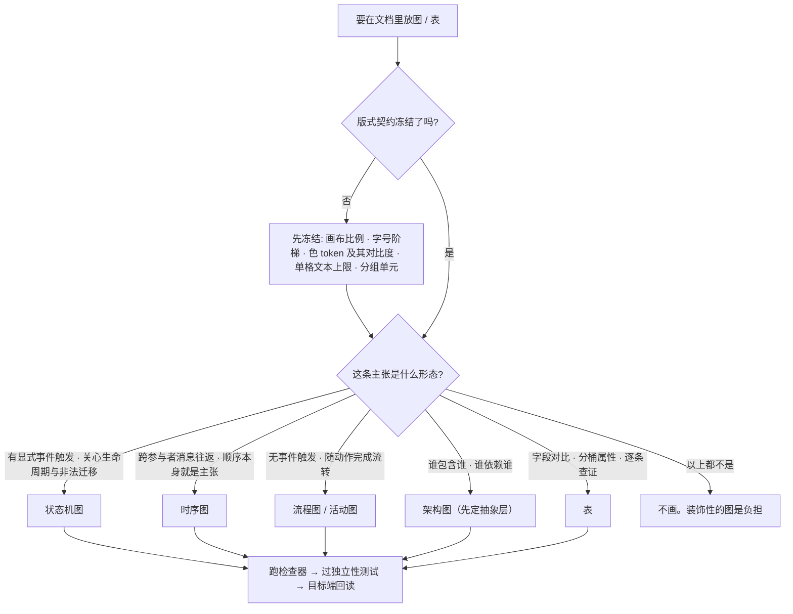

# 图与表手册

> **何时找它**：文档里要画图、要放表，或者图画完总觉得不对但说不上哪不对。
> 判据本体在 [`tighten-doc/references/figure-and-table-craft.md`](../skills/tighten-doc/references/figure-and-table-craft.md)，
> 本文是人读入口；文字层归 [写文档与润色手册](doc-writing-handbook.md)，族与候选图归
> [`deliverable-doc-genre-skeletons.md`](../skills/tighten-doc/references/deliverable-doc-genre-skeletons.md)。
>
> 一句话：**版式先冻结、图种由主张定、能机械判的交给脚本、剩下的靠一个测试——脱离正文看得懂吗。**

## 起草期的顺序

顺序不能倒。**在版式未冻结时画的图，会被下一次内容变动整个推翻**——账上记成"调图"，实际是重画。



*图 1：起草期判定顺序。版式契约是前置条件而非收尾工作；图种由**要承载的主张的形态**推出，不由文档类型或习惯决定。*

## 三条最常被问倒的规则

| 规则 | 依据档 | 说明 |
|---|---|---|
| 图种由主张形态定，判别式是**有没有显式事件触发** | `[外]` | UML 2.5 图种语义。没有时间顺序不画时序图，没有非法迁移不画状态机 |
| 画了就必须有**标题与图例**、**每条线单向且标签具体** | `[外]` | C4 记法。禁 `Uses`/`调用`/`依赖` 这类单词标签 |
| 正文对底 **≥4.5:1**，大字（≥18pt 或 ≥14pt 粗）**≥3:1** | `[外]` | WCAG 2.2 SC 1.4.3。图里的说明小字最容易违反 |

## 依据分三档，混档就会被问倒

落任何一条图/表规则前先归档。**档位决定它能不能挡住"你这数字哪来的"**。

| 档 | 含义 | 能做什么 | 不能做什么 |
|---|---|---|---|
| `[外]` | 有权威一手源 | 声称行业基线，引用时点名来源 | — |
| `[工]` | 工程约定 + 观测到的失败类 | 防返工、写进团队契约 | **不得声称是业界最佳实践** |
| `[禁]` | 查证后确认无可靠来源 | 挡住别人重新立它 | 不得以任何形式重新引入 |

`[禁]` 档已核实的几条，**勿再立**：加粗/高亮密度；每 N 字一图的图表密度；"一行不超过 40 汉字"引 WCAG（该条原文要求是"提供**机制**让用户改"，且 CJK 40 是从拉丁文 80 折半推导）；"句子不超过 25 词"；"留白提升理解约 20%"。

**同体裁实测分布 ≠ 规范阈值**：可以说"本稿在同体裁公开样本分布的哪个位置"，不能由此推出"写得好"。

## 两个检查器各管什么

```
python3 skills/tighten-doc/scripts/figure-lint.py <svg 目录或文件>
python3 skills/tighten-doc/scripts/doc-lint.py   <文档.md>
```

| | `figure-lint.py` | `doc-lint.py` |
|---|---|---|
| 对象 | SVG | Markdown 的表格与结构 |
| 阻断项 | 缺标题、文本溢出、卡片未分组、契约偏离、几何非法 | 假表头、图文引用悬空、读取失败 |
| 非阻断项 | 缺图例、连线无标签、底色不可解析 | 数值列无单位、该出图却压成表、载体偏表 |
| 不管 | 图种选得对不对、图注写的是不是主张、独立性验收 | 文字质量（归 `tighten-doc`） |

**缺图例与连线无标签为什么不阻断**：C4 的规则本身是 `[外]`，但用**邻近距离与色块计数**去认它是 `[工]` 代理，实测两个方向都会错——两条目的合法图例会被拒，注释里出现 `legend` 字样又会放行。代理不该挡别人提交。要恢复阻断需**结构化关联**（契约声明的组 / `aria-labelledby` / `textPath`），不是把阈值调准。

## 唯一的图级验收测试

> **这张图能不能脱离正文被独立看懂？**

可判定：把图单独发给没读过正文的人，他能否说出**图在主张什么**。不能，就是图没画完。

图注承担这个测试的一半——**图注写图在主张什么，不写图里画了什么**。"图 1：系统架构"是废话；"图 1：入口层与 API 路径分离，AI 能力跨云调用不与主云绑定"才是主张。

## 检查器不可信的三种情况

1. **本地绿不等于目标端绿。** 推送到会重排 z 序的目标端时，未分组的「形状 + 文字」可能被矩形盖住字，而本地渲染全绿——**验收以目标端回读为准**。
2. **报出的数是下界不是全量。** 连线标签检测靠邻近，中点附近的分区标题会掩盖未标注的连线。
3. **底色解析不了时它会说出来**（`CONTRAST-UNSUPPORTED`），此时依赖几何的判据全部跳过——**不要把"没报错"读成"没问题"**。

## 走查示例：给一份方案配图

1. **冻结版式**：写 `figure-contract.json`（画布比例、字号阶梯、色 token 及各自对比度、单格文本上限、分组单元）。契约缺失本身是缺陷——一致性不可判定。
2. **按主张选图种**：有部署差异才画部署图，有跨组件时序才画时序图，**没有就不画**。
3. **画，并写主张式图注**。
4. **跑检查器**，ERROR 必修，WARN 人工判。
5. **过独立性测试**：单独看这张图，说得出它在主张什么吗。
6. **目标端回读**：推到飞书/wiki 后回读确认，不认本地渲染。

## 延伸阅读

- [判据本体 `figure-and-table-craft.md`](../skills/tighten-doc/references/figure-and-table-craft.md)（含检查器自身的规则与已删除谓词的记录）
- [写文档与润色手册](doc-writing-handbook.md)（文字层）
- [`deliverable-doc-genre-skeletons.md`](../skills/tighten-doc/references/deliverable-doc-genre-skeletons.md)（哪个族画哪几张图）
