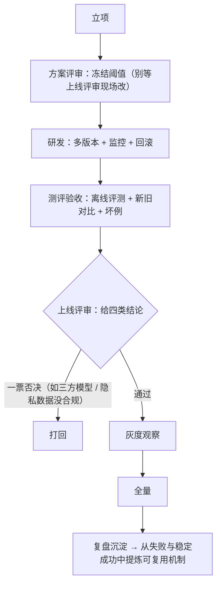

# 接入 LLM / 算法能力与上线手册

> **何时找它**：接 LLM、大模型怎么调、提示词、RAG、工具调用、模型评测，以及算法能力上线。
> - 工程接入入口：[`llm-inference-integration`](../skills/llm-inference-integration/SKILL.md)
> - 算法上线门禁/材料：已有专门的 [算法服务上线手册](algorithm-service-launch-handbook.md)（本手册做入口串联，不重写）

## 什么时候用

- 接入或迭代任何 LLM / 推理能力（完整覆盖见下「覆盖什么」）。
- 一个算法能力要进研发或上线（新能力或迭代）。

## 两条线，别混

| 你的问题 | 去哪 |
|---|---|
| 工程上怎么接 LLM、prompt 怎么写、RAG 怎么搭、流式/缓存/评测怎么做 | `llm-inference-integration` |
| 这个算法能力能不能上线、要哪些材料、走哪些门禁 | [算法服务上线手册](algorithm-service-launch-handbook.md) + `product-rd-workflow` 算法上线门 |
| 让 OpenCode/Codex/Claude 帮我生成或核查上线材料 | [使用 CCL Skills 辅助算法上线手册](algorithm-service-launch-with-skills.md) |

## llm-inference-integration 覆盖什么

模型调用、prompt 工程、RAG、agent/工具调用、model-routing、streaming、评测（eval）、replay、shadow、token 成本控制、批量推理、推理侧可观测。

另外两块容易被漏掉、但同样归它：

- **统一 LLM 网关/客户端**：所有模型调用走一个小网关，不散在 handler 和领域服务里；网关收敛类型化消息、模型选择、响应模式、超时、trace/request id 和工具 schema。
- **推理容量运营**：就绪判定、注册时机、容量与降级。**服务要在真正 ready 之后才注册或对外声明**——进程起来了、路由建好了都不等于模型已加载可服务，拿这些当就绪证据是典型的上线即报错。

> **搭 agent 运行时**（不只是调模型）是独立的大块：要**按层验收**（启动/路由 · 会话 · 每轮 model loop · 工具执行 · 权限决策 · 持久化/恢复 · 沙箱），并拿代表性 turn 走通 **allow / deny / resume / 动态换工具** 四条路径。细节见技能的 `agent-*` references。

几条贯穿纪律：

- **检索/工具/模型输出都当不可信数据**：用户上传、检索到的文档、网页内容、工具结果、模型输出，在校验前都不可信——用于**有权限的动作前**先过信任边界（防 prompt 注入 / 越权 / 数据外泄）。安全 / 鉴权 / 数据完整 / 工具执行边界一律 **fail-closed**，只有非关键遥测/日志可 fail-soft。
- **高风险 AI 输出**：产品先定义可见的降级/拒绝行为和客服解释，工程再实现 fallback/重试/降级；高影响路由的 fallback 要有质量等价证据或合规批准，否则明确拒绝/降级，别静默降到差模型。
- **评测先于上线**：模型/prompt 改动要有离线评测基线 + 新旧对比，不能只看 happy-path；上线看**业务核心指标不降**，不是子算法局部指标涨就上。
- **优化器/自动改 prompt 的产物是不可信输入**：要过 heldout / 安全 review / trace PII 审计 / 契约保持 / 人审 PR，再采纳。
- **token 成本和延迟**是工程基线的一部分，不是上线后才看。

### 模型输出进入客户端时的五阶段交付

Prompt、model/tool output、citation/provenance、拒绝/降级文案、streaming 状态、权限/能力、默认值或结果形状若可能改变客户端呈现、动作或决策路径，先用 manifest、契约、发布目标和仓库清单建立完整 consumer universe；只搜推理仓零命中不算证明。

- 已知受影响消费者：先按 [`delivery-contract.md`](../skills/product-ui-ux-design/references/delivery-contract.md) 建完整或低风险纯文案设计记录，由 `testing-strategy` 给 Phase 0；`llm-inference-integration` 回传 prompt/model/tool 等 `producer_record` 与不可变 binding，每个受影响客户端回传自己的 member 和实际执行的 producer member/version；Phase 1 聚合 design/test/producer/client 集合判充分性，设计 owner 再给 verdict。
- universe 或成员不完整/不可访问：记 `unknown-consumers`、缺口 owner/动作，保持 `pending + blocked`；不能用离线 eval、模型服务 ready 或生产者日志关闭客户端缺口。
- 只有全集证明输出不会被任何客户端渲染或用于状态/动作/决策时，才走 inference/backend-only；产品含义仍交 product owner，API/log/output 验证和全集证明交 `testing-strategy`。inventory 不是行为验证。

## 算法上线（串联已有手册）

算法能力上线是一条有门禁的链，权威在 [算法服务上线手册](algorithm-service-launch-handbook.md)：

三类上线证据：产品证据（目标/业务基线/边界）、测评证据（报告/数据集/对比/坏例）、上线证据（多版本或灰度/归因/监控/回滚授权/风险 owner）。一票否决项见 SOP。

## 走查示例：给搜索接入语义重排

1. 工程接入 `llm-inference-integration`：embedding + 重排模型、缓存、token 预算、降级（模型挂了回退原排序）。
2. 评测：离线 heldout 集对比新旧排序质量，确认业务指标不降。
3. 上线判断：这是算法能力上线 → 走算法上线手册：方案评审冻结阈值、灰度观察、四类结论。
4. 可观测：加重排延迟/降级率指标和告警（平台基建手册）。
5. 复盘沉淀：同时检查失效与稳定成功，把可复用机制交给提炼技能判断应保持、合并、移位还是新增。

## 延伸阅读

- [`llm-inference-integration` 技能](../skills/llm-inference-integration/SKILL.md)
- [算法服务上线手册](algorithm-service-launch-handbook.md) · [使用 CCL Skills 辅助算法上线手册](algorithm-service-launch-with-skills.md)
- [平台基建手册](platform-infra-handbook.md)
