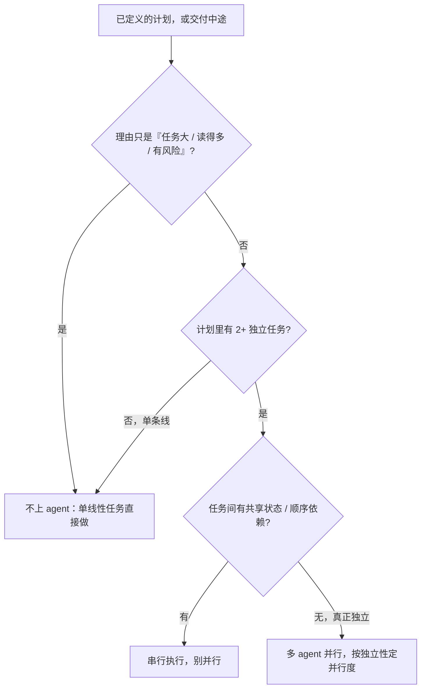
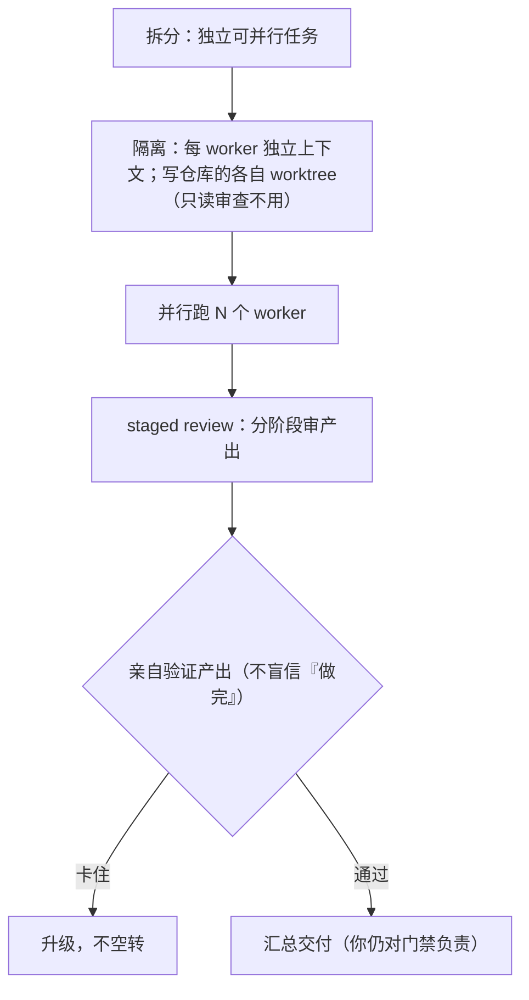

# AI agent 委托与并行执行手册

> 域专题：用 AI agent / 子 agent / 并行 worker 执行一个已定义的计划。入口 [`multi-agent-delegation`](../skills/multi-agent-delegation/SKILL.md)。
>
> 关键区分：**agent 委托是为了"分发执行"，不是为了"更安全"或"任务大"**。

## 什么时候用

- 一个**已经定义好的计划**里有多个独立、无共享状态、无顺序依赖的任务。
- **交付中途**冒出 2+ 个真正独立的切片（只读审查角度、或写作用域不相交的按仓/按模块改动）——这也是时机，不只"一上来就规划好"。**最常见的漏判就是没注意到活中途变得可并行了。**
- 明确说"并行跑几个 agent / 让子 agent 做 / 拆给多个 agent / 分发"。

**不要**因为任务大、读得多、或"有风险"就上 agent——单条线性任务直接做，别加分发开销。

## 和生命周期门的分工

| 谁 owns 什么 |
|---|
| `product-rd-workflow` owns 生命周期门和验收边界 |
| `multi-agent-delegation` owns 执行配方：拆任务、隔离上下文、决定并行度、staged review、验证 agent 产出、阻塞升级 |

即：**先有计划（product-rd-workflow / 写计划技能），再用 multi-agent-delegation 分发执行**，不是用 agent 替代计划。

## 流程速查

| 阶段 | 做什么 | 硬线 |
|---|---|---|
| 拆分 | 分解成独立、可并行的任务 | 有共享状态/顺序依赖的别并行 |
| 出境检查 | 检查即将放进 worker prompt 的计划、需求、状态、复盘、任务卡及其派生文本 | 先过 artifact-egress 保密闸；能力收口不能清除已经发出的敏感内容 |
| 派活 | 每份 worker brief 带可执行的 owner 契约：`required_skills: [ccl-skills:<owner>, …]` | 取够用的最小集；派之前 controller 自己先把 owner 选对，别让 worker 猜 |
| 隔离 | 每个 worker 独立上下文 | **要改仓库**的各自 worktree，只读审查不用（见隔离手册）|
| 角色边界 | 默认 worker 是不能继续委托的叶子 | 只有显式提升为 orchestrator，并给出深度上限、子任务范围和 transcript 回传，才可再委托 |
| 并行度 | 按独立性决定并行数 | — |
| staged review | 分阶段审查 worker 产出 | — |
| 验证 | 亲自验证 agent 的产出，不盲信 | 自由格式 reviewer 必须返回 `verdict_scope` 和 `cannot_verify`；包外义务仍由 controller 验证 |
| 升级 | 卡住就升级，不空转 | — |

## 关键纪律

- **并发隔离**：多个 worker 改同一仓库要各自 worktree/clone，不能共享一个工作树（见 [隔离开发手册](worktree-isolation-handbook.md)）；只读审查 worker 不改仓库、不用 worktree。
- **能力收口（不只上下文隔离）**：给 worker 只配它任务需要的能力，默认**拒绝**副作用/持久写/跨系统/密钥读/再委托/自由代码执行。上下文隔离限制它"看到什么"，能力收口限制它能"搞坏什么"。
- **先检查 prompt，再谈能力**：计划、需求、状态、复盘、任务卡、finding 或 review packet 进入 worker prompt 前，先走 `product-rd-workflow` 的 artifact-egress 保密闸，处理凭据、PII、客户数据、未公开策略、NDA 内容和带负面判断的实名信息。工具 allowlist 只约束派出后的读取与动作，不能撤回已经写进 prompt 的内容。
- **委托是 turn 内、易孤儿**：默认子 agent 只活在当前 turn；中断父 agent **不保证子停了**（可能孤儿还在跑），且它已产生的副作用（文件/git/产物）会留下——中断后先确认它真停了、核对它的写作用域再继续。要跨 turn 存活的活走持久机制（调度任务/队列/受管后台进程），不是默认 subagent。
- **owner 契约要真被加载，不是写上就算**：brief 里列了 `required_skills`，worker 得在动实质活之前真的加载它们。宿主有机械兜底——派子 agent 时注入冷启动提醒、收尾核对 worker 有没有真调过技能——但兜底不替代你把 owner 选对。
- **技能没加载上是 controller 自己补，不是找用户**：发现 worker 没走 owner 技能，controller 重新派或补上下文，别把这事升级成"请用户确认"。
- **叶子 worker 不再往下委托**：优先用宿主能力关闭委托工具，并核对生效后的 tool set；只有显式把 worker 提升为 orchestrator，同时写定深度上限、子任务范围和 transcript 回传，才允许下一层。只在 prompt 里写“不要再派”不算能力隔离。
- **验证 agent 输出**：子 agent 的产出和 LLM 输出一样是假设级，要独立验证，尤其声称"通过/完成"时。
- **评审结论有覆盖范围**：自由格式 reviewer 的返回必须显式包含 `verdict_scope` 与 `cannot_verify`，缺一项就不是完整评审——而且这句话本身只是散文，没有解析器会替你挡：**缺任一项时由 controller 按 `INCONCLUSIVE` 处理并重派，不得读成 pass**。判据落在 controller 的收敛逻辑上，别指望 reviewer 自觉。没有随 packet 提供的需求、未改代码中的义务和被保密闸删减的内容，默认仍由 controller 核验，不能因 reviewer 没提而算通过；受约束 wrapper 则遵守自身 pass-record 契约。
- **"卡住 / 复现不了 / 环境不可用" 是放弃声明，不是结果**：跟"验证 agent 输出"不是一回事——那条防的是假成功，这条防的是把放弃当结论收下。收到这种回复要自己核一遍：到底是环境问题，还是任务没做。
- **读 worker 返回时防静默截断**：大段 diff / 报告经过只留头尾的工具读进来，看着是完整的、中间那截没了。要核的返回按段读或落盘再读，别拿被截断的内容下判断。
- **委托不等于免责**：你仍对最终交付和门禁负责，agent 只是执行者。
- **持久件锚定**：委托进度锚到 `multi-agent-delegation` 的持久件，别只靠对话——子 agent 上下文是隔离的。

## 延伸阅读

- [`multi-agent-delegation` 技能](../skills/multi-agent-delegation/SKILL.md)
- [隔离开发与协作纪律手册](worktree-isolation-handbook.md) · [做需求/加功能/重构手册](feature-delivery-handbook.md)
- 若装了 `superpowers:dispatching-parallel-agents` / `subagent-driven-development`，可交给这些技能生成执行配方
