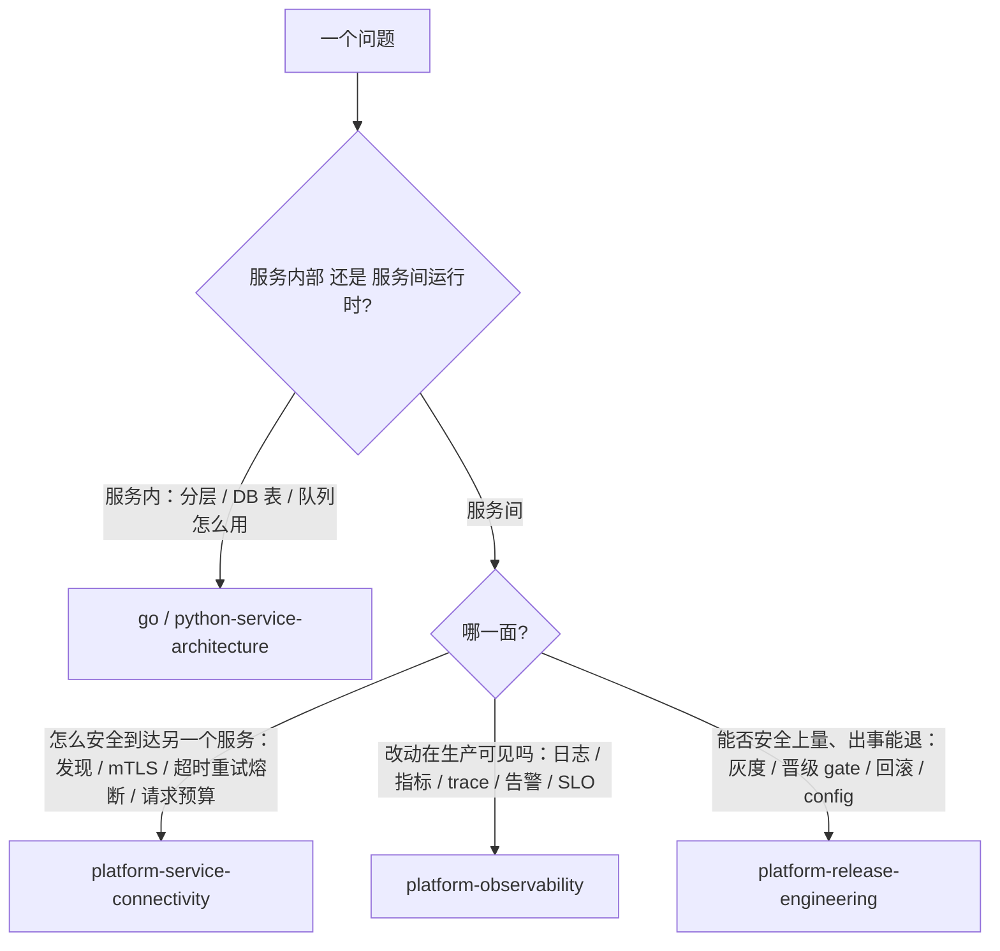
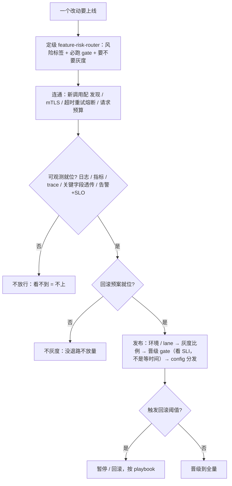

# 平台基建手册（连通 · 可观测 · 发布回滚）

> **何时找它**：服务怎么互相调、怎么观测、怎么安全发布上线和回滚，以及发布前要不要灰度/走哪些 gate。三个平台技能 + 风险定级横切门。
>
> 一句话边界：**服务内部架构（HTTP/RPC/DB/队列）归后端架构技能；服务间运行时（连通/观测/发布）归平台技能。**

## 三个技能各 owns 什么

| 技能 | owns 的问题 |
|---|---|
| [`platform-service-connectivity`](../skills/platform-service-connectivity/SKILL.md) | 一个请求怎么跨服务、跨环境安全到达另一个服务：mesh、服务发现、mTLS、重试/超时/熔断、请求预算、多环境流量整形（lane/canary/shadow）、传播 correlation 的客户端/服务端中间件 |
| [`platform-observability`](../skills/platform-observability/SKILL.md) | 改动在生产可见吗：日志、指标、分布式 trace、log/trace 关联、dashboard、告警、on-call、SLI/SLO、错误预算；哪些字段必须透传、哪些中间件必须自动接 |
| [`platform-release-engineering`](../skills/platform-release-engineering/SKILL.md) | 改动能不能从 build 安全走到流量、出问题能不能退回来：环境/lane 矩阵、灰度、蓝绿、镜像/影子、晋级 gate、回滚 playbook、密钥分发、动态 config vs 静态 config、镜像构建、多集群/多区域 |

横切门 [`feature-risk-router`](../skills/feature-risk-router/SKILL.md)：发布前判断风险标签、要不要灰度、必跑哪些 gate。它不执行 gate，只点名。

**发布的"机制"和"这一次发版"是两个 owner**：

- 怎么灰度、怎么回滚、晋级 gate 怎么设计 → `platform-release-engineering`
- 真要发这一版（上线范围、合并 main、打 tag、生产构建、pipeline 证据、交接 watcher、发布后 reset）→ [`release-coordination`](../skills/release-coordination/SKILL.md)
- 上线文档 / 发布说明正文 → [`release-doc-writer`](../skills/release-doc-writer/SKILL.md)

## 边界：什么归平台、什么归服务架构

最常混的是"服务内 vs 服务间"——按下图认 owner：

跨语言契约：路由到拥有被改边界那一侧的架构技能。

## 流程速查（发布一个改动）

| 阶段 | 做什么 | owner |
|---|---|---|
| 定级 | 风险标签 + 必跑 gate + 要不要灰度 | feature-risk-router |
| 连通 | 新服务/新调用：发现、mTLS、超时重试熔断、请求预算 | service-connectivity |
| 可观测 | 上线前确认日志/指标/trace 齐、关键字段透传、告警和 SLO 就位 | observability |
| 发布 | 环境/lane、灰度比例、晋级 gate、回滚预案、config 分发 | release-engineering |
| 回滚 | 触发阈值即暂停/回滚，按 playbook | release-engineering |
| 发版 | 上线范围确认、合并 main、打 tag、生产构建、pipeline 证据、发布后 reset | release-coordination |
| 上线文档 | 发布范围、变更清单、验证证据落成文档 | release-doc-writer |

表是线性顺序，下图把两道**阻断门**画出来（observability 不就位不放行、回滚预案先于灰度）：

## 平台默认值：这些已经是这样，不用你自己搭

最常见的误会有两种：把平台已经给的东西又在服务里实现一遍；或者反过来，以为某样东西"应该有"，其实它要显式声明才有。

| 这件事 | 默认是什么 | 你要做的 |
|---|---|---|
| 服务进不进网格 | **默认进**（opt-out 不是 opt-in），pod 自动带 sidecar | 要退出得显式注明并说明理由，不是不管就不进 |
| 服务间加密 | **mTLS 由网格强制**，应用关不掉 | 服务间不许用明文 HTTP/gRPC。本地开发可以不走网格，但构建/预发路径一律带网格测 |
| 服务发现怎么找 | **没有默认**——平台显式选定一种并写下来（注册中心 / k8s 原生 / 混合） | 按选定的那种接，别自己另起一套 |
| 日志 / 指标 / trace | **框架默认接好**，新服务写**零行**观测样板代码 | 发现缺了，去补框架，不是在自己服务里补一份 |
| 敏感信息 | 日志**在发射那一刻**脱敏，不是落库后再洗 | 日志是持久的，密钥一旦发出去就永久泄漏。token 类请求头默认屏蔽 |
| 密钥从哪来 | 部署时或运行时从密钥库取 | **绝不提交进源码仓** |
| 构建产物 | 同样的 `源码@commit + 版本号` → 同样的镜像 | 生产**不用浮动 tag**（`latest`、分支名），用不可变版本号或 digest |
| 日常部署 | 走声明式路径（控制面 API 或 GitOps） | `bash deploy.sh` 只允许用于一次性集群 bootstrap；日常发布还靠脚本的服务是审计和回滚隐患，要标记迁移 |
| 回滚 | 和正向发布**同一个控制面**、一条命令、几分钟内回到稳态 | 目标是上一个已知良好版本（镜像 digest + 配置快照）。需要另一套回滚工具 = 模型本身有问题 |
| 高影响改动 | 审批记录是**发布路径的一部分**，不是发布前的一个步骤 | 生产部署、schema 迁移、网格策略、IAM 变更，部署接口要求先有审批记录（含评审人、风险等级、回滚方案、看过的观测证据）|

> `lane` 不只是"环境的别名"：它是**多环境路由的规范原语**，也是**发布的单位**。真实平台上并存的 lane 远不止 prod / staging / dev——每人一条的开发 lane、每次测试跑一条的 lane、金丝雀切片、影子流量都是 lane，各自带 owner 和过期时间。

上面是三个技能各自 non-negotiable 规则里最常被新人漏掉的部分，不是全集；完整规则集在各技能 SKILL.md 的 Non-Negotiable Rules 节。

## 关键纪律

- **改动可见性是发布前提**：observability 缺失（看不到这个改动在生产的表现）不应放行。
- **回滚预案先于灰度**：没有回滚路径不灰度。
- **动态 config vs 静态 config 要分清**：行为改变的默认值/迁移走 release-engineering。
- **超时预算沿调用链递减**：上游超时 = 调用方 deadline − 安全余量，越往下游越短，防级联雪崩。
- **lane 要穿透每一跳**（含队列边界）：别硬编码集群 URL 绕过 lane 路由，否则多环境流量会串。
- **晋级看 SLI，不是等时间**：把 SLI 查询接进晋级 gate，不达标就拒绝晋级——"等 30 分钟再放量"是猜。
- **边缘不信外部路由/关联头**：lane / log-id 由网关按**认证身份**派生 + 校验，不信外部传入（否则外部能伪造 lane 头钻进灰度子集）；log-id 在边缘生成、全程透传不变。
- **重试要幂等**：跨服务调用/写操作的重试会放大重复副作用，写操作必须幂等。
- **高风险改动**（钱/权限/数据隔离/写终态）：feature-risk-router 标记后，按 `product-rd-workflow` 高风险韧性门走场景矩阵和演练。

## 延伸阅读

- 三个技能 SKILL.md（见上链接）+ [`feature-risk-router`](../skills/feature-risk-router/SKILL.md)
- [后端服务开发手册](backend-dev-handbook.md)（服务内部架构）
- [做需求/加功能/重构手册](feature-delivery-handbook.md)
