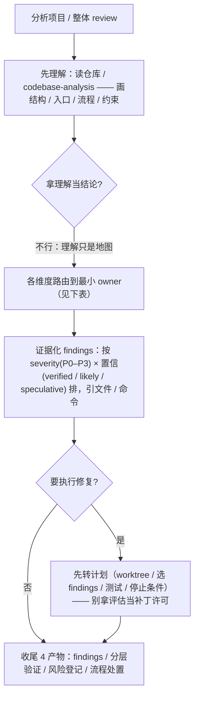

# 分析项目 / 代码库评估手册

> **何时找它**：分析项目、重新分析项目、整体 review（架构/实现/bug/测试/设计一起看）。入口是 [`product-rd-workflow`](../skills/product-rd-workflow/SKILL.md) 的 Existing Project Assessment 路由。
>
> 核心纪律：**先理解，再判断**——理解只是地图，不是结论；每个评估维度路由到最小 owner 技能。

## 什么时候用

- "分析本项目 / 重新分析项目 / 看有哪些做得好做得不好"。
- 整体质量 review：架构、实现、测试、UI/UX、bug、风险一起看。
- 接手一个陌生仓库要快速建立认知。

**别因为是某个单一栈（小程序/Web/Go 服务）就直接换成栈技能**——栈技能只 owns 矩阵里的一行，入口 owns 整张矩阵。

> 若这不是一次性 review、而是**多阶段质量专项**（持续治理工程质量基线），这套评估只是它的 **Phase 0 诊断**；后续按治理程序走（基线 → 止血 → 安全网 → 受控重构 → 固化），见 `product-rd-workflow/references/quality-remediation-program.md`。

## 流程速查

| 阶段 | 做什么 | 硬线 |
|---|---|---|
| 0 保留入口 | 即使前面有"先清理/切分支/装依赖"，做完准备仍回到本入口分类 | 准备动作不能盖掉"整体 review"这个触发 |
| 1 证据边界 | 记仓库路径、栈、本地规则、构建/测试脚本、生成区、读不了/跑不了的部分 | 没先列启动清单（各评估维度点名 owner + 证据边界 + 不可测/收尾边界）= 只是 interim 探索，不算完成 |
| 2 评估矩阵 | 各维度路由到 owner（见下表） | 碰可见界面要加设计行；碰登录/权限/支付要加场景矩阵 |
| 3 证据化 findings | 按 severity(P0–P3) × 置信 两轴排，引文件路径、命令、观察到的输出 | 不把"文档说"升级成"代码做"；不用 build-only 替代断言测试/渲染证据 |
| 4 下一步 | 分快修 / 结构重构 / 测试债 / 产品设计跟进 | 要执行修复时先转计划，别拿评估当补丁许可 |

## 评估矩阵：维度 → owner

| 维度 | owner 技能 |
|---|---|
| 理解结构/流程 | `codebase-analysis`（若装了）+ 直接读仓库 |
| 架构/服务边界 | `go-microservice-architecture` / `python-service-architecture` / `platform-*` |
| 实现质量 | `go-microservice-dev` / `python-service-dev` / `web-react-dev` / `app-cross-platform-dev` / `miniapp-product-dev` / `terminal-cli-dev` |
| 测试拓扑/缺层 | `testing-strategy` |
| UI/UX | `product-ui-ux-design` + 对应客户端技能 |
| bug/风险 | 有症状 → `defect-diagnosis`；无症状 → 标 verified/likely/speculative |
| 发布/运维 | `platform-release-engineering` / `platform-observability` / `platform-service-connectivity` |
| 独立评审 / 唱反调 | `code-review`（换一个模型家族对着 diff 找茬，不替代本表其它行的 owner 判断）|

> **盘的是代码还是产品**：本手册评的是代码库质量。要的是"现在这个产品/流程/页面/接口对外提供了什么能力"这类现状清单（喂 PRD 用），走 `requirement-baseline`，别用质量评估凑。

## 关键纪律

- **别用 `codebase-analysis` 收尾质量评估**：它只 owns 初始结构理解，质量判断走各 owner 技能。
- **findings 两轴排**：severity（P0–P3，后果多大）× 置信（verified 有代码/命令证据 · likely 代码模式推断 · speculative 猜测）。两轴都标，别只说"严重"或只说"可能"。
- **设计行不能被运行时阻塞挤掉**：即使第一批 blocker 是登录/E2E，可见界面仍要有 yes/no 的设计判断和 owner。
- **高后果入口要场景矩阵**：登录/账号/权限/支付不能用"E2E 跑过了"收口；缺恢复/登出清理/权限拒绝/UI 验收要单列。
- **依赖/凭据/设备阻塞**：记下尝试过的补救和残余风险，不是直接标"不可用"。

## 四个收尾产物

完成评估必须给：

1. 项目 findings（分级、引证据）。
2. 按层的验证证据（哪些跑了、哪些 not-applicable/blocked）。
3. 问题/风险登记。
4. 可复用流程处置：要么挂提炼技能落地教训，要么显式记 `unchanged`/`routed`/`discarded`。

报告默认形态见 `product-rd-workflow/references/existing-project-assessment-report.md`。

## 延伸阅读

- [`product-rd-workflow` 技能](../skills/product-rd-workflow/SKILL.md) Existing Project Assessment 段
- [做需求/加功能/重构手册](feature-delivery-handbook.md)（评估后要修时转这里）
- [架构总览](ARCHITECTURE.md)
