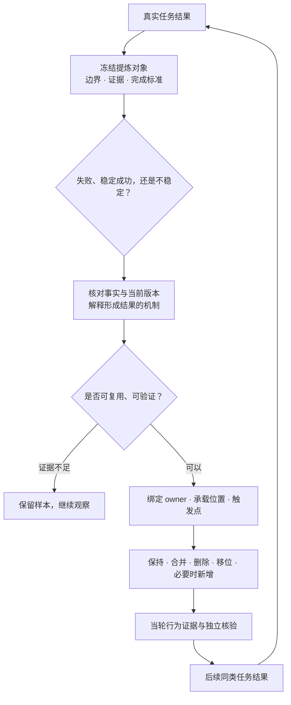

# 复盘与沉淀 / 迭代技能手册

提炼不是把每次经验都写成一条新规则，而是让已经发生的真实结果持续改善下一次同类任务。失败能暴露缺口；稳定、可复现的成功同样能揭示值得保留和复用的机制。写进文件只是记录，接上实际触发点并经后续任务复验，才算落地。

## 复盘同时从失败和稳定成功中学习

| 观察到的结果 | 要回答的问题 | 可能的沉淀 |
|---|---|---|
| 失败、返工或用户纠正 | 哪个判断、约束或验证没有起作用？为什么当时仍显得合理？ | 补足触发条件、验证点或执行约束 |
| 连续多次做得好 | 成功依赖了什么可复用机制，而不是偶然运气？ | 保留有效做法，提升为默认步骤、模板或检查项 |
| 结果不稳定 | 哪些条件变化会让同一做法失效？ | 补清适用边界，或继续观察而不急着改 |

关键不是给结果贴“成功”或“失败”的标签，而是找到对下一次任务仍有解释力、可执行、可验证的机制。

## 提炼是持续迭代，不是从零到一

一个成熟技能的大多数迭代并不是“新增一条规则”。保持有效内容、合并重复、删除无效内容、把内容移到更会被用到的位置，和新增同样重要。

## 先还原结果，再决定是否改技能

1. **冻结提炼对象。** 开始前写清目的、范围、证据来源和完成标准，避免读到什么就临时改变问题。
2. **界定结果。** 写清任务目标、实际结果、关键证据和未验证部分；先读任务产物，不用印象代替事实。
3. **核对当前版本。** 确认问题或成功来自现在正在使用的技能，而不是旧分支、旧安装或已经变化的实现。
4. **解释机制。** 同时看当场决策、输入信息、既有规则、工具反馈和环境约束；不要把“没注意”“下次小心”当作原因。
5. **判断复用性。** 只有换一个人、项目或相邻任务仍可能受益，才值得进入共享技能；一次性业务事实留在原项目。

## 先找承载位置，再选择保持、合并、删除、移位或新增

先问“下一次做这个决定时，Agent 实际会读到什么、走到哪里”，再决定改哪里。内容存在但没有触发，通常是触发、位置或验证机制的问题，不等于还要再追加一段同义文字。

| 选择 | 适用情况 |
|---|---|
| 保持 | 现有机制已清楚、会触发，并被结果证明有效 |
| 合并 | 多处在表达同一义务，已经形成重复或理解成本 |
| 删除 | 内容无独立作用、已被更强机制覆盖，或会误导行为 |
| 移位 | 内容本身正确，但不在真正做决定的位置 |
| 新增 | 存在明确、可复用且目前无人承载的缺口 |

承载位置不只是一份 `SKILL.md`。规则可能更适合放在触发描述、核心流程、参考材料、模板、检查脚本、仓库契约或项目代码里。选择能在正确时机实际起作用的最小位置。

一次真正的落地还要同时说明三件事：谁负责这类判断，机制写进哪个可执行位置，以及下一次在哪个决策点会实际取到它。只有文件位置、没有触发点的内容只是被记录，不能算已经学会。

## 优化技能要分别看冲突、体量和位置

- **冲突：** 先找同一权限层级下互相竞争的指令，并明确优先关系；位置不能越过更高层级的安全和授权约束。
- **体量：** 每段文字都占用注意力预算。保留最少但足够的高信号内容，避免既空泛又堆叠。
- **位置：** 关键义务要放在真正的触发点、决策点或收尾点；仅仅“某处写过”不等于执行时会用到。

因此，合并进主规则通常比在末尾追加同义条款更稳，但“追加永远无效”也不成立。先判断问题究竟来自冲突、体量还是位置，再选择手段。

## 验证的是行为义务，不是关键词

改前先写清评价标准和必须满足的行为义务，再比较改前、改后或不同方案。评价者应不知道答案来自哪个版本，并允许同义表达，避免用新文本里的词反过来定义“通过”。

- 先冻结评价标准和判定顺序，再看候选结果。
- 用完整技能或真实加载范围测试；只截一小段时要明确局限。
- 多次运行并报告波动范围；小样本没有差异，不足以证明等价。
- 要证明删除无害，必须有正向对照：同一套评价应能识别出删除一个确实承载义务的内容会导致能力下降。
- 静态检查只证明结构、链接或格式等属性；最终仍要回到真实任务的质量、效率、自主性和人工介入是否改善。
- 依赖外部工具、标准或供应商行为的规则，要写清何时重新核对；外部条件变化后，旧证据不能继续冒充当前事实。

## 一次完整提炼应留下可复查的结论

- 提炼对象、边界、证据来源和完成标准。
- 哪些结果被纳入：失败、稳定成功或两者都有。
- 哪些机制被保持，哪些被合并、删除、移位或新增，以及各自依据。
- 每项机制的 owner、承载位置和实际触发点。
- 评价标准、对照、运行次数、结果分布和仍未验证的风险。
- 共享技能行为变更还要经过独立事实核验、对抗检查和敏感信息检查。

当轮检查通过，只能说明候选机制已经落地并获得局部证据；只有后续同类任务更可靠、更省力，或需要的人工作业更少，才能声称能力得到改善。

## 进一步阅读

- [技能体系的理论基底](skills-theory-foundations.md)
- [技能架构总览](ARCHITECTURE.md)
- [贡献与验证要求](CONTRIBUTING.md)
- [`skill-extraction-workflow` 执行规则](../skills/skill-extraction-workflow/SKILL.md)
- [行为证据与评价设计](../skills/skill-extraction-workflow/references/external-practice-controls.md#designing-a-behavioral-evidence-measurement)
