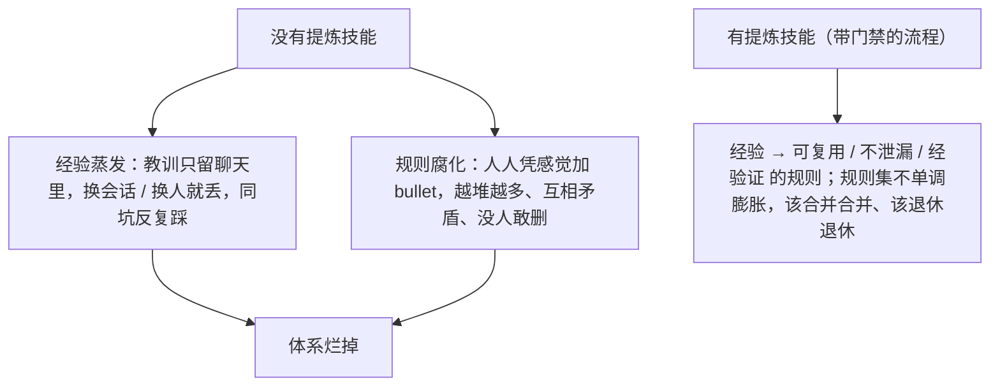
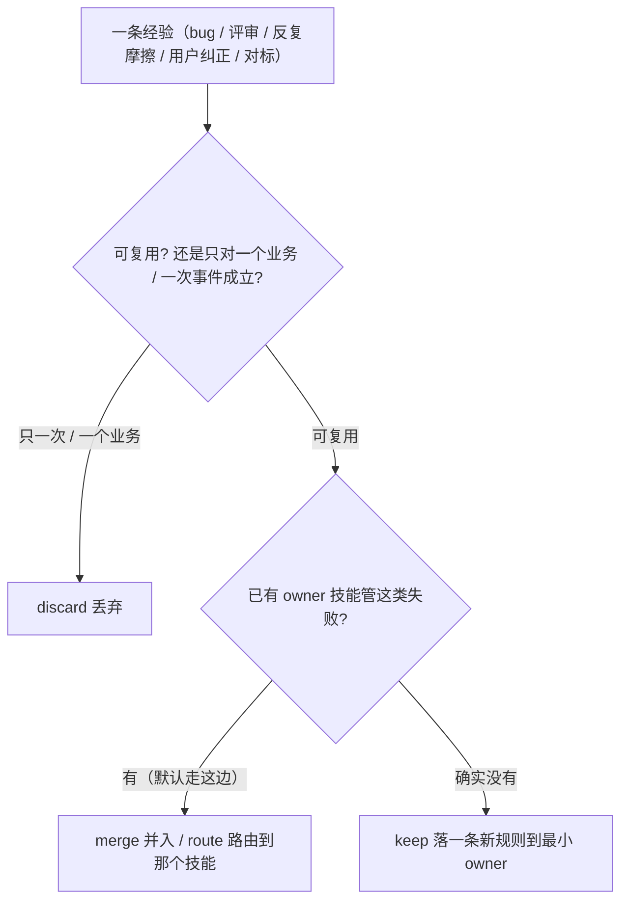
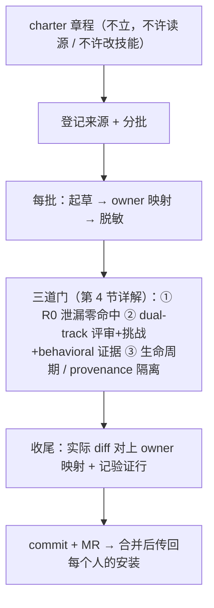
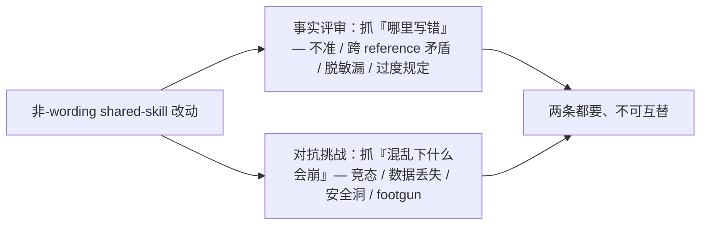
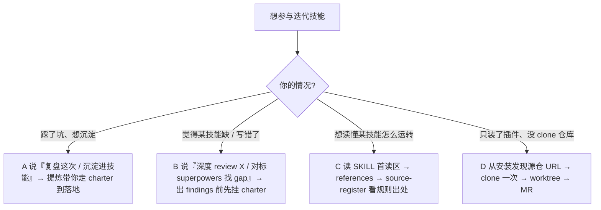
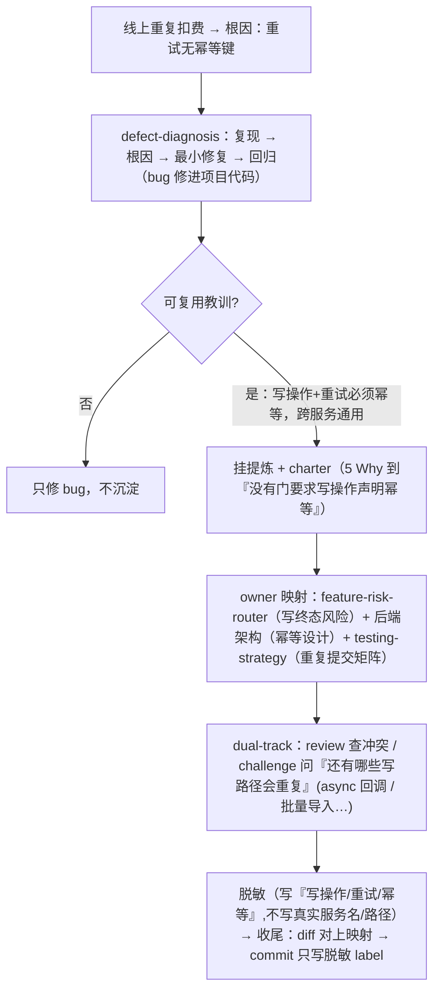

# 复盘与沉淀 / 迭代技能手册（提炼技能）

> `skill-extraction-workflow`（下称"提炼技能"）是整个技能体系**自我演进的引擎**——它决定一条经验该不该变成规则、落到哪、怎么验证。读懂它，团队同学就能自己分析、复盘、迭代技能，而不只是使用者。
>
> 权威规则在 `skills/skill-extraction-workflow/SKILL.md` 与其 `references/`，红线以那里为准。

## 1. 为什么需要这个元技能

普通技能编码"怎么做研发"，提炼技能编码"**怎么让这套规则越用越准**"。

和外部 `writing-skills` / `skill-creator` 分工：那些定义技能的**格式和写法**；提炼技能定义怎么**挖掘、过滤、泛化、验证、落地**一条可复用规则。

## 2. 核心心智：一条经验的四种归宿

任何一条经验（bug、评审 finding、重复摩擦、用户纠正、外部技能对标），先判断它的归宿：

| 决策 | 含义 | 典型场景 |
|---|---|---|
| **keep** | 落成一条新规则 | 全新的、可复用的失败模式，现有技能没覆盖 |
| **merge** | 并入已有规则 | 同一失败类已有 owner，补强它而不是再加一条 |
| **route** | 路由到别的 owner | 这条经验该归另一个技能管 |
| **discard** | 丢弃 | 只对一个业务/一个遗留库/一次性事件成立，不可复用 |

**默认倾向 merge 和 route，而不是 keep**：规则集膨胀本身就是一种失败。加新 bullet 前先 grep 同主题的已有 owner，能并就并（见 `references/rule-consolidation.md`）。

### 什么不该沉淀（Do Not Extract）

- 证据弱、只观察到一次、纯猜测。
- 只对一个业务域 / 一个遗留库 / 一次迁移 / 某人临时偏好成立。
- 更适合写成代码、测试、CI、仓库文档或产品需求，而不是 agent 行为。
- 已有 sibling 技能 owns 它 → route 过去，别重复。
- 想做"技能索引 / 速查目录 / 决策树"这类会和 frontmatter 漂移的东西——`description` 才是发现面。

## 3. 完整流程（一页式）

权威执行流见 `references/extraction-quickstart.md`，整条链：

### Step 0 · 先立 charter，再读源、再动手

**红线：charter 没立，不许读源、不许改技能。** 浅提炼没价值。charter 至少含：

| 字段 | 回答什么 |
|---|---|
| Purpose | 这次提炼要防住未来哪个失败 / 漂移 / 反复解释 |
| Scope | 目标技能、sibling、源类别、明确不做什么 |
| Depth | 纯文字清理 / 定点核查 / 文件级刷新 / 清单级 / 完整流程提炼 |
| Root cause | 为什么现有技能或流程拦不住（用 5 Why，别停在"agent 不小心"） |
| Evidence plan | 哪些源类必须读 / 路由 / 丢弃 / 标记不可用 |
| Completion standard | 什么证据、压力场景、评审、命令能证明做完了 |

> **产品无关 / 声称"行业最佳实践"的技能**（架构、测试、LLM、可观测、发布、安全、设计），evidence plan 必须含**外部权威源**（标准、官方文档、≥2 独立实践来源），不能只靠一份组织内部 SOP——内部语料只说明"我们怎么做"，证明不了"是否符合业界领先实践"。

### Step 1–5 · 登记来源 → 分批 → 起草 → 映射 owner → 脱敏

- **source register（来源登记）**：完整/深度提炼前先建登记表，每个源类定最小读取深度。
  - **读透 digest（AGENTS.md/README）≠ 读透代码**——是不同源类，digest 很强会掩盖大量未读代码。
  - 声称"穷尽"前，先枚举源的顶层结构（文档 `##` 段 / 仓库顶层目录），逐项标 `read`/`skipped`。
- **owner 映射（关键）**：动第一笔编辑前，列出每个可能的 owner（产品 / 测试 / 设计 / 各端 / 后端 / 发布 / 可观测 / 安全 / test-artifact-management / 提炼技能自己），逐个标 `updated`/`unchanged`/`routed`/`not-applicable`。
  - 收尾时**实际 diff 必须和这张图对上**。
  - **栈相关教训做 sibling mini-map**：一条 Go 服务的通用教训往往也属于 Python 服务，语言无关的规则落到最小公共技能。
  - **决策面编辑双向查 impact-chain**：改实现技能 → 查上游 owner（架构/设计/测试策略/产品流程）；改上游 owner → 查下游执行者（实现/客户端/测试/发布）。
- **sanitize（脱敏）**：业务名 / 仓库路径 / host / 凭据 / 源文件标识绝不进 shared 树；命名按"可复用能力"，不按源产物。

**判"已有规则覆盖了、不用改"时，要给触发点（firing path）。**

- 空口说"这条已经覆盖"不算数——要指出它在哪一步、被什么触发。
- 反复出现的根因通常不是"没有规则"，而是**规则在、但没触发**。
- 写进登记的触发点门禁会校验：那个位置后来被搬走或删掉，闸判红。

**锚在外部事实上的规则要带复核期。**

- 对标上游做法、依赖某个工具版本或外部标准的规则，登记时写清什么条件下要重新核，到期会提示。
- 规则被取代时标成"已被取代"，别原地悄悄改掉——那会让台账失去可追溯性。
- 这一层是提示性的，不挡合并。

落地前还有三道硬门（下一节）。

## 4. 三道必过的门禁

任何 shared-skill 改动（SKILL.md / references / scripts / overlay，以及本仓 ship 的 plugin 行为面）都要过：

### ① R0 · 泄漏审计零命中

提交前跑泄漏审计，**新增/改动内容必须零命中**（历史遗留可记 `known_debt`）。覆盖这些：

> 源文件 key/URL · 项目/团队标识 · 真实路径/仓名 · 分支名 · 贡献者邮箱/姓名 · ticket id · 内网域名 · 指向某个具体组织（而非可复用能力）的业务名词。

grep 抓不到的"标识符形状示例泄漏"靠对抗挑战兜底。权威 `references/r0-leakage-audit.md`。

### ② dual-track · 评审 + 对抗挑战（两条都要，不可互替）

跳过挑战正是 P0/P1 安全问题混进 shared 技能的方式。非 wording 改动还要一条 **behavioral 证据行**（改行为/路由的用 RED-baseline，证明行为真的变了，不是只靠评审说"看着对"）。

**评审员不自己挑**：先走 [`code-review`](../skills/code-review/SKILL.md) 那道门，别按 `command -v` 结果自己拼 CLI。它管这些：

- 装了哪些客户端、按什么顺序试；
- 排除掉和作者同一模型家族的评审员；
- packet 冻结、超时、结论解析。

只有这道门本身不在或起不来，才退到同等约束（同一有界 packet、独立模型家族、只读不执行、评审员自己给结论）的替代通道。完整失败梯队见 `references/dual-track-review-gate.md`。

> **两个反复踩的教训**（已固化，尤其注意）：
> - **先自盖安全/隐私/权限/数据丢失轴**：草稿常只写 happy-path，漏掉越权 / 密钥·PII 进持久件 / 不可恢复删除 / 拿生产凭据跑。挑战是安全网、不是第一道防线。
> - **LLM 输出是假设级、不是判决**："codex 说没问题"最易让人漏一手核实——load-bearing 外部事实/出处/API，必须有非 LLM 的一手源核实。

### ③ 生命周期 / provenance 隔离

- WIP 放 per-host scratch；
- 已关批次的 provenance 放私有 alias；
- shared 树（含 git 历史）只放 label 化规则，commit message 只写脱敏 label。

权威 `references/extraction-lifecycle-handoff.md`。

> **静态验证 ≠ 提炼验证**：`check-ccl-skills.sh` 绿了**不等于**提炼过了。非 wording 提炼收尾必须显式给出 RCA、owner 映射、sibling 决策、落地 diff、验证命令、评审/挑战结果；缺则只能报 `interim`。

### 改 `description` / 触发词 = 路由面改动（额外一道，别漏）

编辑技能的 `description`（含 `Use when` / `Proactively` / `Skip` / redirects）、`source-register.md`、eval 任务库——属**路由面**，比普通改动多两条：

- 要过 **Tier-1 路由分析器**（`make eval-routing`，已内置进 `check-ccl-skills.sh`），零 blocking 才落（blocking = 悬空 redirect、或 ≥2 技能精确触发词冲突且无互斥 skip）。
- **`description` 改写不算 wording**——它改的是路由面，要走**全套 dual-track**，别当"改个措辞"跳门。

## 5. 和贡献流程的关系

提炼技能是 [`CONTRIBUTING.md`](CONTRIBUTING.md) 里 shared-skill 门禁的**权威来源**。两者分工：

- **CONTRIBUTING**：改技能的操作手续（先隔离 → 跑门禁 → 走 MR）+ 门禁清单。
- **提炼技能**：每道门禁的判断逻辑和红线定义。

所以：纯 `docs/` / README 改动**不走 dual-track**（给人读的，过 `check-ccl-skills.sh` + 不泄漏即可）；一碰 `skills/**` 或 plugin 行为面，就回到提炼技能的全套门。

## 6. 团队同学怎么自己分析、复盘、迭代技能

你不需要是维护者也能参与。按你的情况对号入座：

图里没说、但容易忽略的几点：

- **A 想沉淀**：普通 bug/QA/review 在它自己的 owner 技能里处理就行，只有**可复用的技能/流程教训**才转提炼。
- **B 觉得技能缺/错**：一旦输出是要改技能行为的方案，就在出 findings **前**挂 charter；外部包（superpowers/gstack）是参考、不是落地目标。改到 `description`/触发词时按**路由面**走（§4）。
- **D 只装插件、没 clone**：分析用装好的技能就够；**改文件+走 MR 才需要可编辑的 clone**（插件缓存只读、改了会丢）。
  - 源仓 URL 从安装里查：marketplace remote（`git -C ~/.claude/plugins/marketplaces/<name> remote get-url origin`）或插件 `source.url`，两者可能 ssh/http 不一样、交叉核对。
  - clone 一次复用 → 每改一次开 worktree → 走 MR；合并后经 plugin update 传回每个人。
  - 完全没仓库权限 = 找有权限的同学落（机制见 `references/extraction-lifecycle-handoff.md`）。

动手前的自检 + 对应的坑，合在 §8 一张表里。

## 7. 走查示例：从一个 bug 到一条规则

要点：**bug 修复进项目代码、可复用预防规则进技能，两者分开。**

## 8. 动手前自检 + 反复踩的坑

每行左边动手前问自己，右边是没做会踩的坑：

| 自检（动手前问） | 不做会踩的坑 |
|---|---|
| 该先挂提炼技能吗？（产出"会改技能/流程的结论"前） | **该挂没挂**：攒了一堆 findings 才想起，已偏离规则集 |
| charter 立了吗？RCA 到可控预防点了吗？ | **没 charter 就开干**：浅提炼，规则飘、质量逐轮退化 |
| 这条可复用吗？还是只对一个业务/一次事件？ | 不可复用的硬塞成规则（应 discard）|
| 已有 owner 吗？ | **规则只增不减**：同主题堆成 bullet 墙（有 owner 应 merge/route）|
| 在独立 worktree 上吗？ | 在主检出 / main 直接改共享仓库 |
| owner 映射做了吗？协调者也查了吗？ | **只改执行者没改协调者**：给 `*-dev` 加触发词，但入口 `product-rd-workflow` 的 description 没动 → 多阶段交付仍绕开生命周期门 |
| 源真读全了吗？枚举过顶层结构吗？ | **只读一部分就声称"穷尽"**：读透 AGENTS.md/digest 或文档一段就说完了 |
| R0 + dual-track 过了吗？ | 把**"静态绿 / LLM 说没问题"当验证过**：都不代表 dual-track 过，支持性结论尤其最易漏一手核实 |
| 新一轮提炼重新挂了吗？ | **per-round 不重新挂**：不同目标/域/源都要重新 invoke，别凭记忆跑同一套 |

## 9. 延伸阅读

- 一页式执行流：`skills/skill-extraction-workflow/references/extraction-quickstart.md`
- 三道门：`r0-leakage-audit.md` · `dual-track-review-gate.md` · `extraction-lifecycle-handoff.md`
- 规则合并/退休：`rule-consolidation.md`
- 来源登记 + impact-chain：`source-register.md`
- 贡献手续：[`CONTRIBUTING.md`](CONTRIBUTING.md)
- 体系全局：[架构总览](ARCHITECTURE.md)
