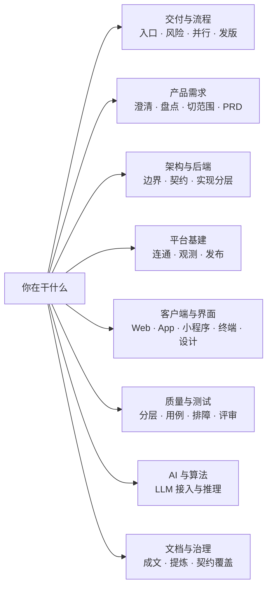
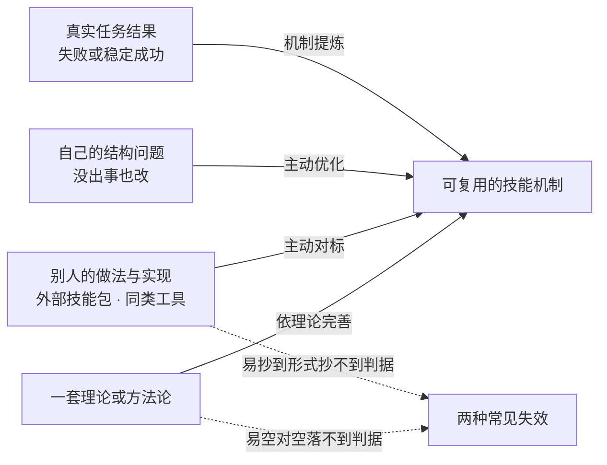

# 技能体系的理论基底

技能里的每条硬规则，背后都有一个"为什么"。这份把**思想**和它**变成的规则**对起来放，你用技能时能知道规则为什么这么定，改技能时能判断它该不该动。

先看〔三条通用思想〕，再按工作类型查对应技能；需要追溯来源或调整规则时，继续看〔规则是怎么来的〕和〔规则与理论如何继续演进〕。体系的目录、路由、分发与治理边界见 [架构总览](ARCHITECTURE.md)。

## 三条通用思想

这三条几乎在每个技能里各出现一次。**理解了它们，多数具体规则你能自己推出来。**

| 思想 | 它管什么 | 典型体现 | 对应理论 |
|---|---|---|---|
| **组织学习** | 失败要变成可复用的预防，稳定成功也要变成可保持的机制，否则换个人、换个项目仍会丢失 | 从真实结果进入提炼闭环；持续比较后续任务是否改善 | [双环学习（Argyris）](https://hbr.org/1991/05/teaching-smart-people-how-to-learn)——事后认出，不是照它设计的 |
| **证据优先于断言** | 说"做完了 / 修好了 / 覆盖了"要有当轮跑出来的证据，不接受自证 | 改前可复现基线；改前冻结评价标准；渲染与行为证据；无证据不声称完成 | 团队自建，没有挂靠的外部理论 |
| **隔离与可逆** | 先把爆炸半径限住再动手，动完能退回来 | worktree 隔离；回滚预案先于放量；破坏性删除前先扫产物 | [fail-safe defaults（Saltzer & Schroeder 1975）](https://web.mit.edu/Saltzer/www/publications/protection/) |

## 按技能查

八个域，按你手上的活跳：

每行读法：**思想内核**是它为什么存在，**变成了哪条规则**是它在实际执行时长什么样，**想深入读**给你可点的原始材料。

**最后一列的标记说明这条规则的权威从哪来**——四档不同，别混着读：

| 标记 | 含义 | 你该怎么用 |
|---|---|---|
| **🔗 内核** | 技能包里**明写了自己的方法论出自哪里**，规则是照着它设计的 | 想改这条规则，先读原始材料——它是规则的地基 |
| **🔗** | 技能包里**已有这条可定位的引用**——URL，或 arXiv 编号 / 会议卷期这类能解析到唯一文献的标识，不只是提了个理论名 | 规则文本和出处在同一个包里，可直接互查 |
| 无标记 | 理论名是**事后归纳的参照系**：规则是团队从实践里自建的，链接只作延伸阅读 | **别倒过来当成"这条规则由该理论推出"** |
| **团队取舍** | 没有外部理论撑着，权威来自团队共识 | 谁拿出更好的依据都可以推翻，不必为它欠着愧疚 |

### 交付与流程

| 技能 | 思想内核 | 变成了哪条规则 | 想深入读 |
|---|---|---|---|
| `product-rd-workflow` | 架构决策的本质是**取舍**，没有共同词汇就只能口头争"好不好" | 技术设计要写清关键决策 + 被否的替代方案 | [ISO/IEC 25010:2023](https://www.iso.org/standard/78176.html)、Bass 等 SEI 质量属性分类 |
| `product-rd-workflow` | 交付效能可度量，且四项指标要一起看 | 交付健康度按 [DORA 四项指标](https://dora.dev/)记录 | DORA / Accelerate |
| `feature-risk-router` | 风险要先分类再决定跑哪些门，不是所有改动一视同仁 | 碰钱 / 权限 / 数据隔离 / 写终态 / AI 高影响 → 先定级再动手 | 风险标签是团队自定；威胁建模透镜用 [OWASP Top 10 / STRIDE](https://owasp.org/Top10/) |
| `multi-agent-delegation` | **编排者-工作者**模式：拆分看真实独立性，不看任务数量 | 有共享状态或顺序依赖就退回串行；worker 只给它任务需要的能力 | [Anthropic《Building effective agents》](https://www.anthropic.com/engineering/building-effective-agents)（提示链 / 路由 / 并行 / 编排者-工作者 / 评估者-优化者五种模式的出处） |
| `release-coordination` | **部署流水线**：一次构建、多处晋级，每个关口只放行有证据的制品 | 发版按范围确认 → 合主干 → 打 tag → 生产构建 → 证据 → 收尾 | [部署流水线（Humble & Farley）](https://martinfowler.com/bliki/DeploymentPipeline.html) |
| `release-doc-writer` | 发布要留下可追溯的书面记录 | 上线文档写清发布范围、变更清单、验证证据 | 团队取舍 |
| `worktree-isolation` | 主干始终可发布，开发在隔离工作区进行；破坏性操作默认 **fail-safe** | 绝不在 main 上开发；删 worktree 前先扫 gitignored 产物；`remove` 不带 `--force`、`branch -d` 不用 `-D` | [主干开发](https://trunkbaseddevelopment.com/)；[fail-safe defaults（Saltzer & Schroeder）](https://web.mit.edu/Saltzer/www/publications/protection/) |

### 产品需求

| 技能 | 思想内核 | 变成了哪条规则 | 想深入读 |
|---|---|---|---|
| `requirement-intent` | **需求是挖出来的，不是收上来的**——用户说的不等于用户要的 | 把含糊意图拆成已知 / 未知 / 用户路径 / 非目标 / 待决策 | [IEEE/ISO/IEC 29148-2018](https://standards.ieee.org/ieee/29148/6937/) 的需求获取（elicitation） |
| `requirement-baseline` | 不先测绘现状就设计目标，等于对着想象改 | as-is 盘点先于 to-be 设计，事实缺口要显式记 | 业务流程建模的 as-is / to-be 两段式（通行实践，无单一权威出处） |
| `requirement-scope` | **先定愿意花多少，再定做什么**（appetite 而不是估算） | 划出改动范围、非目标、MVP 边界、版本切片 | [Shape Up 的 appetite](https://basecamp.com/shapeup)；[MoSCoW 优先级（DSDM）](https://www.agilebusiness.org/dsdm-project-framework/moscow-prioritisation.html) |
| `requirement-doc-writer` | 验收标准必须**可证伪** | "功能正常"不算验收；每个功能点要有 pass / fail 判据 | [可证伪性（Popper）](https://plato.stanford.edu/entries/popper/)；[Given-When-Then](https://martinfowler.com/bliki/GivenWhenThen.html) 的行为化表述 |
| `grill-me` | **魔鬼代言人**：制造建设性异议，暴露没被检验的前提 | 一问一答逐条拷问方向，不替你写方案 | 苏格拉底诘问法；[CIA Tradecraft Primer](https://www.cia.gov/resources/csi/static/955180a45afe3f5013772c313b16face/Tradecraft-Primer-apr09.pdf) 的 Devil's Advocacy 一章 |
| `multi-perspective-research` | 同一件事换个视角结论就变，**单视角必然有盲区**；检索前先定问题和来源类别，别让手上现有材料悄悄变成边界 | 覆盖预检矩阵：证据至少分**用户线索 / 一手官方 / 独立外部 / 反例负面**四类，每类给关闭条件 | 这套是**依理论完善**出来的，方法依据写在 `skill-extraction-workflow/references/external-practice-controls.md#research-coverage`（`SKILL.md` 里有指针）：系统性综述的问题-来源-检索-闭合纪律（[PRISMA 2020 清单](https://www.prisma-statement.org/s/PRISMA_2020_checklist-ab3g.pdf)、[Cochrane 手册第 4 章](https://www.cochrane.org/authors/handbooks-and-manuals/handbook/current/chapter-04)）、[英国政府机构分析指引](https://www.gov.uk/government/publications/understanding-institutional-analysis/understanding-institutional-analysis)的三角验证、[CIA Tradecraft Primer](https://www.cia.gov/resources/csi/static/955180a45afe3f5013772c313b16face/Tradecraft-Primer-apr09.pdf) 的对立假设与逆向检验、[OpenAI deep research 指南](https://developers.openai.com/api/docs/guides/deep-research)的来源优先级 🔗 |
| `multi-perspective-research` | **🔗 内核**（包内明写「方法改编自」）：研究质量取决于**提问的视角多样性**，而不是单个问题的措辞——所以先造视角，再由视角生成问题 | 先按角色 / 立场枚举视角，每个视角独立提问、独立取证，最后合成；不是一个人换着措辞多问几遍 | [STORM（Shao et al., NAACL 2024）](https://aclanthology.org/2024.naacl-long.347/) 与 [Co-STORM](https://arxiv.org/abs/2408.15232) 🔗；包内同时记了一条反证：[Smit et al.《Should we be going MAD?》ICML 2024](https://arxiv.org/abs/2311.17371) 与[《别再高估多智能体辩论》](https://arxiv.org/abs/2502.08788)都显示，**同质 persona 的辩论常打不过单模型基线**——所以视角要带不同的证据来源，不能只换个人设 🔗 |

### 架构与后端

| 技能 | 思想内核 | 变成了哪条规则 | 想深入读 |
|---|---|---|---|
| `go-microservice-architecture` `python-service-architecture` | **[限界上下文](https://martinfowler.com/bliki/BoundedContext.html)**：服务边界按语言和职责切，不按技术分层切；**[康威定律](https://martinfowler.com/bliki/ConwaysLaw.html)**——系统结构会长成沟通结构的样子 | 定边界、契约、数据所有权之后才写代码；跨语言契约归被改边界那一侧 | 限界上下文与康威定律 🔗（两包 `references/architecture-playbook.md` 已写明借鉴边界：只借**边界输入判据**，不声称完整 DDD 战略设计或逆康威方法；契约与数据所有权的操作性判据是技能自有规则）；数据清除另据 [NIST SP 800-88](https://csrc.nist.gov/pubs/sp/800/88/r1/final)（加密擦除作为清除手段的条件）；事件驱动镜像参考的 exactly-once 五条款配方借鉴 [End-to-End Arguments in System Design（Saltzer/Reed/Clark，ACM TOCS 1984）](https://web.mit.edu/Saltzer/www/publications/endtoend/endtoend.pdf) 🔗——正确性只能由通信端点的应用建立，broker 事务特性是原文所谓"不完整版本可作性能增强"；两包 `references/event-driven-architecture.md` 已写明借鉴边界。架构 playbook 的分层节另引 [Ports-and-Adapters / Hexagonal（Cockburn）](https://alistair.cockburn.us/hexagonal-architecture/) 🔗，只借 ports/adapters 放置思想 |
| `go-microservice-dev` `python-service-dev` | 依赖指向内层，数据访问隔离在边界；契约由代码生成保证单一真值 | 实现时保留架构决策不偷改边界；DAL / DI / codegen 按既定分层 | [整洁架构](https://blog.cleancoder.com/uncle-bob/2012/08/13/the-clean-architecture.html)、[六边形架构](https://alistair.cockburn.us/hexagonal-architecture/) 的依赖方向与端口隔离 |

### 平台基建

| 技能 | 思想内核 | 变成了哪条规则 | 想深入读 |
|---|---|---|---|
| `platform-observability` | SLI 要从**用户视角**定义，且表达为"好事件 / 有效事件"的比例 | 告警对 SLI 求值而不是对原始指标；框架默认接观测，新服务写零行样板 | [Google SRE 的 SLI / SLO / 错误预算](https://sre.google/sre-book/service-level-objectives/) |
| `platform-service-connectivity` | 服务间怎么到达是平台决定的，不是每个服务自选 | 网格默认开、mTLS 关不掉；不硬编码集群 URL 绕过 lane 路由 | [RFC 1035](https://www.rfc-editor.org/rfc/rfc1035) 的 DNS 标签约束——它决定了 gRPC `:authority` 不能带下划线 |
| `platform-release-engineering` | **渐进式交付**：放量是证据驱动的，不是等时间 | 晋级看 SLI 达标才放行；回滚预案先于灰度 | 渐进式交付；凭据条款另据 [RFC 8628](https://www.rfc-editor.org/rfc/rfc8628) |

### 客户端与界面

| 技能 | 思想内核 | 变成了哪条规则 | 想深入读 |
|---|---|---|---|
| `product-ui-ux-design` | 人本设计从**使用情境与任务**出发；可用性是情境中的结果，不是套启发式或把 happy-path 画好看 | 把设计假设写成可观察 criterion，经测试选层、端侧实跑和候选绑定 verdict 闭环；空/载/错/恢复与适配矩阵只是必要输入，启发式只用于发现风险 | [ISO 9241-210](https://www.iso.org/standard/77520.html)、[ISO 9241-11](https://www.iso.org/standard/63500.html)、[WCAG 2.2](https://www.w3.org/TR/WCAG22/)；证据分类与边界见 [`external-ui-ux-quality-benchmarks.md`](../skills/product-ui-ux-design/references/external-ui-ux-quality-benchmarks.md)，交付闭环见 [`delivery-contract.md`](../skills/product-ui-ux-design/references/delivery-contract.md) |
| `web-react-dev` | 框架默认转义，风险集中在**裸 HTML / URL 汇点** | `dangerouslySetInnerHTML` 等原始汇点要显式治理 | [OWASP Top 10 2021 A03](https://owasp.org/Top10/) |
| `app-cross-platform-dev` `miniapp-product-dev` | 宿主平台的能力与审核约束是硬边界，不能靠猜 | 各端渲染证据形态不同：设备 / 模拟器 / 开发者工具 | [Apple Human Interface Guidelines](https://developer.apple.com/design/human-interface-guidelines)、[Material Design 3](https://m3.material.io/)、[微信小程序运营规范](https://developers.weixin.qq.com/miniprogram/product/) |
| `terminal-cli-dev` | 终端是**有状态的渲染目标**，字符串快照证明不了交互态 | 交互 / 控制态要 PTY 生命周期断言 + 清理断言 + 真实终端 smoke | [ECMA-48 控制序列](https://ecma-international.org/publications-and-standards/standards/ecma-48/)、[POSIX `termios`](https://pubs.opengroup.org/onlinepubs/9699919799/basedefs/termios.h.html)；命令契约另见 [clig.dev](https://clig.dev/) |

> UI/UX 证据不能混级：WCAG 成功标准是规范要求；[ARIA APG](https://www.w3.org/WAI/ARIA/apg/about/introduction/) 是信息性实现参考，不是完整设计系统或 production-ready 代码；[Design Tokens Format Module 2025.10](https://www.w3.org/community/reports/design-tokens/CG-FINAL-format-20251028/) 是 Community Group Final Report，不是 W3C Standard 或 Standards Track 文档。Sweller、Faulkner、Tversky 等研究只能在其参与者、任务和材料边界内支持机制假设，Norman 的 signifier 是概念框架；因此不再用“五个人”“五秒”或人名定律当跨产品验收线。[Apple 按钮 44×44pt hit region](https://developer.apple.com/design/human-interface-guidelines/buttons) 的措辞是 vendor general rule，Android 48×48dp 也是平台建议；两者都不能平均或升格为跨平台理论常数。

### 质量与测试

| 技能 | 思想内核 | 变成了哪条规则 | 想深入读 |
|---|---|---|---|
| `testing-strategy` | **测试金字塔**：在能证明该风险的最便宜那一层去证 | 每个关键场景至少一条最低层自动断言；mock 证明不了运行时集成 | [Martin Fowler 的实践版测试金字塔](https://martinfowler.com/articles/practical-test-pyramid.html) 🔗 |
| `testing-strategy` | 测试可信度不只看“在哪层跑”，还要看 **oracle 是否独立、套件是否对错误敏感** | 迁移 / 重写用差分或等价测试；开放输入用属性测试 / fuzz；闭合边界用独立允许面；关键断言用有效 mutant 验证会因正确原因转红。mutation score 不设统一阈值 | [差分与变异的核心规则](../skills/testing-strategy/SKILL.md#core-rules)、[变异归因](../skills/testing-strategy/references/run-killing-mutation-walk.md)、[闭合契约 oracle](../skills/testing-strategy/references/design-closed-contract-oracles.md)、[架构适应度函数](../skills/testing-strategy/references/fitness-functions.md) |
| `test-artifact-management` | 用例是结构化资产，要能和测试代码挂钩、能被追踪状态 | 用例挂 `tc(...)`；废弃走级联而不是标跳过 | 安全用例基线用 [OWASP ASVS L1](https://owasp.org/www-project-application-security-verification-standard/) |
| `defect-diagnosis` | **人为失误是症状不是原因**，根因要追到可控的预防点 | 5 Why 不接受"不小心"当根因；事故级走无责复盘 + 多层补洞 | [Google SRE 的无责复盘](https://sre.google/sre-book/postmortem-culture/) 🔗；5 Whys（丰田生产体系） |
| `code-review` | 自审负责让实现者先收敛，独立评审负责发现剩余盲区；两者不能互相替代 | 实现者先按 owner / 风险轴自审并跑证据，再冻结候选、排除同模型家族评审员；finding 仍须追一手证据，任何评审结果都不能授予合并权限 | [Google 的现代轻量评审实践](https://google.github.io/eng-practices/review/reviewer/looking-for.html)（上溯到 Fagan 式检查）；跨模型独立与 exact-candidate 绑定是团队取舍 |

### AI 与算法

| 技能 | 思想内核 | 变成了哪条规则 | 想深入读 |
|---|---|---|---|
| `llm-inference-integration` | 检索结果、工具输出、模型输出在校验前**都是不可信数据** | 用于有权限的动作前先过信任边界；安全 / 鉴权 / 工具执行一律 fail-closed | Anthropic 官方文档（提示缓存、扩展思考等）🔗；[RFC 7396](https://www.rfc-editor.org/rfc/rfc7396) 的 merge patch 语义 |

### 文档与治理

| 技能 | 思想内核 | 变成了哪条规则 | 想深入读 |
|---|---|---|---|
| `tighten-doc` | 一份文档只服务**一种阅读模式**，教程和参考混写谁也服务不了 | 按四模式分类；结论前置；一点一行 | [Diataxis 四模式](https://diataxis.fr/)；Strunk《风格的要素》，取适用于中文交付文档的子集 |
| `skill-extraction-workflow` | **🔗 内核**：结果通常由多个条件共同形成；失败不能停在"谁不够仔细"，成功也不能停在"这次做得好" | 先还原事实与当前版本，再分别分析当场决策、潜伏条件、反馈与控制；失败找可控预防点，成功找可保持且非运气的机制 | [Leveson《Engineering a Safer World》STAMP/CAST](http://sunnyday.mit.edu/safer-world.pdf)：根因是任意停止规则、事故是控制结构上约束执行不足；[Cook《How Complex Systems Fail》](https://how.complexsystems.fail/)：显性失效必然多因 🔗；[Reason 瑞士奶酪模型（BMJ 2000）](https://www.ncbi.nlm.nih.gov/pmc/articles/PMC1117770/) 的当场 / 潜伏之分；Dekker《The Field Guide to Understanding Human Error》的局部合理性与后见之明陷阱；[Google SRE 无责事后复盘](https://sre.google/sre-book/postmortem-culture/) |
| `skill-extraction-workflow` | 单条 5-Why 链是**入门手法、不是方法**：它停在症状、受提问人知识边界限制、不可复现、且只隔离出一个原因 | 非琐碎提炼的 RCA 必须**拓宽**——按触发/路由、过时的流程认知、缺失的机械控制、缺失的反馈、更早埋下的潜伏条件、检测缺口分类枚举多个促成因素 | 5 Whys（丰田生产体系，Taiichi Ohno）及其标准批评，见 [Card《The problem with '5 whys'》BMJ Qual Saf 2017](https://pubmed.ncbi.nlm.nih.gov/27590189/)；包内明写「Sakichi Toyoda 1930s」的起源说法来源薄弱，不当定论 |
| `skill-extraction-workflow` | **从正常运作中学**，不只从失败中学——要问"哪里做对了、为什么、怎么保持"，不是只问哪里错了 | 稳定成功只在有机制、非运气证据和明确承载位置时沉淀；失败、评审、反复摩擦与对标同样可以进入提炼 | [美军 AAR（FM 7-0 附录 K）](https://armypubs.army.mil/epubs/DR_pubs/DR_a/ARN30907-FM_7-0-000-WEB-1.pdf) 的 sustain / improve 双半边；Safety-II（[NHS England 患者安全](https://www.england.nhs.uk/patient-safety/)）/ 韧性工程（Hollnagel） |
| `skill-extraction-workflow` | 取证要有纪律：先定问题、先定纳排、检索可复现、逐源闭合 | 开始前明确目的、边界、证据与完成标准；每类来源说明已读、跳过或不可用 | [PRISMA 2020 清单](https://www.prisma-statement.org/s/PRISMA_2020_checklist-ab3g.pdf) / [Cochrane 手册第 4 章](https://www.cochrane.org/authors/handbooks-and-manuals/handbook/current/chapter-04) 的综述纪律 🔗——包内明写只借纪律、不声称符合系统性综述 |
| `skill-extraction-workflow` | **硬数据优先**：复盘的第一手证据必须是任务产物本身，纠正轮和自述是有偏摘要，不能替代 | 取证计划首先读取代码、日志、测试结果或成品，而不是只读自述 | [Derby & Larsen《Agile Retrospectives》](https://pragprog.com/titles/dlret/agile-retrospectives/) 的 gather-data 阶段；实证支持见[《经验 vs 数据：更依据数据的复盘活动》](https://arxiv.org/abs/2101.01528)与[《从软件仓库中挖掘流程改进》](https://arxiv.org/abs/2007.08265) 🔗 |
| `skill-extraction-workflow` | **清单要有暂停点**：在关键节点停一次、逐项确认，而不是边做边勾 | 报告完成前设置明确暂停点，逐项复核收尾条件 | Gawande《Checklist Manifesto》的 DO-CONFIRM / pause point / killer items；效果实证见 [Haynes 等 NEJM 2009 手术安全清单试验](https://pubmed.ncbi.nlm.nih.gov/19144931/) |
| `skill-extraction-workflow` | **识别到 ≠ 学到**：教训写下来不等于组织学会了，得有可达的触发点 | 教训必须接到会实际触发它的决策点；只写进文件但不会被用到，不算学会了 | PMI / NASA 的 lessons-identified ≠ lessons-learned，参见 [NASA Lessons Learned 系统](https://llis.nasa.gov/) |
| `skill-extraction-workflow` | 入口只暴露路由所需信息，正文、资源和工具按需进入上下文 | `SKILL.md` 只放触发 / 路由 / 硬规则，深度进 `references/`；大工具集先检索再加载相关子集 | [Anthropic Agent Skills 的渐进披露](https://platform.claude.com/docs/en/agents-and-tools/agent-skills/overview)、[OpenAI Model guidance 的 tool search](https://developers.openai.com/api/docs/guides/latest-model) |
| `skill-extraction-workflow` | 指令优化先处理**冲突与重复**，再比较体量和加载时机；供应商指南只提供候选假设 | 一次只删改一组指令、示例或工具，用同一批代表性原任务重跑；每个任务、每个版本分别按自己的真实触发链加载，禁止用一份全局 bundle 或强行等长上下文代替；质量过线后才比较 token、延迟、成本、调用和轮次 | [Anthropic 的上下文工程](https://www.anthropic.com/engineering/effective-context-engineering-for-ai-agents)、[OpenAI Model guidance](https://developers.openai.com/api/docs/guides/latest-model) |
| `agents-file-coverage-gate` | 每个目录都该有一份 agent 开工契约 | 扫描 `AGENTS.md` 覆盖率，可补 stub、可接 CI | 文件格式对齐 [AGENTS.md 开放约定](https://agents.md/)；覆盖率要不要卡是团队取舍 |

### 业界对照：Anthropic 与 OpenAI

两家的能力不宜压成“都支持 Skills”一句话。**Skill 是能力封装与按需加载层；tool、handoff、多 agent、trace、guardrail 与长会话状态属于运行时编排层。** 本仓的 `SKILL.md + references + scripts` 主要对应前者，owner 路由、委托、评审、权限与度量门禁同时覆盖后者。

| 观察面 | Anthropic | OpenAI | 对本仓的含义 |
|---|---|---|---|
| 技能封装 | [Agent Skills](https://platform.claude.com/docs/en/agents-and-tools/agent-skills/overview) 用 `SKILL.md` 元数据、正文和资源形成渐进披露；Claude Code 从文件系统发现自定义 Skill | [Skills API](https://developers.openai.com/api/reference/python/resources/skills/methods/create) 提供上传、版本与项目级资源；具体宿主仍决定何时展示和加载 | 入口保留触发与硬规则，深材料按需进入；不要把“存在一个 Skill”写成“运行时必然采用” |
| 工具与上下文预算 | Skill 自身分层加载，执行能力仍受宿主工具与容器边界约束 | 大工具集可用 [tool search](https://developers.openai.com/api/docs/guides/latest-model) 延迟加载相关定义；长流程可用 [Responses compaction](https://developers.openai.com/api/reference/java/resources/responses/methods/compact) 延续状态 | 预算是观察和路由输入，不是跳过 owner、验证或权限门的理由 |
| 多 agent 编排 | Skill 包不等于多 agent 控制面；委托边界仍由实际宿主和任务契约决定 | Agents SDK 明确区分 [manager-as-tools 与 handoffs](https://openai.github.io/openai-agents-python/multi_agent/)，并提供 [tracing](https://openai.github.io/openai-agents-python/tracing/) 与 [guardrails](https://openai.github.io/openai-agents-python/guardrails/) | 用 owner/生命周期/横切门禁描述协同；不要把固定链、Skill 目录或单次 handoff 当完整治理 |

供应商能力以**截至 2026 年 8 月可访问的官方材料**为准；涉及产品可用性、API 字段或宿主行为时，按上面的官方链接重新核对，不把本文快照当长期既成事实。

## 规则是怎么来的

上面那些规则不是一个来路。四条路径都会长出规则，但**输入不同、可信度不同、失效方式也不同**：

| 路径 | 典型例子 |
|---|---|
| **结果提炼** | 失败形成可复用的预防；稳定成功形成应保持的默认机制 |
| **主动优化** | 入口体积闸、规则合并与退休、owner 边界收窄 |
| **主动对标** | 对标 superpowers / gstack 等找我们缺的循环控制、诊断手法 |
| **依理论完善** | 调研技能按系统性综述与情报分析方法改出"四类证据 + 关闭条件"；提炼技能的取证纪律 |

> 后两条常被并成一件事，其实是两条路。**对标**比的是别人怎么做，容易抄到形式抄不到判据——别人那条规则为什么成立、什么条件下才成立，没搞清就搬过来。**依理论**读的是一套方法论，容易空对空——理论说得通，但落不到可执行的判据上。两条都是正规路径：「对标外部找 gap」直接写在提炼技能的触发词里。

理论和规则的先后关系也有两种，同样别混：

- **事前借鉴**——先读了方法，照它改技能。调研技能的"四类证据 + 关闭条件"就是这么来的。
- **事后认出**——先摸索出做法，后来才发现前人早有名字。提炼闭环和"双环学习"属于这类。

**认出或借来之后，真正的收益在后面**：

- **去看那套理论还讲了什么我们没覆盖的。** 认出提炼闭环与双环学习相近，就继续读它对防卫机制、自我封闭解释等失效方式的讨论，再判断是否能转成可验证的约束。
- **去看它已知的失效边界**，不必再交一遍学费。
- **判断一条规则能不能绕**：靠在成熟理论上的，绕之前要有更强理由；标「团队取舍」的，本来就欢迎更好的方案。

当某次结果与这里记录的理论相符时，回读对应方法，检查尚未覆盖的机制和已知失效边界。没有新的可复用结论也是合法结果，不为填表硬造规则。

## 规则与理论如何继续演进

- **真实结果或自审带来的规则变化**：**不要为了填表去找一个理论套上去。**
  - 先把规则本身写对——它改善什么真实任务结果：失败类写清预防点，成功类写清要保持的机制。
  - 填表是之后的动作：想得起对应的就写，想不起来就空着或标团队取舍。**空着是准确的信息，硬填是噪音。**
- **对标别人的做法改出来的**：记下**判据**而不只是形式——那条规则在对方那里为什么成立、什么条件下才成立。抄形式不抄判据，是这条路径最常见的失败。
- **读理论改出来的**：把理论落到**可执行的判据**上再写进技能，否则就是空对空。同时在技能包里留下引用（留了才能标 🔗），并写清边界——哪部分借了、哪部分没声称符合。
- **事后认出了对应关系**：认出来之后顺手做两件事：
  - 去看那套理论还讲了什么我们没覆盖的、以及它已知的失效边界；
  - 把其中有价值的部分变成技能里的新规则。
  - 认出的对应落在需要外部依据的技能类上时，**把引用回填进技能包**并写清借鉴边界；引用只留在理论索引里不能改变执行行为。
- **理论和规则打架**：以**规则的实际行为**为准校正理论映射，别反过来把规则往理论上硬掰。我们的场景和理论成立的场景未必相同——真不同就写清楚哪里不同，那本身是有价值的信息。
- **标「团队取舍」的行**：不必长期背着愧疚，也不必想办法消灭它。它只说明这条规则的权威来自团队共识，谁拿出更好的依据都可以推翻。
- **加 / 改链接时**：**一律核标题，不只核 HTTP 200**。取回页面标题，并与目标作者、篇名逐项核对。
- **标 🔗 之前**：去技能包里核对那个 URL。**包里提了理论的名字不等于有可点的引用**。跨包指针（如调研技能指向 `external-practice-controls.md`）算数，但要在 `SKILL.md` 里写明。
