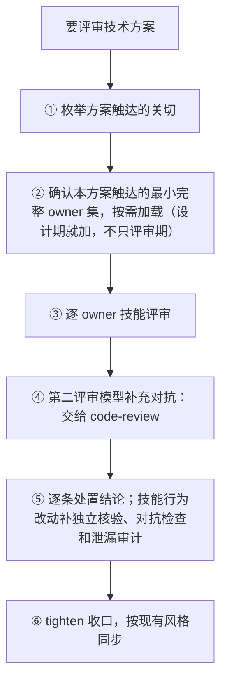

# 技术方案评审手册

> 评审一份技术方案的核心不是"找一个聪明模型挑刺"，而是**按方案触达的关切，路由到对应 owner 技能**评审；外部/第二评审模型（Codex/Claude 等）只作补充。权威门禁以各 owner 技能源仓为准，本手册是操作视图。

## 什么时候用

- 要评审一份技术方案 / 设计稿（自己写的或别人的）。
- 方案跨多个 owner（后端架构 + 平台 + 安全 + 测试…）。

**不适用**：

- 窄 diff / 单文件改动 → [`code-review`](../skills/code-review/SKILL.md)
- 想被一问一答拷问方向，而不是收一份评审意见 → [`grill-me`](../skills/grill-me/SKILL.md)
- 纯文案润色 → [`tighten-doc`](../skills/tighten-doc/SKILL.md)
- 单 bug 复现定性 → [`defect-diagnosis`](../skills/defect-diagnosis/SKILL.md)

## 流程速查

## ① 按关切路由到 owner 技能

| 方案触达的关切 | owner 技能 |
|---|---|
| 后端架构：服务边界/契约/数据所有权/一致性 | [`go-microservice-architecture`](../skills/go-microservice-architecture/SKILL.md) / [`python-service-architecture`](../skills/python-service-architecture/SKILL.md) |
| 连通性：mesh / 泳道 / mTLS / 重试超时熔断 / baggage 传播 | [`platform-service-connectivity`](../skills/platform-service-connectivity/SKILL.md) |
| 发布：多环境 / 灰度 / 晋升 / 密钥分发 / 回滚 | [`platform-release-engineering`](../skills/platform-release-engineering/SKILL.md) |
| 可观测：审计 / 日志 trace / SLI/SLO / 告警 | [`platform-observability`](../skills/platform-observability/SKILL.md) |
| 风险定级 / 高风险门禁 / 安全确认边界 | [`feature-risk-router`](../skills/feature-risk-router/SKILL.md) |
| LLM / agent / RAG / 评测 | [`llm-inference-integration`](../skills/llm-inference-integration/SKILL.md) |
| 测试层选择 / 验收 | [`testing-strategy`](../skills/testing-strategy/SKILL.md) |
| 可见 UI / 交互 | [`product-ui-ux-design`](../skills/product-ui-ux-design/SKILL.md) |
| 跨阶段交付 / 生命周期门 | [`product-rd-workflow`](../skills/product-rd-workflow/SKILL.md)（入口路由器） |
| 生产发版执行 / 发布文档 | [`release-coordination`](../skills/release-coordination/SKILL.md) / [`release-doc-writer`](../skills/release-doc-writer/SKILL.md) |
| 方案里的事实底稿不足（选型、竞品、领域）| [`multi-perspective-research`](../skills/multi-perspective-research/SKILL.md) 产调研底稿，裁决仍回本表 owner |

> 安全是横切关切、不是单 owner：定级/门禁归 `feature-risk-router`，实质分散在各 owner（架构的 fail-closed/鉴权、连通的 mTLS/zero-trust、观测的审计/脱敏）——别只挂定级就当已评安全。

## 三条铁律

1. **先枚举关切、确认本方案触达的最小完整 owner 集**（不是加载全部技能），按需加载相关 SKILL.md/章节；别中途逐个发现、别逐域打补丁。漏一个关切（如 mesh 没加载连通性技能）= 评审不完整。
2. **owner 技能是评审门，第二评审模型只补充**：第二评审模型在 owner 评审之下/之后跑，绝不充当门本身（模型作执行宿主时仍按 owner 技能跑——"只补充"仅指其第二评审模型角色）。
   - 选哪个客户端、怎么保证跨模型家族独立性，归 [`code-review`](../skills/code-review/SKILL.md)，别手工拼 CLI 命令。
3. **owner 既管设计实质也管评审**：调了入口路由器（`product-rd-workflow`）≠ 已派发 owner——设计期就要真加载 owner 技能产出实质，不是只在评审时。

> 这三条的权威定义在 [`product-rd-workflow`](../skills/product-rd-workflow/SKILL.md) 的技术设计门 + [`multi-agent-delegation`](../skills/multi-agent-delegation/SKILL.md) 的派活规则。

## 评审后的复盘同时解释失效和稳定成功

- 逃逸缺陷、重复高优先级问题、漏评关键关切、用户重复纠正或上线事故，都要追到可控的预防点。
- 若一类方案连续多次评审顺利，也要说明哪些检查、边界或证据使它稳定成功，并判断是否值得固化为默认做法。
- 根因停在"没应用规则 / 应用纪律问题 / 会注意 / 记个人记忆" = "粗心"的变装，不是根因。
- 当根因是"**规则在、但没触发**"，续问"**为何没机制让它触发**"，把触发机制（trigger / 门 / validator）落到**共享技能**——个人记忆换 agent/项目无效。
- 复盘/沉淀走 [`skill-extraction-workflow`](../skills/skill-extraction-workflow/SKILL.md)；修改技能行为时，分别完成独立事实核验、对抗检查和敏感信息检查。

## 关键门禁

- **被评的必须是 review 级设计，不是 spec+plan**（只有 spec+plan 就进实现 = 流程缺陷），要含：
  - 接口/契约、数据流；
  - 关键决策 + 被否替代；
  - 失败模式、高风险处理（幂等/服务端配额/并发/回滚）；
  - 按 owner 的验收项（发布计划/观测指标/测试策略/回滚演练）。
- **默认先定级，不是"不清楚才定"**：技术方案默认先过 [`feature-risk-router`](../skills/feature-risk-router/SKILL.md) 出 risk tags + 需要哪些 gate；money/权限/数据隔离/外部消费者契约 = 高风险。
- **评审产出 = 记录件**：每条 finding 附 severity + owner + 证据锚点 + 处置 + 未解决项 + 评审者/工具身份；高风险附签核状态/签核人。存成 artifact，不是口头。
- **高风险人工签核**：money/权限/数据隔离 + 对外部消费者的契约/API 变更，覆盖设计/实现/上线三阶段，合并/上线前由 owner 签核；独立对抗性评审先行。
- **文档收口**：每次整文重建/再同步过 [`tighten-doc`](../skills/tighten-doc/SKILL.md) closeout；明确 source of truth + 同步后验证一致；评审 provenance、版本自述不进交付物。
- **无证据不声称通过**：评审结论附 owner、findings、处置。

## 走查示例：评审一份"配置与密钥统一平台"方案

1. 枚举关切：架构 + 连通(Istio/泳道) + 发布(多环境/晋升) + 可观测(审计/告警) + 安全。
2. 逐 owner 加载评审 + `code-review` 换模型家族对抗补充。
3. 挖出并修复：审计写失败**按风险分级** fail-open/fail-closed（一刀切 fail-closed 会可用性自杀）、撤权传播延迟**指标口径**、安全告警**分层**（page vs 通知）、env 反伪造。

## 延伸阅读

- [做需求/加功能/重构手册](feature-delivery-handbook.md) —— 技术设计门在这条生命周期里
- [平台基建手册](platform-infra-handbook.md)
- [复盘与沉淀/迭代技能手册](skill-extraction-handbook.md)
- [写文档与润色手册](doc-writing-handbook.md)
