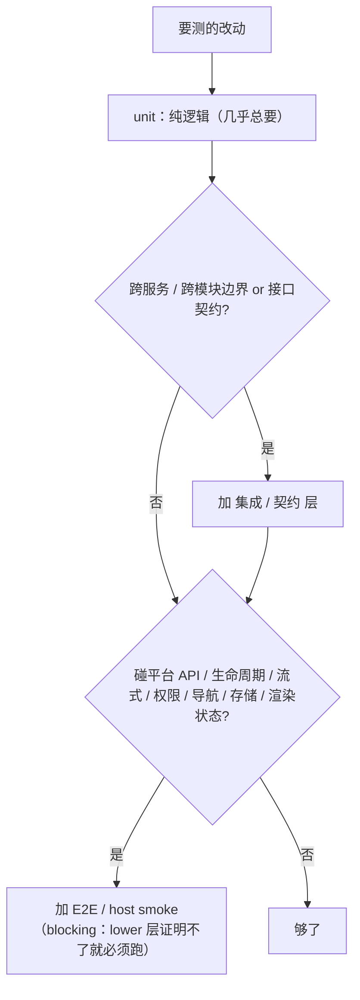
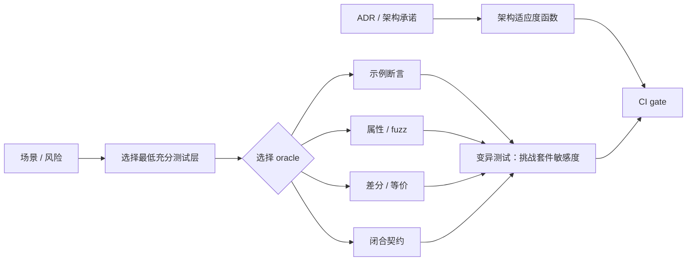
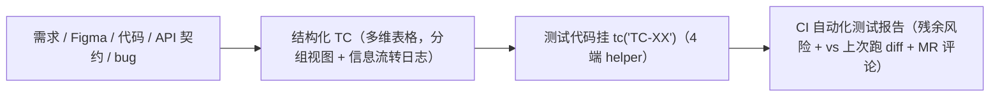

# 写测试与测试用例手册

> **何时找它**：怎么测、测试方案、覆盖、回归、CI gate、写测试代码、把用例放飞书。这块是**两个技能的同生态**：
> - [`testing-strategy`](../skills/testing-strategy/SKILL.md)：用例落到哪一层 + 怎么验证。
> - [`test-artifact-management`](../skills/test-artifact-management/SKILL.md)：用例从哪来 + 怎么管 + 怎么报告。

## 三种「自动化」，别混

团队常说的"自动化测试"其实是三件事，owner 和文档不同：

| 说的是 | 指什么 | owner | 文档 |
|---|---|---|---|
| 自动化测试**用例** | 用例从源生成、进多维表格、挂 `tc()`、出 CI 报告的 harness | `test-artifact-management` | [自动化测试方案](auto-test-scheme.md) · [使用手册](auto-test-manual.md) |
| 自动化测试（**分层**）| unit / 契约 / 集成 自动跑、当 gate | `testing-strategy` + 栈 dev 技能 | 本手册 + `testing-strategy` |
| 自动化 **e2e** | 浏览器/真机/小程序端到端自动跑关键链路 | `testing-strategy`（策略）+ 客户端技能（执行）| 本手册下方「自动化 e2e」节 + [客户端开发手册](client-dev-handbook.md) |

三者是一条链上的不同环：用例（写哪些）→ 分层（落哪层）→ e2e（关键链路端到端验）。harness 本身**层无关**——任何带 `tc()` 的测试（含 e2e）都进同一套报告。

## ownership 边界（先分清）

| 你的问题 | owner |
|---|---|
| 这个测试写在 unit / 集成 / E2E 哪一层？用什么 mock？CI gate 怎么设？怎么算验证过？ | `testing-strategy` |
| 测试用例从需求/代码/bug 怎么生成？怎么进多维表格？怎么挂 `tc()`？自动化测试报告怎么出？ | `test-artifact-management` |
| pytest/Jest/Espresso 的命令和 config 怎么写？ | 对应栈 dev 技能 |
| 测试用例 Base 没建、字段不全、用例记录或报告链路没接？ | `test-artifact-management`（具体表操作用 `lark-base`） |

`test-artifact-management` 内部会先借 `testing-strategy` 出场景/风险矩阵，不绕开它。测试用例 Base 初始化、字段、内容和记录全生命周期都归 `test-artifact-management`；通用 Wiki 和其他业务 Base 直接使用 `lark-wiki` / `lark-base`。

## testing-strategy：选层与验证

| 层 | 测什么 | 何时必须 |
|---|---|---|
| unit | 纯逻辑、窄改动 | 几乎总要 |
| 集成/契约 | 跨边界、接口契约 | 改了跨服务/跨模块边界 |
| E2E / host smoke | 真实运行链路、渲染 | 碰平台 API/生命周期/流式/权限/导航/存储/渲染状态 |
| 手动/探索 | 难自动化的 | 补充，不替代自动化 |

核心纪律：

- **先复用再新写**：动手前先 grep 同一个函数 / 接口 / 场景已有的测试，能扩就扩，别平行造一份。
- **别写变更检测器**：给"本来就会变"的数据打快照（供应商目录、配置版本号、枚举全集）不是测试，是每次改动都要手动同步的噪音。
- **test-case-first**：行为改动先写用例、跑 RED，再写实现。
- **代码改动必须测**：build/grep/typecheck/lint/review 都只是支持证据，不替代测试；至少跑一个相关层、当轮执行新加的测试。
- **mock 不证明运行时集成**：UI 接 API/生成内容要有真实渲染状态 + 契约/错误处理证据。
- **可见 UI 用同一交付记录**：按 [`delivery-contract.md`](../skills/product-ui-ux-design/references/delivery-contract.md) 的 Phase 0 先把完整 brief 或低风险纯文案轻量记录的 criterion 映射到断言层、渲染层、case 和 oracle；每个受影响端/宿主层在首笔实现前写 canonical `client_entry`，实跑后回传完整 client member，每个 changed/claim-bearing producer 只写一次自己的 record/binding member。Phase 1 引用完整集合、补测试自有命令/artifact，再给 criterion 结果、聚合充分性、覆盖边界和缺口；缺 `client_entry`、client member 不完整、绑定不一致/过期或 producer 未被该客户端实跑都要阻断，测试 owner 不代替设计 verdict。
- **按层报告验证**：真不适用的 criterion 标 `not-applicable` 并写理由；应测但缺环境/数据/owner 的标 `blocked` 并写 remediation/owner，不 collapse 成“build 过了”。
- **blocking 层失败 = 不能完成**：`accepted + complete`、`rejected + design-rejected`、`pending + pre-runtime-test-ready|blocked`、`candidate + blocked` 是契约允许的终态组合；其余组合无效。`accepted + complete` 还要求绑定的 Phase 1 为 `sufficient` 且没有 required evidence gap；`insufficient` / `blocked` 不会因设计 owner 写了 accepted 而变绿。不许把缺的 blocking 层重述成“残余风险/ready”。
- **planned/unavailable 不是空标签**：`planned` 要带具体命令并在 final verdict、MR-ready 或普通 MR 前解决；`unavailable-*` 要有实际尝试、观察到的失败、残余风险和解阻动作。用户只可在当前线程、针对这个具体改动、看过风险后接受 handoff 缺口；它仍不是测试通过或设计接受。
- **证据分三档**：强=确定性+断言；中=有断言但依赖固定 DB/缓存/网络态；弱=只 log/sleep/随机/调真实模型/非阻断 CI。**弱证据只能提示风险，不能证明正确**。
- **冻结回归集、每次发布都跑**：每个修过的 bug / 事故 / 确认的坏 case 都进一个冻结集，**每次发布跑**（"测过一次"不算回归覆盖）。分层养得起：确定性 case 进阻断发布门；要 live 基建/模型/真索引的进发布前门，带 marker + owner + 超时，别塞进快门变 flaky。
- **覆盖看怎么跑，不看有几个文件**：按跑它的命令、marker、依赖、CI 里的位置来分类，别数测试文件个数或看文件名推断覆盖。
- **skip ≠ 跑过**：条件跳过（缺可选依赖就 importorskip、平台 marker）叠上分 job 选择，会出现"哪个 job 都没真跑它"但全绿——绿的是没跑，不是过了。
- **用仓库自带的 test wrapper**：它往往编码了必需的 env、代码生成、fixture、超时和 CI 对齐行为，绕过去自己拼命令等于换了一套跑法。

### 八个跨栈测试工程模式

这八项属于 `testing-strategy` 内部的测试代码方法，不是八种技能关系：

| 模式 | 核心作用 |
|---|---|
| AAA / Given-When-Then | 把准备、行为和断言分开，让失败原因可定位 |
| 测试命名约定 | 名称写清行为、条件和结果；名称里的每个主张都欠一个能让它变红的 mutation |
| Test smells | 识别脆弱、晦涩、重复、过度 mock 或无有效断言的测试 |
| Object Mother / Test Data Builder | 复用默认 fixture，只让当前场景的差异显眼 |
| 行为验证与状态验证 | 按契约选择观察最终状态还是必要交互，避免把实现细节写死 |
| Coverage：floor 非 goal | 覆盖率是最低信号，不是正确性的替代品；先看风险是否被有效断言 |
| Test isolation | 隔离数据、时间、环境和副作用，使结果可重复、可并行 |
| 参数化 / 表驱动测试 | 用同一行为契约覆盖有区分度的输入、边界与错误类 |

当前 reference 另有“跨栈移植测试”和“行为纠正时的断言清扫”两项维护扩展；它们沿用上述方法处理移植与契约纠正，不改变这八个基础模式。

### 选层之后，还要选 oracle 和验证强度

unit、集成和 E2E 回答的是“**在哪一层观察风险**”；oracle 回答“**凭什么判定对错**”；变异测试再追问“**这套断言真的能发现错误吗**”。只选了测试层、没有设计 oracle，仍可能得到一套运行稳定却什么也没证明的测试。

| 技术 | 它回答什么 | 适合什么场景 | 合格证据与常见假绿 |
|---|---|---|---|
| **差分 / 等价测试** | 两个实现或两条路径是否保持同一契约 | 迁移、重构、跨语言移植、双路径灰度、供应商或模型切换 | 同一输入和依赖状态进入两边，比较业务契约而不是易漂移的原始文本；已知差异必须显式列出并限制清单大小，不能让豁免无限增长 |
| **变异测试** | 现有测试能否抓住它声称保护的错误 | 高风险纯逻辑、关键门禁、历史上出现过“测试绿但断言没生效”的位置 | 未变异 control 通过；变异体（mutant）仍能解析、构建和完成 fixture；所属断言因正确原因失败，非所属断言不跟着失败。变异体崩溃或整套测试一起红，不算有效归因 |
| **属性测试 / fuzz** | 一组输入是否始终满足不变量，而不是只过几个例子 | 解析器、序列化、状态机、边界组合、数值和集合逻辑 | 先写独立不变量，再生成输入；失败样本可收缩、可用 seed 重放。只有随机输入、没有不变量和可复现样本，只是在制造噪音 |
| **闭合契约 oracle** | “只允许这些”是否真的被完整约束 | 权限、安全、allowlist、协议字段、状态终态和输出 schema | 独立列出允许面，并覆盖值的形状、来源、数量、语义和必要时的顺序；同时保留合法 near-miss，防止门禁只顾召回、误伤正常输入 |
| **架构适应度函数** | 架构承诺是否在持续演进中漂移 | 依赖方向、模块边界、数据访问、破坏性契约变更、性能或安全预算 | 把 ADR 中可机械判定的不变量接进 CI；它保护结构承诺，不替代用户行为、接口结果和运行时链路测试 |

这些是**跨层的验证技术**，不是五个新测试层，也不把 mutation score 变成统一 KPI。按风险选择：差分测试强化“实现是否漂移”的 oracle，变异测试检验“测试是否有牙齿”，属性 / fuzz 扩大输入空间，闭合契约补全边界，适应度函数守住架构承诺。

#### 一次变异走查怎样才算完成

1. **从主张出发。** 枚举本次改动涉及的测试名称、说明、参数 ID 和子用例标签；其中每个行为主张都要能说出一个会让它失败的具体变异。只从现有断言反推，会漏掉“名字声称了、代码却没检查”的部分。
2. **先跑控制组。** 未变异版本必须通过；随后确认变异体仍能解析、构建、完成 fixture 并到达目标路径。
3. **看归因，不只看红绿。** 负责该主张的断言要因预期原因失败，不负责它的断言应保持通过。若期望值和实现都从同一来源计算，两边会一起漂移，这只是变化探测器，不是独立 oracle。
4. **反向查漏并恢复。** 从被保护的规则、脚本或契约反向检查：每条义务是否都能指向一个删除它就会变红的测试；然后恢复变异并重新跑绿，确认工作树回到变异前状态。

破坏性或不可逆对象不能靠一次手工走查结案：应把变异探针固化进测试套件，并在隔离副本或临时环境运行。探针只有非零退出码还不够，仍需证明是正确断言因正确原因失败，并防住探针递归调用自身或打到错误目标。

> **非功能 / 专项测试**（性能、安全、可访问性等）要不要进门禁、要什么证据，也归 `testing-strategy` 判；具体怎么测由对应领域 owner 负责。

## 场景/风险矩阵（动手写测试前先列）

高风险 / 产品可见改动，动手写一堆测试前先列一张小矩阵：按**风险**裁剪，不是每个排列都测。每行 = 一个有区分度的风险场景，标它在最便宜够用的那层证。

| 场景 | 风险 | 落哪层 | 断言（pass / fail）|
|---|---|---|---|
| 主成功路径 | 功能不通 | 集成 | 返回契约 + 落库正确 |
| 参数非法 | 脏数据入库 | unit | 拒绝且不写库 |
| 越权访问 | 数据泄露 | 集成 | 无权限 = 拒绝 |
| 并发重复提交 | 重复副作用 | 集成 | 幂等 / 去重 |
| 大数据量 / 中途失败 | 资损 / 截断 | E2E smoke | 可重试、不交付截断结果 |

> 矩阵小而准：覆盖不同**风险**，不是穷举排列。它**上游接**需求成形的覆盖矩阵（功能点+风险点×验收，见 [做需求手册](feature-delivery-handbook.md)）——需求覆盖 → 这里决定在哪层怎么证；**下游**决定测试代码写哪些。

## 自动化 e2e

e2e 策略归 `testing-strategy`，执行归客户端技能（浏览器/真机/小程序）。要点：

- **只测关键链路**：关键用户/调用旅程 + 发布信心，不要每个分支都走浏览器。
- **断言可见结果，不只点控件**：前端 API 页面要验 loading / success / failure / disabled-retry，并抓 console error 和失败网络请求。
- **覆盖一条真实成功路径 + 一条真实失败路径**，失败路径要可读、不崩。
- **各端 smoke 形态**：
  - Web → 浏览器打开真实页面 + 受控数据/稳定后端。
  - App → 设备/模拟器。
  - 小程序 → 开发者工具编译/预览或真机，验 route/scene 参数、状态、host 能力（分享/支付/订阅/扫码/webview bridge）。
- **运行时依赖的 host smoke 是 blocking**：碰平台请求/分块、流式终态、前后台恢复、host 导航、权限/能力弹窗、bridge 回调、存储/会话恢复、host 渲染错误态——lower 层证明不了就必须跑。
- **标 unavailable 前先补救**：起 emulator/browser/server、等就绪、重启 client daemon、跑仓库 setup 脚本、重跑发现命令；设备类先确认 `adb devices -l` + 就绪。仍不可用才记 `pre-runtime-test-ready`（有 owner 交接，非 merge-ready）或 `blocked`。
- **组合链路三层验收**：module-level（改动模块自身）+ chain-level（上下游契约、端到端恢复回滚）+ product-level（用户可见结果不退）。一个子模块只看局部指标不够。
- e2e 测试同样挂 `tc()`，进同一套报告。

## test-artifact-management：源 → TC → 代码 → 报告

这条链：

4 端 helper：pytest marker / Go `tc.Mark` / Vitest `tcTest` / Dart `tcTest`。

- TC 在 多维表格，测试代码用 marker/wrapper 挂 `tc("TC-XX")`，sidecar `test/results/tc-map.jsonl` 维护映射。
- bug → 回归 TC：`defect-diagnosis` 出 RCA → `test-artifact-management` 生成 P0 [回归] TC → 栈技能写测试挂钩。
- 需求变更/功能下线：TC 标 `废弃`（不是 `跳过`），走 product-rd-workflow 的 Feature Deprecation 级联。

团队落地细节（辅助库标记、make 目标、飞书报告、CI/本地差异、孤儿检测）见 [自动化测试使用手册](auto-test-manual.md) 和 [自动化测试方案](auto-test-scheme.md)。

## 走查示例：给一个新接口补测试

1. `testing-strategy` 选层：纯参数校验 → unit；落库 + 返回契约 → 集成。
2. `test-artifact-management` 从接口契约生成 TC 到多维表格：正常、参数非法、并发重复提交。
3. 写测试代码挂 `tc("TC-XX")`，先 RED。
4. 实现接口 → 测试转绿。
5. CI 报告自动评论到 MR，带 vs 上次跑 diff。

## 常见坑

- **先跑了测试才补用例**：已发生就停下补用例、如实报告，不声称走了 TDD。
- **删/跳过失败测试求绿**：修代码或纠正无效测试，不是把测试跳过。
- **TC 标"跳过"代替"废弃"**：功能下线要走废弃级联，否则孤儿测试腐烂。

## 延伸阅读

- [`testing-strategy` 技能](../skills/testing-strategy/SKILL.md) · [`test-artifact-management` 技能](../skills/test-artifact-management/SKILL.md)
- [变异测试与归因](../skills/testing-strategy/references/run-killing-mutation-walk.md) · [属性测试与确定性](../skills/testing-strategy/references/test-data-and-determinism.md) · [闭合契约 oracle](../skills/testing-strategy/references/design-closed-contract-oracles.md) · [架构适应度函数](../skills/testing-strategy/references/fitness-functions.md)
- [自动化测试方案](auto-test-scheme.md) · [自动化测试使用手册](auto-test-manual.md)
- [排查与修复 bug 手册](defect-diagnosis-handbook.md)
