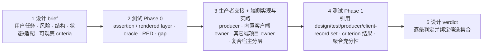

# UI/UX 设计手册

> 域专题：页面怎么设计、交互怎么做、设计走查/验收、空/加载/错误状态。入口 [`product-ui-ux-design`](../skills/product-ui-ux-design/SKILL.md)。
>
> 它 owns 设计**判断**（布局/交互/行为/心理/视觉/状态/可用性/设计系统一致性），把实现和测试细节路由给对应技能。

## 什么时候用

- 这个页面怎么设计、这个交互怎么做、页面看着别扭、体验不对。
- 设计走查、设计验收、空状态怎么处理、用户看到的错误提示怎么写。
- 描述了一个可见产品界面、用户流程、或观感问题——主动用。

**设计已定、只问代码机制**：由对应客户端技能实现，不重开探索；运行时可见改动仍记录设计来源/一致性、测试选层和端侧证据（见 [客户端开发手册](client-dev-handbook.md)）。

## 和实现的分工

| 谁 owns |
|---|
| `product-ui-ux-design`：交互模型、信息架构、视觉层级、状态完整性、可用性、设计验收，以及 Web/App/小程序/桌面/终端和场景风险透镜 |
| `testing-strategy`：Phase 0 选择断言/渲染层、case 和 oracle；Phase 1 判断 criterion 结果与证据充分性 |
| 变更或支撑结论的 backend/config/content/inference owner：写自己的 producer artifact/version、环境和 API/event/log/output 事实 |
| 四个内置客户端 owner：React Web、App、小程序、终端/CLI/TUI 的实现与渲染证据 |
| 其它 Web、Electron/桌面/TV shell 与其它客户端：用项目已安装 owner；映射不明时按 canonical contract 做 fail-closed project-convention lookup |
| 复合宿主：内容层与 shell 层分别由实际 owner 返回实现与运行证据，不能合并成一个客户端成员 |

组件库是实现词汇和约束；引用了组件库不等于层级、状态、无障碍、适配或视觉方向已经合格。

## 入口为什么变短、能力怎么加载

[`SKILL.md`](../skills/product-ui-ux-design/SKILL.md) 只保留 owner 边界、核心判断、五步闭环、硬规则和稳定指针。运行时可见改动直接加载 [`delivery-contract.md`](../skills/product-ui-ux-design/references/delivery-contract.md)；只有需要组合交付深度、work mode、平台、风险或证据透镜时，才加载 [`design-execution-checklist.md`](../skills/product-ui-ux-design/references/design-execution-checklist.md)。路由明确的 source、理论或其它单一 reference 可直接进入，不把 router 当必经入口。

选择不是“只挑一个最像的 profile”：先选一个交付深度，再叠加所有命中的 work mode 和风险透镜。设计转代码、走查、源码/代码证据、命名版本、同栈多项目、跨栈/复合宿主、空/错/加载态与截图验收、通用 surface/loop 等均有独立入口；一个模式不能取消另一个。聚焦测试检查入口到 router、reference 相对路径能实际解析、客户端首笔实现前的 `client_entry` 与完整回传，以及 producer 是否只指向 canonical universe/status；并用缩窄触发、断开指针、删字段或重加局部状态分支的 mutation 防止“文件还在、能力却不可达”。它不证明自然语言触发空间已经穷尽，也不等于真实设计任务效果已经提升。行为或效果 A/B 还必须让每个任务、每个版本按自己的真实触发链加载；用一份全局 bundle 跑所有任务，会因漏载和多载不对称而使比较失真。

## 五步顺序、测试双 pass 交付记录

所有运行时可见改动共用一份 [`delivery-contract.md`](../skills/product-ui-ux-design/references/delivery-contract.md)。它覆盖布局、文案、状态、交互、导航、组件语义、主题/token、无障碍，以及 Web、App、小程序、普通 CLI/help/output、全屏终端/TUI 和其它客户端。后端/推理侧的字符串、API/event/schema、enum、状态/进度、权限/能力、默认值或结果形状，只有先用 manifest/契约/构建发布目标/仓库清单证明消费者全集，再逐个核对不会改变任何客户端呈现或决策流时才可跳过；只搜当前仓零命中不算证明，全集或成员不全就记 `unknown-consumers`。WebView、mini-program `web-view`、Electron 等复合宿主按内容层+宿主层建立 owner/record/binding 集，不能用一个浏览器截图替另一层闭环。

- **设计先给草案，不等“最终 checkpoint”**：改设计稿、UI 文案、视觉规则、设计系统指导或面向代码的验收条件，或对这些改动给 approval 前，就先留下可复查分析；新屏、多端、行为/无障碍/高风险、分支/MR 或实现驱动设计走完整 brief。`product-ui-ux-design` 写目标用户与任务、密度、后果、信息结构/组件语义、状态/适配矩阵、行为保持项、差异分类和带 ID 的行为/交互/视觉结果及失败后果；verifier、测试层和 oracle 留给 Phase 0。
- **测试先选层、后判充分性**：`testing-strategy` 在实现前给 Phase 0 的断言层、渲染层、case、oracle、命令/目标和缺口；生产者/客户端实跑后，Phase 1 引用完整 `design/test/producer/client-record set` 与 `candidate-binding set`，只补并绑定测试自有执行/artifact，核对客户端实际使用的 producer 版本，映射 criterion 并给 `sufficient` / `insufficient` / `blocked`。设计 brief/criteria/source、测试 harness/oracle、生产者和客户端任一项事后变化都会使对应证据失效；这样既没有循环等待，也不会让各 owner 重复抄运行事实。
- **每个产出/渲染层只写一次运行事实**：变更或支撑结论的 backend/config/prompt/model producer 记录自己的 artifact/version、命令/环境和 API/event/log/output 观察；React Web、其它 Web、跨端/原生 App、小程序、普通 CLI/终端、桌面/TV 分别由实际客户端 owner 记录呈现事实，复合宿主建立多个 keyed member，并写明实跑的 producer member/version。没有已安装 owner 的层先记 runtime/framework 和不适用原因，并查 README/CONTRIBUTING、就近 AGENTS/CLAUDE、client/style/design docs；查不全是 `owner-lookup-unavailable`，不能写 `no-installed-owner`。每个 member 使用完整 commit/tree SHA、artifact SHA-256，或带完整 base SHA、binary tracked diff、排序后的 untracked 与所有影响结果的 ignored path/mode/type/content 的 dirty-bundle digest；checkout 外的 harness/config/fixture 等输入必须另建 exact-bytes `artifact-sha256` member。branch、缩写 SHA、空 digest、mutable path 或把 dirty execution 事后标成 commit 都不绑定证据。
- **设计 owner 收口**：逐条记录 `pass` / `fail` / `blocked` / `not-applicable`，再按契约矩阵给 verdict/next state；只有 `accepted + complete`、`rejected + design-rejected`、`pending + pre-runtime-test-ready|blocked`、`candidate + blocked` 可作终态。其中 `accepted + complete` 还要求绑定的 Phase 1 明确为 `sufficient`、没有 required evidence gap，且四类 record/binding/exercised-version 齐全；`insufficient` 或 `blocked` 不能被设计 verdict 覆盖。作者只能在全确定性、低风险的 copy/narrow/当前源一致性例外中接受；先前 `design-judgment` / `mixed` rejection 和其它判断面由用户或独立设计 owner。

新屏、大改、系统性重设计和行为变化先留可证伪基线。系统性或连续多屏重设计仍逐屏建立完整 slice、重新推导 IA/行为/状态/证据；一份 umbrella brief 只能共享 source/token，不得让后续屏只换皮。可执行行为优先用失败断言；纯视觉判断用可解析的 before artifact 加目标 criterion，不造假失败单测。材料随分支或交付继续存在时，记录也必须进入可复查持久件。

纯文案只有在同组件、渲染槽位或输出字段，且无条件逻辑/层级/状态/交互/导航/语义变化时走轻量路径；记录 before/after、语义与风险、消费者、未变证明、设计/测试 owner、所有变更 producer owner、所有受影响 client owner，以及 accessible name、本地化、渲染 extent/目标预览 criterion，测试再给轻量 Phase 0。生产者和客户端仍分别回传自己的 bound record，客户端注明实跑的 producer member/version，Phase 1 引用完整集合。错误、鉴权、金额、破坏性操作、权限、法务合规和 AI 披露仍走完整契约。若前一拒绝仅是 `deterministic-conformance`，针对失败 criterion 的合格轻量文案修复可重绑并重跑；`design-judgment` / `mixed` 不能靠微补丁洗绿。所需运行证据缺失时只能到 `pre-runtime-test-ready` 或 `blocked`；用户只有在当前线程看到该具体改动的残余风险并明确接受交接缺口后，才能接受 handoff，仍不等于 `complete`。沉默不是接受。

如果第一笔实现后才发现缺记录，先停下，记 process defect，从改动前证据重建记录，再按 Phase 0/端规则审计整份既有 diff；事后写一份迎合实现的 brief 不能洗绿。发现同类缺陷时，文本类可静态扫，overflow/裁切/反向绘制/状态几何等 render-class 必须重渲染 sibling set，grep-only 不能关闭。

## 关键纪律

- **状态完整**：空/加载/错误/成功/最终态都要设计，不只 happy-path。高风险流程还要按交付契约的 `state_matrix` 和 `behavior_contract` 补不确定终态、恢复与重复提交保护——核心是让用户知道：动作到底发生没、能不能安全重试、出事给支持什么标识。
- **可逆的不确定性也要给可执行判断**：为可调整的尺寸、阈值、顺序或交互规则选择一个可测试的暂定值/范围，写明推翻它的证据和 fallback；只有不可逆、高后果或缺少必要 authority 时才暂停，不能把 placeholder 当设计。
- **来源冲突逐属性、逐状态裁决**：把 Figma、生产组件 API、token、story 和测试的具体 revision/value/status 放进同一矩阵，逐行标 governing source、仍未知项和验证 owner；空 schema 或一句“以最新为准”不能关闭冲突。
- **运营工作台不是营销页**：operational/admin/moderation/AI-review 面禁止用营销 hero、装饰渐变、超大空插画、重视觉戏剧或大片首屏空白把任务推到无关 dashboard 下方；默认是聚焦工作面。代表性任务真是展示或营销时，应改判为另一类 surface，而不是放松运营规则。具体密度仍由任务和渲染证据决定。
- **用户可见的错误提示**是产品界面，不是随手文案——要定文案、可恢复路径。
- **设计验收需要目标运行面的证据**：自动化可以关闭它实际断言的视觉 criterion，但不能从一个 pass 推导整体层级、密度或交互质量；按 [客户端开发手册](client-dev-handbook.md) 回传渲染证据。
- **用户质疑 UI 质量就重开证据，不以“审美偏好”驳回**：记录具体观察、任务后果和 criterion。证据确认是缺陷就修；若是目标取舍或方向冲突，呈现差异并交用户/设计 owner 决定，再把稳定教训路由提炼技能。

## 延伸阅读

- [`product-ui-ux-design` 技能](../skills/product-ui-ux-design/SKILL.md)
- [客户端开发手册](client-dev-handbook.md) · [做需求/加功能/重构手册](feature-delivery-handbook.md)
