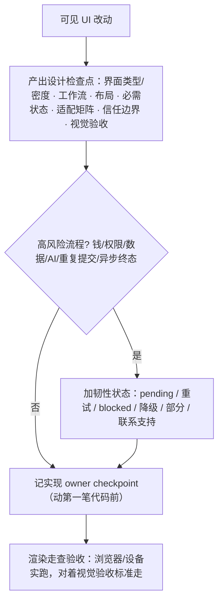

# UI/UX 设计手册

> 域专题：页面怎么设计、交互怎么做、设计走查/验收、空/加载/错误状态。入口 [`product-ui-ux-design`](../skills/product-ui-ux-design/SKILL.md)。
>
> 它 owns 设计**判断**（布局/交互/行为/心理/视觉/状态/可用性/设计系统一致性），把实现和测试细节路由给对应技能。

## 什么时候用

- 这个页面怎么设计、这个交互怎么做、页面看着别扭、体验不对。
- 设计走查、设计验收、空状态怎么处理、用户看到的错误提示怎么写。
- 描述了一个可见产品界面、用户流程、或观感问题——主动用。

**跳过**：设计已定，只问代码机制 → 对应客户端技能（见 [客户端开发手册](client-dev-handbook.md)）。

## 和实现的分工

| 谁 owns |
|---|
| `product-ui-ux-design`：交互模型、信息架构、视觉层级、状态完整性、可用性、设计验收、各场景透镜（社区/金融数据/AI 工作区/运营工具/Web/App）|
| 客户端技能：把设计实现出来 + 渲染证据 |

组件库一致性是实现细节，**不替代**设计就绪。

## 设计检查点（写可见 UI 前先产出）

任何可见 UI 改动，编码前先在工作笔记/交付件里产出一个紧凑的设计检查点：

- 界面类型 + 密度模式
- 主工作流
- 布局结构
- 必需状态（空/加载/错误/成功/最终态）
- **适配矩阵**：主视口 + 压力视口、折叠规则（次面板先于主内容折叠）、长文本、空/载/错几何；移动端含安全区/键盘/触达/朝向。
- 信任/安全边界
- 视觉验收标准（新屏/大改先过**视觉方向**：字体源、主色源、中性阶、圆角/阴影角色、现有 token 够不够；没强参考就给 2–3 个紧凑方向）

读一个设计技能、点名一个组件库，**不算**完成检查点。

## 实现 owner checkpoint（动第一笔代码前）

上面的设计检查点管**设计内容**，这一道管**谁负责、证据在哪**。**即使这次改动窄到直接找本技能、根本没进 product-rd-workflow，也照做。**

触发面比想象的宽：布局、文案、状态、交互、导航，以及共享主题 / token 改动、客户端渲染的用户可见文案。

| 记什么 | 怎么才算记到位 |
|---|---|
| 设计 owner | `product-ui-ux-design` |
| 栈实现 owner | 点名具体技能（React web / App / 小程序 / 终端）；该运行面没有对应技能就写明面类型 + `no-installed-owner` |
| 测试 owner | 调 `testing-strategy`，记下**它产出的断言层和渲染证据选择**，不是只写个技能名 |
| 入口规则证据 | 引一句原文，或给出规则标识 **+ 它产出的决定**。只给文件路径、运行时名字、或"那条可见 UI 规则"这种含糊指向都不算 |
| 渲染 / 设备证据状态 | 要能看的产物：截图、录屏、trace、DOM 或字符网格 dump，并连同实际跑的命令和目标面一起记。构建日志、lint、pass/fail 汇总行都不算 |

记在哪：跟分支 / MR 走的活，记进计划、检查清单、MR 说明或证据文件这类**持久件**；只有当轮就丢弃的本地小改才能只写在进度里。记录里必须带上"已读 checkpoint 规则"的引用声明，**没有这句声明的记录无效**。

- **文案微改有轻量路径**：不动布局 / 状态 / 交互 / 导航 / 视觉层级 / 组件选择的纯文案改动可以走简版，但要给出可度量的依据（同组件、没碰条件逻辑、每个上线语种的新文案都不比旧的长）。
- **但这几类文案不适用轻量路径**：错误、鉴权、支付 / 金额、破坏性操作、权限、法务合规、AI 披露——照走完整 checkpoint，风险定级另走 `feature-risk-router`。
- **漏了不是补一条记录就完事**：事后（包括自查）发现没记，要记下这个缺陷、补做 checkpoint，并**拿补做的规则回审已经改出来的 diff**。审完才能继续改、才能给最终回复或声称 MR 就绪——补个记录直接给已有 diff 背书，本身又是一次流程缺陷。

## 关键纪律

- **状态完整**：空/加载/错误/成功/最终态都要设计，不只 happy-path。高风险流程还要加韧性状态（见上图）——核心是让用户知道：动作到底发生没、能不能安全重试、出事给支持什么标识。
- **运营/工作台默认 productive-compact**：admin / 审核 / 分析 / AI-review 用清晰工作台（上下文条 + 输入区 + 输出区 + 状态 + 信任边界），别用营销 hero / 渐变 / 超大空状态硬装设计感——要冷静、密、动作导向。
- **用户可见的错误提示**是产品界面，不是随手文案——要定文案、可恢复路径。
- **设计验收用渲染走查**：自动化测试证明不了视觉/层级/密度（见 [客户端开发手册](client-dev-handbook.md) 渲染证据）。
- **用户质疑 UI 质量 = 设计缺陷，不是偏好争议**：重开设计检查清单，找到违反的设计规则，先修 UI，再把可复用教训路由提炼技能。

## 延伸阅读

- [`product-ui-ux-design` 技能](../skills/product-ui-ux-design/SKILL.md)
- [客户端开发手册](client-dev-handbook.md) · [做需求/加功能/重构手册](feature-delivery-handbook.md)
