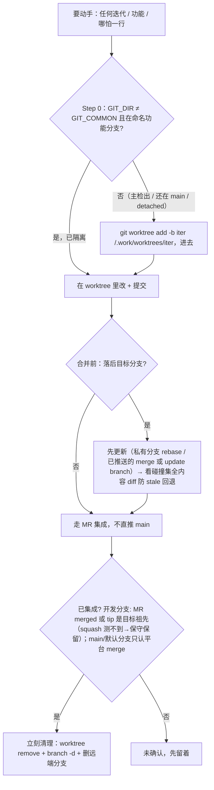

# 隔离开发与协作纪律手册

> **何时找它**：开始任何迭代/功能/哪怕一行修改之前。核心一句话：**绝不在 main（主检出 / main 分支）上开发**，先建分支 + worktree 再改；活一旦集成回目标分支就立刻清理。
>
> 权威规则在 [`worktree-isolation` 技能](../skills/worktree-isolation/SKILL.md)；仓库级路由和跨项目安装边界见 [架构总览](ARCHITECTURE.md)。

## 什么时候用

- 开始做任何迭代 / 功能 / 修改（单人单线也要，不是只有并发才用）。
- 并行做两个版本 / 两个迭代。
- 改 ccl-skills 这类共享仓库。
- 被编辑隔离硬闸 deny 时。
- worktree 干完要清理时。

## 为什么（心法）

主检出（main 那个工作树）是**干净的基线 / 集成点，不是开发现场**。每个迭代在自己的 worktree 里做，并行的两个迭代 = 两个 worktree，互不碰主检出 → 天生不会互相覆盖（clobber）。worktree 很便宜，没有例外。

`git checkout` 切分支会**移动同一个共享工作树**——所以"在 main 上 checkout 出一个分支接着改"不算隔离，并发时会把别人的改动连根带走。真正的隔离是独立 worktree。

**别靠"我现在 cd 在哪"。** 多 worktree 下 shell 的当前目录可能在**两次命令之间**被静默重置回主检出，删过的 worktree 路径也会失效。所以：

- **git 变更一律 `git -C "<worktree 绝对路径>" …`**（`add` / `commit` / `merge` / `branch` 都是），不靠当前目录。
- **写文件用绝对路径**。
- 确实需要工作目录的命令（在 worktree 里跑测试、构建、dev server）用**单条** `cd <绝对路径> && <命令>`，在调用当刻设好，别假设它活到下一条命令。

裸 `git commit` 落错地方最典型的后果：提交悄悄落进主检出、进了**错的分支**，一直到合并时才暴露。

**跨检出的同路径文件是不同文件**：刚进一个新 worktree，哪怕你"记得"这个文件长什么样，也要先读这个 worktree 里的实际文件再改——凭另一份检出的记忆直接编辑会按旧内容改错。

## 跨项目：工作目录怎么选

技能是全局插件，你在**任何产品仓**里用它。隔离作用在**你当前在改的那个仓**，不是 ccl-skills 仓。

| 你在做 | 在哪个仓建 worktree |
|---|---|
| 产品仓 X 的需求/bug | X 仓主检出根：`git worktree add -b <iter> <primary-root>/.work/worktrees/<iter> <base>` |
| 改 ccl-skills 技能本身 | ccl-skills 仓（有 `.worktree-only` 硬闸；Claude Code plugin 和 OpenCode plugin 运行时强制，其他工具靠自律） |

原则：

- **每项目一 checkout，每迭代一 worktree**；新 worktree 的**默认/推荐路径**是该项目主检出根的 `.work/worktrees/<iter>`，本地 lane metadata 约定放在 `.work/lanes/<iter>.json`。这是约定不是硬安全条件：已存在的、不在 `.work/worktrees` 下的独立功能 worktree 只要满足硬安全条件仍是 `SAFE`，status 脚本只对它打非阻断 warning，提示新 lane 走 `.work/worktrees`。
- 不在 A 项目目录里改 B 项目。跨项目任务显式说清在哪个仓。
- 多项目 / 多迭代并行 = 多 worktree。
- 长 / 跨会话 / 跨项目的工作锚到持久件（spec/plan），别只靠对话。

## Step 0 · 开工先自检（每次实现任务第一步，自己做）

```bash
GIT_DIR=$(cd "$(git rev-parse --git-dir)" && pwd -P)
GIT_COMMON=$(cd "$(git rev-parse --git-common-dir)" && pwd -P)
BRANCH=$(git symbolic-ref --quiet --short HEAD)
```

- `GIT_DIR != GIT_COMMON` **且 `BRANCH` 是命名功能分支**（非 main/默认分支、非 detached）→ 已隔离，直接干。
- 否则（在主检出，或虽在 worktree 但还停在 main）→ 先建分支 + worktree：
  ```bash
  PRIMARY_ROOT=$(cd "$(dirname "$(git rev-parse --git-common-dir)")" && pwd -P)
  git worktree add -b <iter-or-feature> "$PRIMARY_ROOT/.work/worktrees/<iter>" <base>
  cd "$PRIMARY_ROOT/.work/worktrees/<iter>"
  ```

## 流程速查

| 阶段 | 做什么 | 硬线 |
|---|---|---|
| 开工 | Step 0 自检 → 没隔离就建 worktree+分支 | 不在 main/主检出上开发 |
| 开发 | 在 worktree 里改、提交 | — |
| 合并前 | 落后目标分支就先更新（防 stale 回退）| 见下节 |
| 集成 | 走 MR，不直推 main | 默认分支受保护时走 MR |
| 收尾 | 立刻清理 worktree + 本地分支 + 远端分支 | 确认已集成才删 |

表是阶段清单，下图把贯穿的**三道判定门**串起来（隔离 / 合并前更新 / 清理前已集成）：



## 合并前：落后就先更新（防 stale 静默回退）

长活分支从旧基线分出去后，目标分支往往又前进了——所以**落后就先更新到目标分支再合并**。

为什么不能直接合：当分支**整文件重写 / 重新生成 / 格式化**了一个旧快照（formatter、重生成 codegen、改 lockfile、大范围 find/replace），合并会用分支的旧内容**把目标刚修复的那块悄悄盖掉**。**squash 最危险**——压成一个 commit，事后翻历史看不出。

> 精确边界：不是"落后就必回退"，也不是"两侧都改过就回退"——坑**只在分支用旧版本盖回目标已修复的同一块**时。别两头过读。

合并前序：`git fetch` → 钉住目标 SHA → 判断是否落后 → 私有分支可 rebase / 已推送挂 MR 的分支用 merge 或平台 "update branch"（别无脑 rebase+force-push）→ 合并后**看碰撞集的全内容 diff**（`--stat` 看不出文件内回退）。完整命令见 [worktree-isolation 技能](../skills/worktree-isolation/SKILL.md) 的"合并回目标分支前"段。

## 收尾：一集成就清理（本地 + 远端）

**"已集成"判据**（**开发分支之间**，任一即真）：MR 已 merge；或分支 tip 是目标分支祖先（`git merge-base --is-ancestor <branch> <target>` 退出 0）。squash 合并测不到祖先 → 当"未确认"保守保留。`main`/默认分支更严：只认平台 MR/PR 已在当前 head SHA 上完成 merge（见 SKILL.md「已集成判据」）。

**删目录之前先扫一眼被 ignore 的产物**——`git worktree remove` 不带 `--force` 会拒绝脏树和未跟踪文件，但 **gitignored 文件不算"脏"，会跟着目录一起被删且 git 不拦你**，删完找不回来：

```bash
git -C <worktree路径> status --ignored -s   # 必须 exit 0；命令失败按"没扫"处理，别当空输出继续删
```

判据是**重算代价**，不是"是不是被 ignore"：

- **重算便宜的直接丢**，不必请示：`.venv`、`node_modules`、构建/测试产物、缓存、日志。
- **重算贵的先 rsync 回主检出**：跑很久才拿到的中间数据、采集结果、训练产物。
- 拿不准就按贵的那类处理。

```bash
# 在主检出里跑，不在要删的 worktree 内
git worktree remove <path>      # 不带 --force：脏树/锁会拒绝→先查原因
git branch -d <branch>          # -d 不是 -D：未合并会拒绝=安全网
git worktree prune
git worktree list && git branch # 验证都没了
```

**分支名里带 `release` 的一律不自动删**（`release/*`、`release-1.2`、`hotfix-release` 都算，大小写不敏感）。

- 判据是**名字**，不是拓扑——发布分支在 git 里跟临时功能分支长得一模一样。
- 它合并后还要打 tag、追溯发版内容、出补丁，所以"已合并"在这里不等于"可删"。
- 要删由人指名；建 MR 时也别给它设 remove-source-branch。

远端分支：MR 路径在**用户已明确下达合并指令**（按「合并执行协议」——见 [SKILL.md](../skills/worktree-isolation/SKILL.md)）后，随合并用平台 remove-source-branch 顺手删（执行建议的守卫命令形态见 SKILL.md 协议第 3 条，`--remove-source-branch` 随之附带；本页不给可复制的裸 merge 命令）；清理压力不是合并授权，`dev` 等永久/集成分支绝不设 remove-source-branch。本地 merge 路径推过远端的用 `git push origin --delete <branch>`。

**安全红线**：只在确认已集成后删；用 `remove`（不 `--force`）+ `branch -d`（不 `-D`），被拒绝正是防误删未交付工作；绝不盲删主检出/默认分支。批量清积压用 `skills/worktree-isolation/scripts/worktree-sweep.sh`（默认 dry-run，`--apply` 才动手）。

## 延伸阅读

- [worktree-isolation 技能](../skills/worktree-isolation/SKILL.md)（含合并前更新的完整命令序）
- [架构总览](ARCHITECTURE.md)
- 交互式 merge 菜单：若装了 `superpowers:finishing-a-development-branch`，可 route 给它
