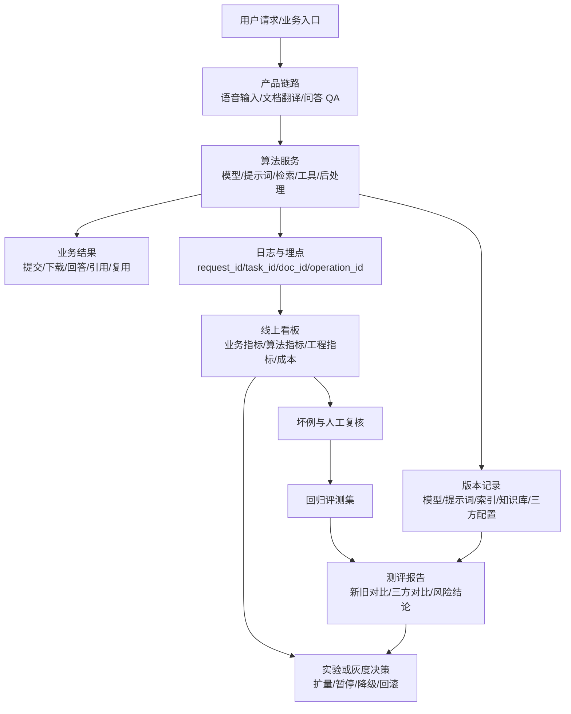

# 算法能力上线门禁 SOP

## 1. 目的

涉及算法服务的产品研发，必须先定义产品，再定义业务效果基线，最后用基线执行上线门禁。所有项目必须同时回答三个问题：

- 产品业务目标：这个算法是否真的改善用户链路和业务结果。
- 产品研发质量：需求、研发、测评、上线、回滚是否有明确证据。
- 风险控制：算法效果、业务指标、工程稳定性、成本和合规风险是否可控。

原则：产品定义不清，不进入算法方案评审；业务效果基线不清，不进入研发排期；基线未达标，不进入上线评审。算法局部指标变好只是必要条件，不是上线充分条件。

## 2. 适用范围

适用于所有影响线上产品体验或业务结果的算法服务项目，包括：

- 新增算法能力：产品原来没有该能力，本次新增用户可感知链路。例：语音输入。
- 迭代算法能力：产品已有该能力，本次优化模型、策略、提示词、检索、排序、后处理或服务实现。例：文档翻译、问答 QA。
- 算法工程变更：算法接口、服务链路、依赖数据、版本路由、多版本实验或灰度、回滚、成本或稳定性发生变化。

项目如拆出上线要求、执行规范、测评报告、检查表或其他子文件，子文件必须同步到飞书，并在本 SOP 或项目主文档的对应章节放引用链接。

## 3. 配套模板与引用

| 文档 | 用途 | 链接 |
|---|---|---|
| 算法服务上线执行规范 | 细化基线冻结、多版本实验或灰度、组合链路验收、监控回滚、评测集治理、三方对比和全量后运营 | [算法服务上线执行规范](algorithm-launch-execution-spec.md) |
| 算法服务上线检查表 | 上线评审逐项确认必备材料、责任人、证据链接、结果和状态 | [算法服务上线检查表](algorithm-launch-checklist.md) |
| 算法服务测评报告模板 | 项目测评报告模板，承接产品定义、业务基线、测评数据、指标对比、工程指标、链路验收、风险和上线建议 | [算法服务测评报告模板](algorithm-launch-evaluation-report-template.md) |

项目上线材料至少使用三类模板：

1. 先回答产品定义三问。
2. 再填写业务上线基线、新能力或迭代能力差异、测评报告。
3. 最后用上线检查表确认每项证据链接、结果和状态。

## 4. 角色职责

| 角色 | 职责 |
|---|---|
| 产品负责人 | 定义业务目标、用户链路、上线范围、业务指标基线和验收标准 |
| 算法负责人 | 定义算法方案、核心指标、测评数据集、测评报告和风险样例 |
| 研发负责人 | 负责服务接入、接口契约、多版本实验或灰度、回滚、监控、稳定性和成本 |
| 测试负责人 | 负责功能、回归、异常、链路和上线前验收 |
| 数据/分析负责人 | 负责线上指标口径、多版本实验或灰度分析和业务结论 |
| 项目负责人 | 组织评审，检查门禁材料，推动风险闭环 |

## 5. 总览图

### 5.1 算法任务研发门禁流程

### 5.2 算法服务数据与版本流

### 5.3 常用术语

| 术语 | 含义 |
|---|---|
| QPS | 每秒请求数，用来判断服务吞吐能力 |
| P95/P99 | 95%/99% 请求的耗时不超过该值，用来判断慢请求 |
| CER/WER | 字错误率/词错误率，用来衡量语音识别准确性 |
| BLEU/COMET | 机器翻译常用质量指标，需结合人工评审使用 |
| SSE | 服务端流式返回，用于问答 QA 的逐步输出 |

## 6. 产品定义

产品定义由产品负责人牵头，算法、研发、测试、数据共同确认。产品定义未完成，不进入算法方案评审。

产品定义先回答三问：

| 问题 | 必须回答 | 不通过情况 |
|---|---|---|
| 给谁用，哪个任务会变好 | 用户群、场景、当前替代方式、目标链路和上线范围 | 只写能力名、模型名或内部模块名 |
| 哪个业务结果必须改善，什么不能变差 | 核心业务指标、护栏指标、基线周期、数据来源、看数负责人和验收阈值 | 没有基线、没有 owner，或只有离线算法指标 |
| 为什么现在要自研、采购或迭代 | 自研与三方投入产出、成本、效果、接入、风险和交付周期对比；迭代能力说明老版本为什么不够 | 默认自研但无投入产出说明，或变更没有产品原因 |

| 定义项 | 必须说清楚 |
|---|---|
| 用户是谁 | 哪类用户、什么场景、什么入口会使用该能力 |
| 要解决什么问题 | 当前链路的痛点、损失或机会是什么 |
| 用户动作 | 用户从进入、使用、确认、提交到完成的完整路径 |
| 业务目标 | 要提升什么业务结果，如完成率、解决率、采纳率、留存、成本或满意度 |
| 能力边界 | 该算法负责什么，不负责什么；失败时用户如何继续完成任务 |
| 上下游影响 | 影响哪些产品模块、数据链路、服务、运营流程或人工流程 |
| 风险边界 | 可能造成误导、投诉、成本上升、合规风险或链路转化下降的场景 |

示例：

- 语音输入（新能力）：目标不是“上线语音识别”，而是让用户更快、更低成本地完成输入。
- 文档翻译（迭代能力）：目标不是“翻译指标提升”，而是让外文资料处理链路稳定完成，保留格式，产出可追踪、可下载、可复用的翻译结果。
- 问答 QA（迭代能力）：目标不是“召回更多答案”，而是提升可信答案、来源解释和任务完成质量，同时控制幻觉和严重高风险事实错误。

## 7. 业务效果基线定义

业务效果基线是上线判断的产品依据。它必须在立项阶段定义，在测评、实验或灰度阶段执行。

| 基线项 | 定义要求 |
|---|---|
| 当前业务基线 | 当前线上、人工流程、老版本或三方方案的业务表现 |
| 最低上线标准 | 低于该标准必须暂缓、暂停灰度或回滚 |
| 目标值 | 本次希望达到的业务收益 |
| 观察周期 | 多版本实验或灰度观察时长，如 3 天、7 天、14 天 |
| 统计口径 | 用户范围、渠道、版本、样本量、排除条件和计算方式 |
| 执行责任人 | 谁每日看数，谁判断扩量，谁触发回滚 |
| 阈值审批 | 谁提出、谁确认、谁有权变更阈值 |

业务效果基线必须包含整体链路指标，不能只包含算法局部指标。

| 场景 | 业务效果基线示例 |
|---|---|
| 语音输入 | 输入完成率、放弃率、主动修正率、提交成功率、平均输入耗时、投诉率 |
| 文档翻译 | 翻译任务完成率、处理中任务超时率、失败率、结果文件可下载率、格式保留质量、翻译结果复用率、doc_id/task_id 关联完整率、下游状态回传完整率 |
| 问答 QA | 任务完成率、有值率、可信答案率、溯源覆盖率、溯源准确率、幻觉率、严重错误率、用户可接受率、复用率 |

## 8. 业务效果基线执行

业务效果基线必须进入项目执行节奏，不得停留在文档里。

| 阶段 | 执行动作 | 不满足时处理 |
|---|---|---|
| 立项 | 产品负责人提交产品定义和业务效果基线草案 | 不进入方案评审 |
| 方案评审 | 算法、研发、测试、数据共同确认指标口径和可观测性 | 不进入研发排期 |
| 研发中 | 研发和数据补齐埋点、日志、看板、实验分组、版本标识和回滚开关 | 不进入测评验收 |
| 测评验收 | 测评报告同时给出算法指标、工程指标和业务指标验收结论 | 不进入上线评审 |
| 实验或灰度上线 | 项目负责人按日检查业务效果基线，记录扩量、暂停或回滚决策 | 未达最低标准则暂停扩量或回滚 |
| 复盘 | 对比目标值、最低上线标准和实际线上结果 | 未达预期必须给出原因和改进计划 |

多版本实验或灰度是算法服务上线的基础要求。影响线上体验的算法变更，必须具备版本分流、版本标识、指标归因和回滚能力；不能直接全量替换。

实验或灰度期间必须执行三类动作：

- 每日看数：业务指标、算法指标、工程指标、成本指标。
- 到线决策：达到扩量标准才扩量；低于最低上线标准必须暂停或回滚。
- 记录结论：每次扩量、暂停、回滚都要记录指标证据和负责人。

多版本实验或灰度方案必须说明：

- 分流规则：按用户、租户、入口、版本、流量比例或白名单分流。
- 版本标识：日志、埋点、测评报告和线上看板都能区分老版本、新版本、三方版本或兜底版本。
- 样本口径：样本量、观察周期、排除条件、统计方法一致。
- 决策阈值：扩量、暂停、降级、回滚的触发条件提前定义。
- 风险隔离：高风险场景、关键用户或租户、红线问题是否排除或单独观察。

A/B 实验和灰度发布不能混用结论：

- A/B 实验用于判断业务效果差异，必须在启动前定义随机分组、样本量、观察周期、核心指标和停止规则。
- 灰度发布用于控制上线风险，必须定义扩量节奏、暂停条件、回滚条件和兜底版本。
- 业务效果有争议时，优先使用 A/B 实验；工程稳定性、成本或风险验证可使用灰度。
- 不允许看到线上结果后再补样本口径、停止规则或成功标准。

## 9. 能力分类与门禁重点

| 类型 | 定义 | 示例 | 上线前必须证明 |
|---|---|---|---|
| 新能力算法 | 新增一条用户可感知算法链路 | 语音输入 | 业务上线基线成立；自研与三方投入产出成立；行业/三方对比可接受；算法效果、工程指标、多版本实验或灰度回滚达标 |
| 迭代算法 | 已有能力的模型、策略、数据、提示词、检索、排序或后处理优化 | 文档翻译、问答 QA | 新版本优于老版本或风险收益明确；业务指标不变差；测评数据集可信；失败样例和多版本实验或灰度回滚可控 |

迭代算法的「新版本优于老版本」须以新旧版本指标对比（old-vs-new metric comparison）与回归检查为证：固定基准集同口径对比、回归坏例集每次发版必跑（§14.1）；即使只变更组合链路中的一个子算法，也必须证明产品级业务指标不变差。

## 10. 标准研发流程

| 阶段 | 必做事项 | 输出物 |
|---|---|---|
| 立项 | 明确产品定义、业务目标、能力类型、用户链路、影响范围 | 产品定义、业务效果基线草案 |
| 方案评审 | 评审算法方案、数据、工程链路、风险、投入产出或版本收益 | 方案评审结论 |
| 研发实现 | 完成算法服务、接口、多版本实验或灰度、监控、回滚、日志 | 可发布版本、服务说明 |
| 测评验收 | 完成算法测评、业务指标验收、工程指标验证 | 测评报告、测试报告 |
| 上线评审 | 检查门禁材料是否齐全，确认是否允许灰度或全量 | 上线评审结论 |
| 实验或灰度观察 | 按业务、算法、工程指标观察，不达标暂停或回滚 | 实验或灰度观察记录 |
| 复盘沉淀 | 复盘业务收益、问题、样例、数据集和后续优化 | 复盘结论、后续计划 |

## 11. 新能力算法上线要求

新能力算法上线前，必须先建立可上线的业务基线。没有业务基线，不进入上线评审。

### 11.1 必备材料

| 材料 | 要求 | 缺失是否阻断 |
|---|---|---|
| 产品定义 | 说明用户、场景、链路、业务目标、能力边界和风险边界 | 是 |
| 业务上线基线 | 定义最低可接受业务结果、观察周期和统计口径 | 是 |
| 自研与三方投入产出 | 说明为何自研，而不是采购成熟三方能力 | 是 |
| 行业/三方效果对比 | 与行业指标、成熟三方或公开基准对比 | 是 |
| 算法效果指标 | 证明算法本身达到可用标准 | 是 |
| 算法工程指标 | 证明延迟、成功率、成本、稳定性可上线 | 是 |
| 测评数据集说明 | 说明数据来源、覆盖场景、样本量、标注方式和偏差风险 | 是 |
| 多版本实验或灰度方案 | 说明分流规则、版本标识、样本口径、观察指标、扩量/暂停/回滚条件和兜底方式 | 是 |

### 11.2 语音输入示例

语音输入是新能力。上线前不能只看语音识别率，必须证明输入链路对用户有真实收益。

| 维度 | 示例指标 |
|---|---|
| 业务指标 | 语音输入使用率、输入完成率、放弃率、主动修正率、提交成功率、用户满意度、投诉率 |
| 算法效果指标 | 字错误率 CER、词错误率 WER、专有词识别率、标点断句准确率、噪声/口音/方言识别表现 |
| 算法工程指标 | QPS、并发请求数、平均耗时、P95/P99、首字延迟、整句延迟、成功率、超时率、单次调用成本、资源消耗 |
| 三方对比 | 成熟语音识别服务在同数据集下的效果、延迟、成本、稳定性、热词能力、数据安全条件 |
| 兜底方案 | 切回键盘输入、切回三方语音识别、关闭入口、保留文本编辑能力 |

语音输入上线结论必须回答：

- 产品定义是否清楚：目标用户、入口、完整输入链路、失败兜底是否明确。
- 业务上线基线是什么，最低允许值是多少。
- 自研相比三方是否有明确投入产出。
- 自研效果、延迟、成本、稳定性是否达到上线要求。
- 如果语音识别指标提升但输入完成率下降，是否暂停上线。

## 12. 迭代算法上线要求

迭代算法上线前，必须证明新版本相对老版本收益明确，且整体业务指标不变差。

### 12.1 必备材料

| 材料 | 要求 | 缺失是否阻断 |
|---|---|---|
| 产品定义变更说明 | 说明本次是否改变用户链路、入口、能力边界或风险边界 | 是 |
| 老版本基线 | 当前线上版本的算法指标、业务指标、工程指标 | 是 |
| 新版本核心指标 | 新版本在同口径测评下的核心指标 | 是 |
| 新旧版本对比 | 同数据集、同统计口径、同计算方法对比 | 是 |
| 测评数据集说明 | 说明数据来源、覆盖场景、样本量、标注方式和偏差风险 | 是 |
| 业务指标验收标准 | 定义业务指标最低要求、观察周期和统计口径 | 是 |
| 失败样例分析 | 说明新版本变差样例、高风险错误和处理策略 | 是 |
| 多版本实验或灰度方案 | 说明分流规则、版本标识、样本口径、观察指标、暂停和回滚条件 | 是 |

### 12.2 文档翻译示例

文档翻译已有能力迭代时，重点不是重新证明“为什么自研”，而是证明新版本更值得上线。

| 维度 | 示例指标 |
|---|---|
| 算法指标 | BLEU/COMET、人工可接受率、术语命中率、语义一致性、漏译率、错译率 |
| 业务指标 | 翻译任务完成率、处理中任务超时率、失败率、结果文件可下载率、格式保留质量、翻译结果复用率、doc_id/task_id 关联完整率、下游状态回传完整率 |
| 工程指标 | QPS、并发任务数、平均耗时、P95/P99、start/processing/success/fail/timeout 状态闭环、首响应时延、任务完成时长、成功率、超时率、成本、降级能力 |
| 数据集说明 | 行业文档、摘要、公开材料场景覆盖，语种、领域、样本量、长短文档、专业术语、表格/图片/格式样本、标注方式 |
| 风险样例 | 术语错译、语义反转、漏译、表格/图片结果错误、格式丢失、结果文件缺失、状态回传丢失 |

翻译质量指标提升，但任务完成率、结果文件可下载率、格式保留质量、状态闭环、链路追踪或成本明显变差，不允许直接全量上线。

### 12.3 问答 QA 示例

问答 QA 已有能力迭代时，必须防止“单点指标提升但整体回答变差”。问答 QA 是组合链路，不能只按一个算法模块验收。

问答 QA 的上线验收按简化链路看：

具体模块以执行规范中的真实链路核查结果为准。未在产品文档、技术文档、代码、配置或日志中确认的节点，不能写成真实链路。

| 维度 | 示例指标 |
|---|---|
| 算法效果指标 | 按本次影响模块选择：检索有值率/召回质量、知识库命中质量、引用准确率、来源解释完整率、答案准确率、无答案识别率、拒答准确率、幻觉率、严重高风险事实错误率、实体抽取准确率、NL2SQL 正确率、模板命中/回退正确率 |
| 业务指标 | 按业务效果基线选择：可信答案率、有值率、溯源覆盖率、溯源准确率、严重错误率、用户可接受率、复用率；不得把未在产品看板或验收流程中定义的指标临时写成上线依据 |
| 工程体验指标 | QPS、并发请求数、平均耗时、P95/P99、首 token 时长、完整响应时长、流式中断率、SSE/SSE V2 连接成功率、成功率、超时率、工具调用失败率、单次问答成本、降级能力 |
| 链路回归指标 | 快速问答和深度思考入口是否都受影响；历史压缩、指代消解、query 改写、知识库检索、混合检索、结构化数据查询、引用/溯源、总结、前端流式渲染是否出现退化 |
| 数据集说明 | 问题来源、入口类型、知识库版本、数据源版本、问题类型、困难样本、无答案样本比例、历史多轮样本、本轮上传文件样本、标注方式 |
| 风险样例 | 错误回答、过度回答、拒答错误、高风险问题误答、引用过期知识、指代消解错误、当前文档误指向历史文档、检索改写误判、NL2SQL 错查或空查 |

QA 新版本如果局部指标提升，但可信答案率、溯源覆盖率、溯源准确率、幻觉率、严重错误率、有值率、首 token、完整响应或流式稳定性恶化，不允许直接上线。

子算法调整必须先做影响面判定：

| 变更点 | 必须验收 |
|---|---|
| 理解问题 | 多轮承接、指代消解、本轮上传文件、短输入、数字业务问题 |
| 检索/查询/工具调用 | 命中质量、有值率、NL2SQL 正确率、空结果兜底、工具失败和超时 |
| 引用/溯源 | 引用准确率、来源解释完整率、过期或错误引用 |
| 答案生成 | 答案准确率、可信答案率、幻觉率、严重错误率、拒答准确率 |
| 流式展示 | 首 token、完整响应、SSE/SSE V2 稳定性、停止和异常终态 |

任一子模块变更都必须同时提供模块级测评和端到端链路回归。只证明子模块变好，不能替代业务上线验收。

## 13. 业务验收

算法上线必须做业务验收。验收结论必须同时说明用户链路、业务结果和风险是否达到最低上线标准。

### 13.1 验收什么

| 验收对象 | 验收内容 |
|---|---|
| 用户链路 | 用户是否能从入口完成任务；失败、重试、取消、回退是否可用 |
| 业务结果 | 是否达到业务效果基线的最低上线标准 |
| 算法结果 | 算法效果是否达标，且没有引入不可接受坏例 |
| 工程体验 | QPS、平均耗时、P95/P99、首 token、完整响应、成功率、超时率是否达标 |
| 成本与资源 | 单次调用成本、token 成本、GPU/CPU/内存资源是否在预算内 |
| 风险兜底 | 多版本实验或灰度、监控、告警、回滚、降级、人工兜底是否可执行 |

### 13.2 怎么验收

| 方法 | 适用场景 | 输出 |
|---|---|---|
| 离线测评 | 算法效果、新旧版本对比、坏例分析 | 测评报告 |
| 链路验收 | 用户从入口到完成任务的完整路径 | 验收记录、截图或日志 |
| 多版本实验或灰度 | 业务指标、工程体验、成本、风险 | 实验或灰度观察表 |
| 坏例评审 | 高风险事实错误、幻觉、错译、溯源错误、高风险样例 | 坏例清单和处理结论 |
| 线上看板 | 成功率、超时率、耗时、状态闭环、成本、任务完成情况 | 看板链接或查询结果 |
| 回滚演练 | 新版本异常、指标跌破、服务失败 | 回滚验证记录 |

### 13.3 怎么判定通过

| 判定项 | 通过条件 |
|---|---|
| 业务基线 | 核心业务指标不低于最低上线标准 |
| 效果收益 | 新版本相对老版本有明确收益，或收益/风险被评审接受 |
| 长链路影响 | 下游业务指标不变差；如变差，必须解释原因并暂缓或回滚 |
| 严重风险 | 严重高风险事实错误、红线误答、不可接受错译、严重溯源错误必须有硬门槛；原则上为 0，例外必须在立项或方案评审阶段书面批准 |
| 工程体验 | QPS、平均耗时、P95/P99、首 token/完整响应、成功率、超时率达到上线标准 |
| 成本 | 单次成本、token 成本或资源成本不超过预算线 |
| 兜底 | 多版本实验或灰度、监控、告警、降级、回滚已验证 |

### 13.4 分场景业务验收项

| 场景 | 必验项 |
|---|---|
| 语音输入 | 入口可用；用户能完成输入；输入完成率、放弃率、主动修正率、提交成功率、平均输入耗时达标；噪声/口音/长句样例无明显退化；可切回键盘或三方语音识别 |
| 文档翻译 | 行业文档、摘要、公开材料场景可用；翻译任务完成率、失败率、超时率、结果文件可下载率、格式保留质量、状态闭环、doc_id/task_id 关联完整率达标；术语错译、漏译、格式丢失坏例可接受 |
| 问答 QA | 问答链路可用；有值率、可信答案率、溯源覆盖率、溯源准确率、严重错误率、用户可接受率达标；首 token、完整响应、流式稳定性达标；红线题能拒答，高风险误答不可放行 |

长链路场景必须做整体业务指标判断：

- 推荐点击率提升，但成交率下降，不能只按点击率放行。
- 语音识别率提升，但输入完成率下降，不能上线。
- QA 召回率提升，但可信答案率下降、溯源不完整、幻觉率或严重错误率上升，不能上线。
- 翻译指标提升，但结果文件不可下载、格式保留变差、状态回传丢失、任务超时率或成本明显上升，不能直接全量。

## 14. AI 算法任务补充上线要求

AI 算法服务不能只按一次离线测评放行。上线前必须补齐以下要求，防止模型、提示词、检索、数据、三方服务或线上流量变化造成质量波动。

| 检查项 | 必须做到 | 不满足时处理 |
|---|---|---|
| 评测集版本治理 | 明确评测集版本、来源时间、样本量、场景分布、标注人、标注规则；固定基准集和回归坏例集分开管理 | 不进入上线评审 |
| 分层评测 | 至少包含离线评测、老版本回放、新版本多版本实验或灰度验证；高风险能力增加红线/安全样例评测 | 不允许全量 |
| 多版本实验或灰度能力 | 支持老版本、新版本、三方版本、兜底版本可区分运行；日志、埋点、看板可按版本归因 | 不进入上线评审 |
| 版本可追溯 | 测评报告记录模型版本、提示词版本、检索/索引版本、知识库版本、工具版本、后处理策略、三方服务版本或配置 | 不进入上线评审 |
| 连续评估 | 上线后把线上坏例、用户反馈、人工复核样例进入回归集；重大模型/提示词/检索/知识库变更必须重跑核心评测 | 不允许继续扩量 |
| 线上漂移监控 | 监控输入分布、无答案比例、错误类型、延迟、成本、超时、失败率、三方依赖异常；提前定义告警阈值、响应时限和处置负责人 | 触发阈值即暂停扩量 |
| 人工复核机制 | 对高风险事实错误、错译、红线误答、语音误识别导致提交错误等高风险样例，定义抽检比例和处理时限 | 不允许全量 |
| 数据安全与合规 | 使用三方 AI 服务、跨境传输、客户文件、行业敏感数据或用户隐私数据时，必须有安全/合规确认 | 不进入上线评审 |

### 14.1 组合算法链路变更要求

一个产品能力由多个算法或策略共同组成时，任何子模块变更都必须回答三个问题：

| 问题 | 必须输出 |
|---|---|
| 改了哪一段 | 真实链路图、入口、模块、上下游接口、版本标识；链路必须来自产品文档、技术文档、代码或日志，不允许凭经验补节点 |
| 影响谁 | 受影响入口、数据源、工具、知识库、三方服务、前端展示、埋点、计费、监控和回滚路径 |
| 怎么证明整体没变差 | 模块级测评、接口契约测试、端到端回归、老版本回放、多版本实验或灰度观察 |

验收必须分三层：

| 层级 | 验收重点 |
|---|---|
| 模块级 | 被改模块的算法效果、错误类型、耗时、成本、异常兜底 |
| 链路级 | 上下游输入输出契约、版本透传、日志埋点、错误处理、回滚是否可用 |
| 产品级 | 业务效果基线、用户链路、风险样例、线上灰度观察是否达标 |

如果无法确认真实链路，项目不得进入上线评审，只能先补链路核查。

评测集必须至少拆成三类：

- 固定基准集：用于新旧版本、三方方案、行业基准同口径对比。
- 回归坏例集：线上问题、人工复核问题、历史严重错误必须进入，每次发版必跑。
- 灰度观察集：来自真实线上流量，用于判断新版本是否适配当前用户输入分布。

## 15. 执行规范

详细执行要求见 [算法服务上线执行规范](algorithm-launch-execution-spec.md)，包括基线冻结、多版本实验或灰度、组合链路验收、监控回滚、评测集治理、投入产出和三方对比、全量后持续运营。

## 16. 上线评审结论

上线评审只能给出四类结论：

| 结论 | 含义 |
|---|---|
| 允许全量上线 | 所有门禁通过，多版本实验或灰度结果稳定 |
| 允许实验或灰度上线 | 基础门禁通过，但需要小流量观察 |
| 暂缓上线 | 材料、指标或风险有缺口，补齐后复评 |
| 禁止上线 | 核心指标、业务指标、工程能力或风险兜底不达标 |

不得使用“基本可以”“问题不大”“先上再看”等模糊结论替代评审结论。

## 17. 一票否决项

出现任一情况，原则上不可上线：

- 缺少业务上线基线或业务指标验收标准。
- 业务基线、核心阈值、样本口径或停止规则在上线评审现场临时变更。
- 缺少产品定义，或产品定义未说明用户、场景、链路、边界和业务目标。
- 业务效果基线未进入埋点、看板、实验或灰度观察和回滚决策。
- 缺少测评报告。
- 缺少新旧版本核心指标对比。
- 缺少测评数据集说明。
- 缺少评测集版本、标注规则、固定基准集或回归坏例集说明。
- 缺少模型、提示词、检索、知识库、索引、工具、后处理或三方服务版本记录。
- 缺少多版本实验或灰度方案，或日志、埋点、看板无法区分版本。
- 缺少监控告警阈值、响应时限、回滚时限或回滚授权人。
- 评测集存在训练/调优污染，但仍作为固定基准集使用。
- 新能力算法缺少自研与三方投入产出说明。
- 新能力算法缺少行业/三方效果对比。
- 使用三方 AI 服务、客户文件、行业敏感数据或用户隐私数据，但缺少安全/合规确认。
- 算法指标达标，但核心业务指标低于最低上线标准。
- 长链路场景只提供局部算法指标，未评估整体业务指标。
- 算法工程指标不达标，包括延迟、成功率、超时率、成本或稳定性。
- 无多版本实验或灰度、无监控、无漂移观察、无回滚、无兜底。
- 存在高风险错误样例，但没有处理策略。
- 关键负责人未确认风险和上线结论。

## 18. 附录：上线检查表

逐项检查见 [算法服务上线检查表](algorithm-launch-checklist.md)。

## 19. 附录：测评报告模板

测评报告格式见 [算法服务测评报告模板](algorithm-launch-evaluation-report-template.md)。
