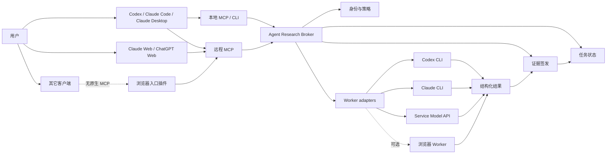
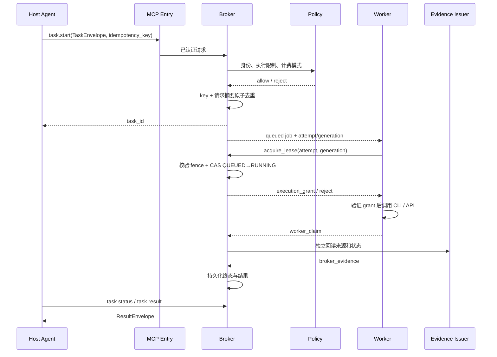
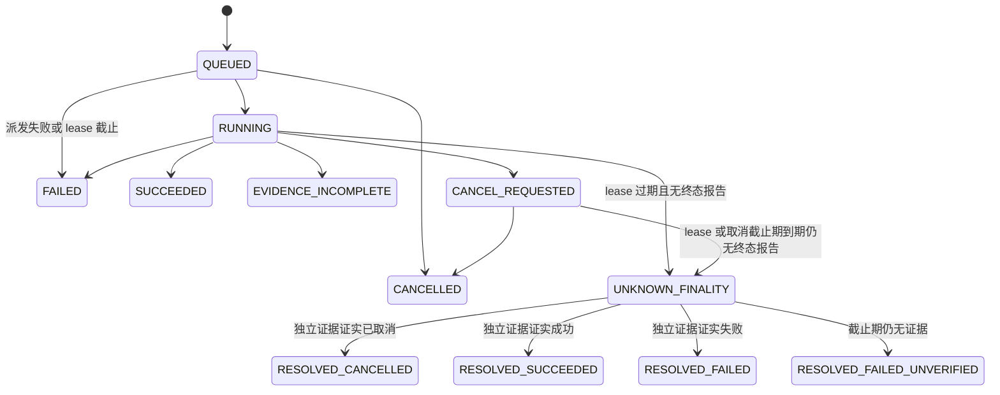
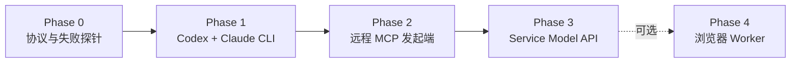

# Agent Research Broker 架构可行性方案

状态：`final architecture feasibility — implementation not authorized; Phase 0 gate not satisfied`

本文定义 Codex、Claude、ChatGPT 等 Host 通过第三方 MCP、CLI 或浏览器入口发起任务，再由 Broker 调用 Codex CLI、Claude CLI、模型 API 或受控浏览器 Worker 完成调研的可行架构。它不包含 DSH 借鉴分析，也不授权实现、发布或生产写入。

## 1. 结论

方案可行。稳定边界不是“一个 Agent 直接控制另一个客户端”，而是：

- MCP/CLI/浏览器插件只负责接入。
- Agent Research Broker 负责身份、授权、任务、状态、执行限制、证据与恢复。
- Worker adapter 调用 Codex CLI、Claude CLI、Service 托管模型 API，或可选的受控浏览器 Worker。
- Worker 自述不是完成证据；Broker 必须独立回读来源或外部状态。
- 本地用户 CLI 的账单归用户管理；只有 Service 托管 API 进入 Broker 费用管控。

推荐 MVP：先完成本地只读闭环，再开放远程 MCP；浏览器 Worker 保持可选，不自动化个人 ChatGPT/Claude 网页会话。

## 2. 总体架构

MCP 负责接入，Broker 负责调度。网页端及浏览器插件不能直接调用用户电脑上的 CLI 或进程；所有本地进程和供应商调用只接受 Broker 向独立 Worker 身份签发的执行授权。

## 3. 发起端与接入方式

| 发起端 | 接入方式 | 边界 |
| --- | --- | --- |
| Codex / Claude Code | 本地 MCP 或 CLI | 直接访问本机 Broker |
| Claude Desktop | 本地或远程 MCP | 本地资源走本地 MCP，跨设备走远程 MCP |
| Claude 网页端 | 远程 MCP Connector | Broker 必须提供 HTTPS 与 OAuth |
| ChatGPT 网页/客户端 | 远程 MCP App | 受账号、工作区、管理员策略和目标客户端能力约束；发布前实测 |
| 无原生 MCP 的客户端 | 浏览器插件或独立 CLI | 只适配入口；`PLUGIN_INGRESS` 无执行权限，必须经 Broker 调度 |

浏览器入口与浏览器 Worker 是两个身份域：

- `PLUGIN_INGRESS` 只能提交和查询任务，不能取得 Worker lease 或 `execution_grant`。
- Phase 4 Native Host 如需执行任务，必须以单独注册的 Worker 身份运行。
- Worker 注册只能由受管控的 Worker 管理流程发起；入口域凭据不能注册、批准或换取 Worker 身份。

## 4. Worker 与计费模式

| 模式 | 计费归属 | Broker 责任 |
| --- | --- | --- |
| `USER_CLI` | 用户账号或订阅 | 不预留、不扣减、不承诺费用上限；只控制递归、并发、超时和取消 |
| `MANAGED_API` | Service 托管凭据 | 调用前校验配额并预留最大暴露；按认证且去重的用量结算 |

`MANAGED_API` 必须满足：

- adapter 能根据模型价格与硬请求上限计算最大暴露。
- 最大暴露是预留时冻结的全部 fan-out 分支逐项上限之和；执行中新增或扩大分支必须先以 CAS 成功追加预留，再允许派发。并发分支竞争同一余量时，只有 CAS 成功者可执行，其余拒绝或重新申请预留。
- 无配额、无法计算最大暴露或无法验证用量时禁止派发。
- root 未取得 lease 即因派发失败、adapter 停用或 lease 截止而进入 `FAILED`/`CANCELLED` 时，按零用量释放全部预留。
- 已取得 lease 的任务进入任一终态时，有认证用量则按实际结算，否则按最大暴露结算。
- 后到账单只能幂等向下冲正，不能增加已结算金额或改变任务终态。
- 账单超过计算上限时记录 `BILLING_INVARIANT_BREACH`、停用 adapter 并进入人工处置，不能静默扩大租户额度。

## 5. 统一任务协议

Broker 暴露四个异步工具：

- `task.start(TaskEnvelope, idempotency_key)`：创建或复用唯一 root，返回 `task_id`。
- `task.status(task_id)`：返回授权后的进度、阶段、执行限制、适用的托管预算和恢复状态。
- `task.cancel(task_id)`：请求取消；接受请求不等于已停止。
- `task.result(task_id)`：仅终态可读，返回 `ResultEnvelope` 与 Broker 证据。

幂等规则：

1. key 绑定已认证用户与租户。
2. Broker 计算规范化请求摘要。
3. 同 key、同摘要返回原 `task_id`；同 key、不同摘要返回 `IDEMPOTENCY_CONFLICT`。
4. 一个数据库事务写入幂等记录、root、可选的托管 API 预留和 outbox event。
5. 幂等 dispatcher 在提交后只发布一个包含 `attempt_id` 与 `generation` 的 Worker job。

所有以 `task_id` 为键的 `task.status`、`task.cancel` 和 `task.result` 请求，都必须按 root 记录中的已认证用户与租户做归属校验。跨用户或跨租户访问统一返回 `NOT_FOUND`，不能泄露任务是否存在，也不能读取、取消或获取其证据。

关闭聊天、切换授权客户端或 Broker 重启都不能丢失任务，也不能要求用户重新描述目标。

## 6. 执行授权与证据

Worker 在首次本地进程启动或供应商调用前，必须取得绑定已认证用户与租户、root、attempt、generation、Worker 身份与有效期的短期 `execution_grant`。启动器和 API adapter 拒绝入口身份以及缺失、过期或不匹配的 grant。

本地启动器不是信任根。Broker 只接受能匹配其已签发 grant 记录的 `worker_claim`、执行事件和回调；未申请 grant 就执行、重放旧 grant 或绕过启动器的结果一律拒绝并记录为未授权/孤儿事件，不能改变终态或结算。

Worker 只能提交 `worker_claim`、原始事件和产物候选。Evidence Issuer 只能从 Worker 无写权限的来源，或具备独立签名/证明的外部状态回读并签发 `broker_evidence`；Worker 写入的本地文件、页面或回读目标不能自行证明其 claim。缺少独立证据进入 `EVIDENCE_INCOMPLETE`，不能报告成功。

## 7. 状态机与结果可读性

| 状态类别 | 状态 | `task.result` |
| --- | --- | --- |
| 非终态 | `QUEUED`、`RUNNING`、`CANCEL_REQUESTED`、`UNKNOWN_FINALITY` | 返回 `NOT_TERMINAL`；客户端继续调用 `task.status` |
| 成功终态 | `SUCCEEDED`、`RESOLVED_SUCCEEDED` | 返回成功结果与 Broker 证据 |
| 非成功终态 | `FAILED`、`EVIDENCE_INCOMPLETE`、`CANCELLED`、`RESOLVED_CANCELLED`、`RESOLVED_FAILED`、`RESOLVED_FAILED_UNVERIFIED` | 返回终态、原因和已有证据，不返回成功结果 |

取消规则：

- lease 前取消：原子写入 `CANCELLED` 与 attempt/generation fence；已发布 job 无法取得 grant；`MANAGED_API` 按零用量释放全部预留。
- lease 后证实停止：进入 `CANCELLED`；托管用量采用统一终态结算。
- lease 后无法证实停止：进入 `UNKNOWN_FINALITY`，禁止自动重试。
- `CANCEL_REQUESTED` 必须持久化取消截止期；lease 或取消截止期到期仍无终态报告时，由 sweep/status CAS 进入 `UNKNOWN_FINALITY`。
- 在 `UNKNOWN_FINALITY` 中重复取消：只追加审计并幂等返回当前状态；不能改为 `CANCELLED`、不能将最大暴露降为零。
- 只有 Evidence Issuer 的独立证据可进入三个已验证的 `RESOLVED_*` 终态；Worker claim 不能触发。

## 8. 终态收敛与 fencing

`UNKNOWN_FINALITY` 必须带持久化 `finality_deadline`、durable sweep entry 与可续租 Reconciler lease。终态转换不依赖某个 Reconciler 实例存活：

- durable sweep、`task.status` 读取或任一 Broker 实例都可以 CAS 执行到期转换。
- Reconciler lease 过期必须重新入队。
- 截止仍无证据时进入 `RESOLVED_FAILED_UNVERIFIED` 并释放执行锁。
- `USER_CLI` 不产生 Broker 费用动作；`MANAGED_API` 使用统一终态结算。

每个 Worker claim、执行结果和执行回调必须携带 root、attempt 与 generation。Broker 只接受当前、未 fenced、状态兼容的 generation；不匹配、已 fenced 或已终态的执行事件全部记录为孤儿事件，不能修改任务终态或结算。

结果面和计费面对账相互隔离。认证且去重的供应商账单可以向下冲正费用，但不能把失败或取消任务恢复为成功。

## 9. 实施阶段

| 阶段 | 交付 | 本阶段新增 gate / artifact | 单人粗估 |
| --- | --- | --- | --- |
| Phase 0 | 协议、幂等、计费模式、状态机、Reconciler、具名失败探针 | `arb-phase0-gate` / `arb-phase0-probes.json` | 3–5 天 |
| Phase 1 | 本地 MCP/CLI，Codex/Claude CLI Worker | `arb-phase1-gate` / `arb-phase1-probes.json` | 1.5–2.5 周 |
| Phase 2 | 远程 MCP、OAuth、异步任务 API、Claude/ChatGPT 网页发起 | `arb-phase2-gate` / `arb-phase2-probes.json` | 1–2 周 |
| Phase 3 | Service 托管模型 API Worker、并发、限流、成本控制 | `arb-phase3-gate` / `arb-phase3-probes.json` | 3–5 天 |
| Phase 4 | 浏览器扩展、Native Host、人工监督 Worker | `arb-phase4-gate` / `arb-phase4-probes.json` | 1–2 周，可选 |

阶段必须顺序推进。Phase 1–4 全部被 Phase 0 gate 阻断；Phase N 开始前还必须先定义本阶段具名探针、让本阶段 gate 产出绑定候选的 artifact，并通过 Phase 0…N−1 的全部 gate，不能以空 gate 集合或仅复用 Phase 0 artifact 跳过。所有 `arb-phaseN-probes.json` 都继承 §10 的不可变 CI run、构建来源、摘要核对和从 run 回读/重跑要求，并记录 `implementer_identity` 与 `adjudicator_identity`；二者相交时 gate 必须失败。Phase 1–4 同样必须由非实现者的独立 Reviewer 或非实现者的人工风险负责人确认；实现者不能以任何角色自我裁决。

## 10. Phase 0 具名失败探针

| 探针 | 故障注入 | 必须观察到 |
| --- | --- | --- |
| `P0-IDEMPOTENCY-01` | 事务提交成功后让首次响应超时，再用同 key 重试 | 一个 root、一个 job；托管 API 仅一次预留 |
| `P0-IDEMPOTENCY-02` | 不同用户和租户复用同一 key | 各自创建独立 root；不返回他方 `task_id`，也不泄露冲突 |
| `P0-AUTHZ-01` | 外部用户和外部租户用有效 `task_id` 调用 status/cancel/result，并对照不存在的 id | 均返回不可区分的 `NOT_FOUND`；无状态变化、结果或证据泄露 |
| `P0-GRANT-01` | `PLUGIN_INGRESS` 请求 lease/grant，或尝试注册、批准、换取 Worker 身份 | 全部拒绝，无 Worker 身份、本地进程或供应商调用 |
| `P0-GRANT-02` | 注册 Worker 分别提交缺失、过期，以及与用户、租户、root、attempt 或 generation 不匹配的 grant | 全部拒绝，无本地进程或供应商调用 |
| `P0-GRANT-03` | Worker 不申请 grant 就直接执行并提交 claim/event | Broker 拒绝并持久化未授权/孤儿事件；终态与结算不变 |
| `P0-QUEUE-01` | 注入派发失败，或让 job 在截止前始终未取得 lease | 进入 `FAILED` 并 fence job；无 grant，托管 API 按零用量释放全部预留 |
| `P0-CANCEL-01` | outbox 已发布、Worker 取 lease 前取消 | `CANCELLED`；job 无 grant；托管 API 结算为零 |
| `P0-CANCEL-02` | `UNKNOWN_FINALITY` 中重复取消 | 状态和最大暴露不降为零；停止证据或截止规则继续生效 |
| `P0-FINALITY-01` | 杀死 Reconciler 并推进到截止时间 | sweep/status 完成 CAS 终态、释放执行锁并结算最大暴露 |
| `P0-FINALITY-02` | 分别注入独立成功、失败、取消证据和仅 Worker claim | Evidence Issuer 产生三个对应终态；claim 单独不能转换 |
| `P0-FINALITY-03` | 已取得 lease 的 Worker 在 `RUNNING` 中失联，分别覆盖有、无待处理取消请求 | lease 或取消截止期后进入 `UNKNOWN_FINALITY`；随后由证据或最终截止规则收敛并完成统一结算 |
| `P0-ORPHAN-01` | 向 fenced、非当前和已终态 generation 注入执行结果 | 全部形成持久化孤儿审计事件，终态与结算不被结果面改写 |
| `P0-SETTLE-01` | 覆盖 lease 后各类终态，再注入较低、重复、超上限账单，以及串行/并发超出冻结预留的 fan-out 分支 | 无认证用量时按最大暴露；较低账单仅向下冲正，重复不重扣，超上限停用 adapter 并持久化 breach；并发竞争仅 CAS 成功分支可派发 |
| `P0-EVIDENCE-01` | Worker 伪造自己可写的回读目标，并声称成功 | Evidence Issuer 拒绝签发成功证据；任务进入非成功终态 |
| `P0-HOP-01` | Worker 身份调用 `task.start` 创建递归 root，或提交 `max_hops>1` | 请求被拒绝，不创建 root、job 或费用预留 |
| `P0-REDACT-01` | 在输入、Worker 输出、页面、产物、回读和证据中注入合成密钥 | 持久化前与 `task.result` 返回前均完成过滤，原文不出现在存储、日志或响应中 |

CI job `arb-phase0-gate` 必须生成不可手写替代的 `arb-phase0-probes.json`：记录不可变 CI run id、候选 SHA、构建来源、`implementer_identity`、`adjudicator_identity`、全部探针结果、证据引用与摘要。独立裁决者必须从 CI run 读取或重跑产物并核对摘要，不能只检查仓库中的同名文件；两种身份相交时 gate 直接失败。仅当同一候选全部通过，且由非实现者的独立 Reviewer 或非实现者的人工风险负责人确认后，Phase 0 gate 才通过；实现者不能以任何角色自我裁决。

当前没有实现或 probe artifact，因此这些是可执行验收合同，不是通过证据。

## 11. 安全与非目标

硬边界：

- 远程入口必须使用 HTTPS 与 OAuth；Broker 绑定用户、租户、客户端和 `task_id`，不信任 Host 自报身份。
- Host 与 Worker 身份分离；调用方只能降低 root 的深度、attempt、并发和超时上限。
- 输入、页面、输出、产物、回读和证据在持久化与返回前统一过滤。
- MVP 只读、单用户/本地优先，不支持无人值守 CI。
- 未来写入型 Worker 需要单独的动作授权、补偿与人工决策策略。

本方案不做：

- 不实现 Broker、MCP server、adapter、浏览器扩展或 Phase 0 probes。
- 不自动化个人 ChatGPT/Claude 网页登录态。
- 不允许 Worker 继续递归创建 root；默认 `max_hops=1`，多模型比较由 Broker 并列 fan-out。
- 不授权写入、发送、购买、生产变更、发布或部署。

## 12. 评审与证据状态

本轮风险标签：`docs-only`、`api-contract`、`permission-access`、`write-finality`、`ai-output`、`external-integration`、`security-review`。

独立 review/challenge 的处置映射：

| ID | 已发现的失败类 | 当前约束与可证伪证据 |
| --- | --- | --- |
| `ARB-F01` | 超时重试、跨租户 key/task 泄露 | §5；`P0-IDEMPOTENCY-01/02`、`P0-AUTHZ-01` |
| `ARB-F02` | 入口、Worker 或本地启动器绕过授权 | §3、§6；`P0-GRANT-01/02/03` |
| `ARB-F03` | queue、运行中失联、取消等待或 Reconciler 崩溃导致永久非终态 | §7–§8；`P0-QUEUE-01`、`P0-FINALITY-01/03` |
| `ARB-F04` | 取消、重复取消、孤儿 generation 改写终态或结算 | §7–§8；`P0-CANCEL-01/02`、`P0-ORPHAN-01` |
| `ARB-F05` | 用户 CLI 与托管 API 费用责任混淆，或 fan-out 突破预留 | §4；`P0-SETTLE-01` |
| `ARB-F06` | Worker claim、自写回读目标或缺证据被当成成功 | §6–§7；`P0-FINALITY-02`、`P0-EVIDENCE-01` |
| `ARB-F07` | 递归 root、敏感信息或浏览器边界失控 | §3、§11；`P0-HOP-01`、`P0-REDACT-01` |
| `ARB-F08` | 空 gate、伪造 artifact 或实现者自我裁决 | §9–§10；逐阶段 gate/artifact、CI run provenance 与非实现者裁决 |

提交前评审证据命名为 `arb-spec-review.json`，必须由受管控的 review job 原样产出并保存在不可变任务 artifact 中，至少绑定 CI run id、构建来源、`review_chain_id`、`candidate_sha256`、`packet_sha256`、`implementer_identity`、`reviewer_identity` 和 `status`。非实现者 Reviewer 必须从该 run 读取或重跑并核对摘要；两种身份相交或仅存在仓库内同名文件时不得通过。评审 prompt 与结果必须显式覆盖 `ARB-F01`…`ARB-F08` 的处置映射；完成报告必须引用该 artifact 与候选 SHA。只有同候选 `status=passed` 且无对应 finding 时才记为已处置，手写摘要不能替代原始结果。

本次变更是 `not-applicable: docs-only`：只新增架构可行性方案，不改变技能、脚本、插件、运行时或发布行为。

## 13. 官方依据

- [OpenAI Codex MCP](https://developers.openai.com/codex/mcp)
- [OpenAI Codex non-interactive mode](https://developers.openai.com/codex/noninteractive)
- [OpenAI Plugins and MCP](https://developers.openai.com/)
- [Anthropic Claude Code MCP](https://code.claude.com/docs/en/mcp)
- [Anthropic Claude Code headless mode](https://code.claude.com/docs/en/headless)
- [Anthropic remote MCP connectors](https://support.anthropic.com/en/articles/11175166-about-custom-integrations-using-remote-mcp)
- [Chrome Native Messaging](https://developer.chrome.com/docs/extensions/develop/concepts/native-messaging)

资料核验日期：2026-08-16。
